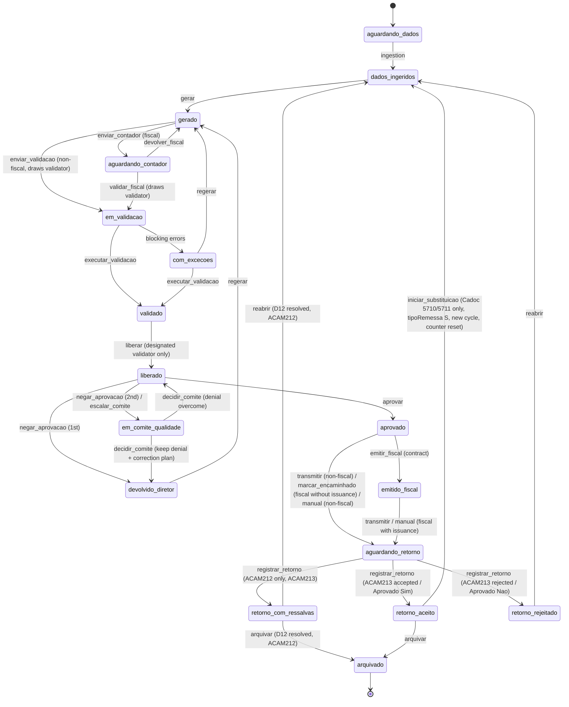

# Videnas - Front-end Backlog: Approval, Return and Archive Flow

**Date:** 2026-09-29
**Author role:** Product Owner
**Status:** R1 (E1 all, E2 all, E4-S1..S3, E11-S1, E11-S2, E11-S5) is implemented on branch `feat/r1-approval-flow`; R2 (E7-S1..S3, E7-S5, E8-S1, E8-S2, E8-S3, E8-S4, E11-S3, rest of E11-S2) is implemented on branch `feat/r2-return-archive`, see section 12; R3 (E3-S1, E3-S2, E3-S3, E3-S4) is implemented on branch `feat/r3-escalation`, see section 13 (E3-S3 was unblocked on 2026-10-01 by the approval of D3, option A). The target state machine below now reflects what R1 built; R4 (E5-S1..S4, E6-S1..S5) is implemented on branch `feat/r4-contract-transmission`, see section 14. R5 (E9, E10, E4-S4, E7-S4, E11-S4; E8-S3 was already delivered in R2) is implemented on branch `feat/r5-organization` (pending commit), see section 15: D6, D7, D10 and D11 were resolved by Manuca on 2026-10-01 and E4-S4, E7-S4, E9 and E10 now follow those decisions (section 15.1); E9-S4 and E10-S3 were dropped by the decisions. D8 was resolved by Manuca on 2026-10-01 and is implemented on branch `feat/d8-cadoc-substitution` (Cadoc 5710/5711 substitution "S" after BCB acceptance, counter per submission cycle), see section 16. Only E12 is still a proposal.

## 1. Scope

- **Front-end only.** Everything in this backlog is built inside the existing Next.js 16 + React 19 + TypeScript mockup.
- Data lives in `src/lib/mock/*`; state and transitions live in the Zustand stores in `src/lib/store/*` (`periodos.ts`, `evidencias.ts`, `tenants.ts`, `sessao.ts`). Permission and transition rules live in `src/lib/permissoes.ts`; domain types in `src/lib/tipos/index.ts`.
- **No backend, no API routes, no real transmission** to the Central Bank (BCB) or to any fiscal issuer. "Transmit", "issue" and "regulator return" are simulated in the store and recorded in the audit trail and the seal chain.
- Every rule that depends on an open business decision is kept as a **configurable flag in mock data** and flagged "Blocked by D#". No rule is invented.
- Out of scope: backend contracts, real KMS/HSM, real notifications (e-mail/Slack), real regulator integrations, new Figma designs (UI/UX owns those; stories reference existing components).

## 2. Glossary

Ids stay in Portuguese snake_case to match the code. English meaning in the second column.

### 2.1 Profiles (`PerfilId`)

| Id | Current UI label | Meaning |
|---|---|---|
| `cliente` | Cliente | Client data supplier. Only profile that uploads source inputs. |
| `executor` | Executor | Videnas operator who ingests and generates files. |
| `validador` | Validador | Videnas validator; runs schema validation and releases. Cannot release what they generated (SoD). Each period has one validator designated by random draw (D7); only that validator validates and releases. |
| `contador` | Contador | Client accountant; Fiscal module only. |
| `diretor` | Compliance | Client Compliance officer ("Responsável de Compliance" in sentences); approves and records protocol. D11 resolved: the UI shows "Compliance"; the id `diretor` is unchanged. |
| `operacional` | Operacional | Client-side support; follows completeness and exceptions. |
| `admin` | Administrador | Videnas admin; provisions tenants and contracted modules. |

### 2.2 Current states (`EstadoPeriodo`)

| Id | Meaning |
|---|---|
| `aguardando_dados` | Waiting for client data |
| `dados_ingeridos` | Data ingested |
| `gerado` | File generated |
| `aguardando_contador` | Waiting for accountant (Fiscal) |
| `em_validacao` | Under schema validation |
| `validado` | Validated |
| `com_excecoes` | Validation found exceptions |
| `liberado` | Released by Validador to the client |
| `aprovado` | Approved by Compliance |
| `entregue` | Delivered / protocol recorded |
| `retorno_com_erro` | Regulator returned with error |

### 2.3 Proposed new states

| Id | Meaning |
|---|---|
| `devolvido_diretor` | Approval denied/returned by Compliance, with mandatory reason; back to Executor |
| `em_comite_qualidade` | Escalated to Quality Committee after the 2nd denial |
| `emitido_fiscal` | Fiscal document issued after approval (only if contract allows) |
| `aguardando_retorno` | Transmitted / protocol recorded; waiting for regulator (or issuer) return. Replaces `entregue` |
| `retorno_aceito` | Regulator accepted the file |
| `retorno_com_ressalvas` | Regulator accepted with caveats. ACAM212 only (ACAM213); Cadoc 5710/5711 and Fiscal record only "Aprovado: Sim/Não" (D6) |
| `retorno_rejeitado` | Regulator rejected the file. Replaces `retorno_com_erro` |
| `arquivado` | Final state: archived with exit seal and retention date |

### 2.4 Actions (`AcaoId`) touched by this backlog

| Id | Status | Meaning |
|---|---|---|
| `gerar`, `regerar`, `enviar_validacao`, `enviar_contador`, `validar_fiscal`, `devolver_fiscal`, `executar_validacao`, `liberar`, `aprovar`, `reabrir` | existing | Generate, regenerate, send to validation, send to accountant, accountant confirms, accountant returns, run validation, release, approve, reopen |
| `registrar_protocolo` | existing, retired in R4 | Compliance records BCB protocol. Unified into `transmitir` (Compliance holding the prior registration) and `registrar_protocolo_manual`; the row stays in `REGRAS_ACAO` for history but the action is always hidden |
| `marcar_encaminhado` | existing, retargeted | Compliance marks Fiscal DPS as forwarded to issuer (when Videnas does not issue) |
| `registrar_retorno` | existing, extended | Record regulator return: ACAM213 with 3 outcomes for ACAM212; only "Aprovado: Sim/Não" for Cadoc 5710/5711 and Fiscal (D6) |
| `negar_aprovacao` | new | Compliance denies/returns approval with reason |
| `escalar_comite` | new (system) | Automatic escalation to Quality Committee |
| `decidir_comite` | new | Record Quality Committee decision |
| `emitir_fiscal` | new (R4) | Issue fiscal document after approval |
| `transmitir` | new (R4) | Simulated transmission to the regulator/issuer, by Videnas or by Compliance, depending on the client contract |
| `registrar_protocolo_manual` | new (R4) | Manual protocol recording fallback |
| `arquivar` | new | Archive the period (final) |
| `iniciar_substituicao` | new (D8) | Cadoc 5710/5711 only: starts a substitution remittance ("S") from `retorno_aceito`, opening a new submission cycle with the denial counter reset |

## 3. Client answers (authoritative, summarized)

1. Videnas is the new name of Sentinellus.
2. V1/V2/V3 are validators.
3. Approval is **per execution module**, not a single approval for the three branches.
4. Issuance/transmission depends on the client contract. Transmission requires a **prior registration**, done either by Videnas or by the Responsável de Compliance.
5. "Fall-back arquivo" is the regulator return on receipt and validation of the file (protocol/return step), e.g. **ACAM213** for ACAM212.
6. Two approval denials escalate to a **Quality Committee**.
7. Internal Controls, Custody and Accounting are **client areas**, theoretically responsible for certain controls.
8. DeCripto is **out of scope** for this flow and this backlog (decision by Manuca, 2026-09-29).
9. The regulator return is registered, and the period is archived, by someone from the Videnas team (Executor or Validador); Compliance and the Cliente do neither (D14, decision by Manuca, 2026-09-30).
10. Retention counts from the archiving date and is 5 years for now; the value may change and lives only in `configuracaoFluxo.retencao` (D2, decision by Manuca, 2026-09-30).
11. After a regulator return "accepted with caveats" both paths are valid: archive and reopen (D12, decision by Manuca, 2026-09-30).
12. Segregation of duties on archiving: whoever generated the current version of the file cannot archive the period, and whoever registered the regulator return cannot archive it either; both apply together and neither applies to `reabrir` (D17, decision by Manuca, 2026-09-30).
13. Segregation of duties on issuing and transmitting: whoever generated the current version of the file cannot issue the fiscal document nor transmit; whoever issued the fiscal document cannot transmit it. The manual protocol record is not covered (D18, decision by Manuca, 2026-10-01).
14. The contract of a module is frozen on the period when Compliance approves it; later contract edits only apply to periods approved afterwards (D19, decision by Manuca, 2026-10-01).
15. Prior registrations stay read-only in the app; there is no registration edit screen (decision by Manuca, 2026-10-01).
16. Validators: "é por modulo e é aleatorio" (D7, decision by Manuca, 2026-10-01). One validator per period, drawn at random among the validators eligible for the module and the institution, excluding the generator of the current version; no V1 -> V2 -> V3 sequence.
17. Client areas: "medida informativa do cliente no inicio do contrato" (D10, decision by Manuca, 2026-10-01). Areas and their mapping to controls/modules are informed by the client at contract start, for information only; areas do not sign off.
18. Approver label: "compliance" (D11, decision by Manuca, 2026-10-01). The profile is shown as "Compliance" and, in sentences, "Responsável de Compliance".
19. Return for Cadoc 5710/5711 and Fiscal: "posicionamento se foi aprovado ou nao, somente o campo de aprovado" (D6, decision by Manuca, 2026-10-01). Only "Aprovado: Sim/Não" is recorded; ACAM212 keeps ACAM213 with three outcomes.

## 4. Gaps found and epic mapping

| Gap | Evidence in code | Epic |
|---|---|---|
| (a) No Compliance "No"/denial | `PERFIS` (`src/lib/permissoes.ts`) gives `diretor` only `aprovar`, `registrar_protocolo`, `marcar_encaminhado` | E2 |
| (b) No archived state | `EstadoPeriodo` ends at `entregue` / `retorno_com_erro` | E8 |
| (c) Fiscal issues before approval in the design | Code already orders `aprovar` before `marcar_encaminhado`, but there is no issuance action and the design shows issuance earlier; copy in `banner-posicionamento.tsx` states Videnas never issues | E5 |
| (d) No explicit protocol/return step per channel, no ACAM213 | `registrar_protocolo` jumps to `entregue`; `registrarRetorno` in `src/lib/store/periodos.ts` only changes state on `rejeitado`; `REGRAS_ACAO` only allows `entregue -> retorno_com_erro`; no ACAM213 type | E6, E7 |
| (e) Correction loop has no limit/escalation | `reabrir` can loop indefinitely | E3 |
| (f) Internal Controls, Custody, Accounting not in app | No area entity in `Instituicao` | E9 |
| (g) Re-approval does not go back through Validador by design | Only path back is Executor `reabrir` to `dados_ingeridos`; no Compliance-originated return that forces re-validation and re-release | E2 |
| (h) V1/V2/V3 not represented | Single `validador` user in `src/lib/mock/usuarios.ts` | E10 |

Additional technical observations relevant to sizing:

- `ROTULOS_ACAO` is duplicated in `src/lib/permissoes.ts` and `src/components/dominio/modulo-barra-acoes.tsx`.
- Exhaustive `Record<EstadoPeriodo, ...>` maps exist in `src/components/dominio/badge-status.tsx`, `src/app/app/page.tsx`, `src/app/app/acam212/page.tsx`, plus state keys in `src/lib/ajuda/textos.ts`; `Record<TipoEventoAuditoria, ...>` in `src/lib/mock/auditoria.ts`. Adding states/events breaks typecheck until all are updated (good: compiler finds them).
- Audit events (`EventoAuditoria`) are **not** hash-chained today; hash chaining exists on seals (`RegistroLacre.hashAnterior`, `encadearApos` in `src/lib/evidencias/lacre.ts`). E11 keeps seal chaining for every new artifact; chaining events themselves is D15.
- CSV export in `src/app/app/auditoria/page.tsx` is a toast only (fixed in R5, E11-S4).
- `periodos`, `evidencias` and `tenants` all persist in `localStorage` (`videnas-periodos`, `videnas-evidencias`, `videnas-tenants`), so the flow survives logout/login and reload. New persisted fields need a hydration-safe default.
- No test tooling in `package.json` (only `lint`); no `typecheck` script (use `pnpm exec tsc --noEmit`).

## 5. Proposed target state machine (PROPOSED)

Module keys: `ACAM` = `acam212`, `C5710` = `cadoc5710`, `C5711` = `cadoc5711`, `FIS` = `fiscal`. "All" = all four.
The current `somenteFiscal` / `excetoFiscal` flags are proposed to become an explicit `modulos?: ModuloId[]` list on each rule.

| Action | From | To | Profile | Modules | Guard |
|---|---|---|---|---|---|
| `gerar` | `dados_ingeridos` | `gerado` | executor | All | At least one lot received (existing) |
| `regerar` | `com_excecoes`, **`devolvido_diretor`** | `gerado` | executor | All | From `devolvido_diretor`: new file version; previous file becomes `substituida` |
| `enviar_validacao` | `gerado` | `em_validacao` | executor | ACAM, C5710, C5711 | At least one eligible validator, otherwise blocked with a warning; draws the designated validator of the period (D7, `VALIDADOR_SORTEADO`) |
| `enviar_contador` | `gerado` | `aguardando_contador` | executor | FIS | existing; whether required again after a Compliance denial is D13 |
| `validar_fiscal` | `aguardando_contador` | `em_validacao` | contador | FIS | existing; the confirmation draws the designated validator (D7) |
| `devolver_fiscal` | `aguardando_contador` | `gerado` | contador | FIS | existing; counts as a denial only when `devolucaoContadorContaComoNegacao` is `true` (D9 resolved, default `false`) |
| `executar_validacao` | `em_validacao`, `com_excecoes` | `validado` | validador | All | No open blocking exceptions (existing); only the designated validator (D7) |
| `liberar` | `validado` | `liberado` | validador | All | Generator cannot release (existing SoD); only the validator designated by draw for the current version (E10, D7 resolved); no sequence of levels |
| `aprovar` | `liberado` | `aprovado` | `diretor` | All, **one module per approval** | Ciência text accepted; not in committee; stores a snapshot of the module contract on the period (`contratoCongelado`, D19) |
| `negar_aprovacao` | `liberado` | `devolvido_diretor` | `diretor` | All | Mandatory reason (min length, same rule as `reabrir`: 10 chars); increments denial counter |
| `escalar_comite` | `liberado` (on 2nd denial) | `em_comite_qualidade` | system (triggered by `negar_aprovacao`) | All | Denial counter of the current submission cycle reaches threshold (2, configurable); counting rules D8 (resolved, per cycle), D9 |
| `decidir_comite` | `em_comite_qualidade` | `devolvido_diretor` (outcome "keep denial") or `liberado` (outcome "denial overcome") | admin (chair of the Videnas Quality Committee, D3 option A) | All | Second member eligible and not impeded (segregation of duties); outcomes, quorum and chair from `configuracaoFluxo.comiteQualidade`; justification min 10 chars, correction plan min 10 chars for "keep denial"; sealed minutes (`ata_comite`) created before the state change |
| `emitir_fiscal` | `aprovado` | `emitido_fiscal` | executor, validador (configurable in `emissaoFiscalPerfis`, D5 assumption) | FIS | Contract of the period (frozen at approval, D19) has `emissaoIncluida = true` (D4); blocked for whoever generated the current file version (D18); sealed fiscal document (`documento_fiscal`) created before the state change |
| `marcar_encaminhado` | `aprovado` | `aguardando_retorno` | `diretor` | FIS | Per-client contract `emissaoIncluida = false`; issuer name required; sealed receipt (`recibo_encaminhamento`) |
| `transmitir` | `aprovado` (ACAM, C5710, C5711), `emitido_fiscal` (FIS) | `aguardando_retorno` | executor, validador (configurable in `transmissaoPerfisVidenas`, D5 assumption) when the contract says `videnas`; `diretor` when it says `diretor` | All (Fiscal only with issuance included) | Contract of the period (frozen at approval, D19) has `transmissaoIncluida = true`; blocked for whoever generated the current file version and, in Fiscal, for whoever issued the document (D18); and an active prior registration (`CadastroPrevio`) of the contract's responsible side whose validity has not passed (D4, D5); sealed transmission receipt (`comprovante_transmissao`) |
| `registrar_protocolo` | `aprovado` | `aguardando_retorno` | retired in R4 | ACAM, C5710, C5711 | Unified: Compliance holding the prior registration uses `transmitir`; otherwise `registrar_protocolo_manual` |
| `registrar_protocolo_manual` | `aprovado` (ACAM, C5710, C5711), `emitido_fiscal` (FIS) | `aguardando_retorno` | `diretor` | All (Fiscal only with issuance included) | Only when automatic transmission is unavailable (not contracted, no prior registration, pending or expired); mandatory justification (min 10 chars), protocol number, date and channel; receipt file optional; sealed receipt; no generator/issuer segregation rule (D18 left it out on purpose) |
| `registrar_retorno` (aceito) | `aguardando_retorno` | `retorno_aceito` | executor, validador (D14) | All | ACAM: ACAM213 fields; C5710, C5711, FIS: "Aprovado: Sim" plus optional attachment (D6 resolved) |
| `registrar_retorno` (aceito_com_ressalvas) | `aguardando_retorno` | `retorno_com_ressalvas` | executor, validador (D14) | ACAM only (D6) | Caveat text mandatory |
| `registrar_retorno` (rejeitado) | `aguardando_retorno` | `retorno_rejeitado` | executor, validador (D14) | All | ACAM: rejection code mandatory; C5710, C5711, FIS: "Aprovado: Não" (D6), blocking exception `RETORNO_NAO_APROVADO`; opens exception with origin `retorno_bcb`; does not reset the denial counter and does not open a new cycle (the next remittance keeps its `tipoRemessa`, D8) |
| `reabrir` | `retorno_rejeitado`, `retorno_com_ressalvas` (ACAM only; D12 resolved), `liberado`, `aprovado` | `dados_ingeridos` | executor | All | Reason min 10 chars (existing); `liberado`/`aprovado` origins kept as today pending refinement; no segregation rule (D17); stays in the same submission cycle and does not reset the denial counter (D8) |
| `iniciar_substituicao` | `retorno_aceito` | `dados_ingeridos` | executor | C5710, C5711 only (D8; per-module switch `modulos.<id>.substituicao.habilitada`) | Justification min 10 chars (e.g. "erro apontado pelo BCB após o aceite"); opens the next submission cycle with `tipoRemessa` "S" and the denial counter at 0; previous cycle denials stay in the history; shown disabled with the reason "Período arquivado: o arquivamento é imutável..." when the period is `arquivado`; hidden in every other state and for ACAM212 and Fiscal |
| `arquivar` | `retorno_aceito`, `retorno_com_ressalvas` (ACAM only; D12 resolved) | `arquivado` | executor, validador (D14) | All | Exit seal created and chained; retention date computed from the archiving date (D2); blocked for the generator of the current file version and for the registrar of the return (D17) |

Validation has a single designated validator per period, drawn on send to validation (and on the Fiscal Contador confirmation) and redrawn on every resend; there is no V1 -> V2 -> V3 sequence and no client area sign-off before `aprovar` (D7, D10 resolved). `retorno_com_ressalvas` exists only for ACAM212 (D6).

Read-only actions (`baixar_arquivo`, `baixar_comprovante`, `verificar_integridade`, `ver_evidencias`, `exportar_auditoria`) must add all new states, including `arquivado`, to their `estadosOrigem`.

## 6. Epics and stories

Priority scale: **P0 = Must**, **P1 = Should**, **P2 = Could** (MoSCoW). Relative estimate: **S / M / L** (weights 1 / 3 / 5 for totals).

---

### E1 - State machine and types foundation

**Goal:** make the proposed state machine the single source of truth for every screen, without breaking existing demo flows.
**Priority:** P0 (Must)

**E1-S1 - Extend domain types** (P0, M)
**Status (R1): done**
As an Executor, Validador or Compliance user, I want the app to know the new states, actions and events, so that every screen can represent the full approval, return and archive lifecycle.
- Given the proposed tables, When `src/lib/tipos/index.ts` is updated, Then `EstadoPeriodo`, `AcaoId` and `TipoEventoAuditoria` include every new id in sections 2.3, 2.4 and E11-S1.
- Given `entregue` and `retorno_com_erro` are replaced, When the types change, Then no reference to the old ids remains outside the seed migration (E1-S4).
- Given the change, When `pnpm exec tsc --noEmit` runs, Then it passes.
- Files: `src/lib/tipos/index.ts`.
- Dependencies: none.

**E1-S2 - Rewrite transition rules and guards** (P0, L)
**Status (R1): done**
As a Validador, I want each period to expose only the actions allowed by the target state machine, so that no one can skip a control step.
- Given `REGRAS_ACAO` in `src/lib/permissoes.ts`, When rules are rewritten, Then each row of section 5 exists with `estadosOrigem`, `estadoDestino`, profile via `PERFIS[].acoesPermitidas` and module list via a new `modulos` field replacing `somenteFiscal` / `excetoFiscal`.
- Given a guard fails (e.g. missing reason, missing prior registration, contract flag off, period in committee), When `podeExecutar` is called, Then it returns `permitido: false`, `visivel: true` and a Portuguese `motivo`.
- Given an action from a Blocked story, When its mock flag is off, Then the action is hidden (`visivel: false`).
- Files: `src/lib/permissoes.ts`, `src/lib/store/periodos.ts` (`podeExecutar` wrapper).
- Dependencies: E1-S1.

**E1-S3 - Update every exhaustive state/action/event map** (P0, M)
**Status (R1): done**
As any user, I want new states to show the correct badge, label, help text and stepper position, so that the screen never shows a blank or wrong status.
- Given a new state, When it is rendered, Then `badge-status.tsx`, `src/app/app/page.tsx` (`ROTULOS_ESTADO`), `src/app/app/acam212/page.tsx`, `src/lib/ajuda/textos.ts`, `modulo-etapas.ts` / `stepper-etapas.tsx` and `modulo-etapa-entrega.tsx` all handle it.
- Given `ROTULOS_ACAO` exists twice, When updated, Then `src/components/dominio/modulo-barra-acoes.tsx` reuses the label source from `src/lib/permissoes.ts` (single source).
- Given `devolvido_diretor`, `em_comite_qualidade` or `retorno_rejeitado`, When the stepper renders, Then the current step shows the `erro` visual.
- Files: listed above plus `src/app/app/operacao/page.tsx`, `src/app/app/fornecimento/page.tsx`.
- Dependencies: E1-S1.

**E1-S4 - New period fields and seed migration** (P0, M)
**Status (R1): done**
As a demo presenter, I want the seed data to already contain periods in the new states, so that every flow can be shown without manual setup.
- Given `PeriodoObrigacao`, When extended, Then it holds at least: `negacoesAprovacao` (list of reason, user, timestamp, file id), `emComiteDesde`, `emitidoFiscalEm`, `transmitidoEm`, `retornoSituacao`, `arquivadoEm`, `arquivadoPorUsuarioId`, `retencaoAte`.
- Given seeds in `src/lib/mock/periodos.ts`, When migrated, Then `entregue` becomes `aguardando_retorno` or `retorno_aceito` according to the linked `ProtocoloBCB.situacaoRetorno`, and `retorno_com_erro` becomes `retorno_rejeitado`.
- Given the migrated seeds, When the demo starts, Then at least one period per module exists in each of: `liberado`, `devolvido_diretor`, `aguardando_retorno`, `retorno_aceito`, `arquivado`, and one period in `em_comite_qualidade`.
- Given `reiniciarMock`, When called, Then the new fields reset.
- Files: `src/lib/tipos/index.ts`, `src/lib/mock/periodos.ts`, `src/lib/store/periodos.ts`.
- Dependencies: E1-S1.

**E1-S5 - Mock configuration for pending rules** (P0, M)
**Status (R1): done**
As the product team, I want every rule tied to an open decision to live in one mock config, so that we can switch behaviour after each decision without code rewrites.
- Given a new file (proposed `src/lib/mock/configuracao-fluxo.ts`), When read, Then it exposes per institution and per module: contract flags (`emissao`, `transmissao`), prior registration (`responsavel: "videnas" | "diretor" | null`, date, identifier), denial threshold (default 2), counter reset rule, whether Contador returns count, committee outcomes, retention rule, return artifact per module, validator assignment mode, client area ownership.
- Given a flag is undefined, When a guard reads it, Then the action is hidden, never allowed by default.
- Files: new mock file, `src/lib/mock/index.ts`.
- Dependencies: E1-S1.

---

### E2 - Compliance denial with mandatory reason and re-validation loop

**Goal:** let Compliance say "No" with a reason and force the correction back through Executor, Validador and a new release before a new approval.
**Priority:** P0 (Must)

**E2-S1 - Deny approval with mandatory reason** (P0, M)
**Status (R1): done**
As the Responsável de Compliance, I want to deny or return a released file with a mandatory reason, so that I do not have to approve something I disagree with.
- Given a period in `liberado`, When Compliance opens the action bar, Then a "Devolver / negar aprovação" action appears next to "Aprovar".
- Given the dialog, When the reason has fewer than 10 characters, Then confirm is disabled and the reason field shows the error.
- Given a valid reason, When confirmed, Then the period goes to `devolvido_diretor`, the denial is appended to `negacoesAprovacao`, and event `APROVACAO_NEGADA` is recorded with reason and file hash.
- Files: `src/components/dominio/modulo-barra-acoes.tsx`, `src/lib/store/periodos.ts` (new `negarAprovacao`), `src/lib/permissoes.ts`.
- Dependencies: E1-S2, E1-S4.

**E2-S2 - Executor sees denial reason and regenerates** (P0, M)
**Status (R1): done**
As an Executor, I want to see Compliance's reason and regenerate a new version, so that I fix exactly what was questioned.
- Given `devolvido_diretor`, When the Executor opens the period, Then a banner shows the latest reason, author and timestamp.
- Given `devolvido_diretor`, When `regerar` runs, Then a new file version is created, the previous becomes `substituida`, the state becomes `gerado`, and event `ARQUIVO_REGERADO` references the denial.
- Given the operation queue, When filtered, Then periods in `devolvido_diretor` appear with a "Returned by Compliance" tag.
- Files: `src/components/dominio/modulo-detalhe-periodo.tsx`, `src/components/dominio/painel-arquivo.tsx`, `src/app/app/operacao/page.tsx`, `src/lib/store/periodos.ts`.
- Dependencies: E2-S1.

**E2-S3 - Mandatory re-validation and new release** (P0, S)
**Status (R1): done — default kept as today for Fiscal (D13 undecided), see note below**
As a Validador, I want a regenerated file to go through validation and release again, so that Compliance never re-approves an unvalidated version.
- Given a period regenerated from `devolvido_diretor`, When the Executor proceeds, Then only `enviar_validacao` (non-fiscal) or `enviar_contador` (Fiscal, if D13 says so; else configurable) is available.
- Given release, When the Validador is the generator, Then SoD block applies as today.
- Given a Fiscal period and D13 undecided, When configured, Then the mock flag decides whether Contador is required again. **Blocked by D13** for the default.
- Files: `src/lib/permissoes.ts`, `src/lib/store/periodos.ts`.
- Dependencies: E2-S2.

**E2-S4 - Denial history visible on re-approval** (P0, S)
**Status (R1): done — verified live end-to-end across logins (2026-09-29): see §11 persistence note**
As the Responsável de Compliance, I want to see previous denials and what changed, so that my new decision is informed.
- Given a period with at least one denial, When Compliance opens the approval dialog, Then it lists previous reasons, dates and the file versions/hashes involved.
- Given the period timeline, When rendered, Then denial events appear in `timeline-auditoria.tsx`.
- Files: `src/components/dominio/modulo-barra-acoes.tsx`, `src/components/dominio/timeline-auditoria.tsx`.
- Dependencies: E2-S1.

---

### E3 - Denial counter and Quality Committee escalation

**Goal:** cap the correction loop at two denials and escalate to the Quality Committee.
**Priority:** P1 (Should)

**E3-S1 - Visible denial counter** (P1, S)
**Status (R3): done — counter per period (D8 assumption, pending confirmation by Caio); D9 resolved (2026-10-01): Contador returns not counted by default, configurable per client via `devolucaoContadorContaComoNegacao` (default `false`). Update (2026-10-01): D8 resolved by Manuca, the counter is now per submission cycle (`contagemNegacoes: "por_ciclo_envio"`), see section 16**
As the Responsável de Compliance, I want to see how many times this file was denied, so that I know when the next denial escalates.
- Given a period with denials, When shown, Then a counter "n of 2" (threshold from config) appears in the period header and approval dialog.
- Given the reset rule and Contador-return rule, When the counter is computed, Then it follows the mock flags. D8 and D9 are resolved: the counter resets only when a substitution "S" opens a new submission cycle.
- Files: `src/components/dominio/modulo-detalhe-periodo.tsx`, `src/components/dominio/modulo-barra-acoes.tsx`.
- Dependencies: E2-S1, E1-S5.

**E3-S2 - Automatic escalation on 2nd denial** (P1, M)
**Status (R3): done — `escaladaComiteAutomaticaHabilitada` is now `true`; sealed escalation dossier added**
As the Responsável de Compliance, I want my second denial to escalate automatically to the Quality Committee, so that the loop does not repeat indefinitely.
- Given the counter is at threshold minus one, When Compliance denies with a reason, Then the dialog warns about escalation before confirming.
- Given confirmation, When saved, Then the state becomes `em_comite_qualidade` and events `APROVACAO_NEGADA` and `COMITE_QUALIDADE_ACIONADO` are recorded.
- Given `em_comite_qualidade`, When any pipeline profile opens the period, Then all mutating actions are hidden and a banner explains the escalation.
- Files: `src/lib/store/periodos.ts`, `src/lib/permissoes.ts`, `src/components/dominio/modulo-detalhe-periodo.tsx`.
- Dependencies: E3-S1.

**E3-S3 - Record committee decision** (P1, M)
**Status (R3): done — D3 resolved on 2026-10-01 (option A, Videnas Quality Committee); implementation notes in section 13, "D3 decision and E3-S3 implementation"**
As a Quality Committee member, I want to record the committee decision with justification, so that the period leaves the committee with a traceable outcome.
- Given `em_comite_qualidade`, When the configured actor opens the period, Then `decidir_comite` offers only the outcomes listed in mock config.
- Given a decision, When saved, Then the state follows the configured target, event `COMITE_QUALIDADE_DECIDIU` stores outcome, justification and participants.
- Files: `src/components/dominio/modulo-barra-acoes.tsx`, `src/lib/store/periodos.ts`, `src/lib/permissoes.ts`, `src/lib/comite.ts` (chair: Admin profile).
- Dependencies: E3-S2, E1-S5.

**E3-S4 - Committee items in dashboard and queue** (P1, S)
**Status (R3): done — dashboard (all pipeline profiles and Compliance), `/app/operacao` and calendar**
As an Operacional or Compliance user, I want periods in committee to stand out with deadline risk, so that regulatory deadlines are not missed.
- Given periods in `em_comite_qualidade`, When the dashboard and operation queue load, Then they appear in a dedicated group with days to deadline.
- Files: `src/app/app/page.tsx`, `src/components/dominio/card-modulo-dashboard.tsx`, `src/app/app/operacao/page.tsx`, `src/app/app/calendario/page.tsx`.
- Dependencies: E3-S2.

---

### E4 - Per-module approval UX

**Goal:** make explicit that each execution module is approved on its own.
**Priority:** P0 (Must)

**E4-S1 - Approval dialog scoped to one module** (P0, S)
**Status (R1): done**
As the Responsável de Compliance, I want the approval dialog to show exactly which module, competence, file version, hash and validator I am approving, so that my responsibility is unambiguous.
- Given `liberado`, When "Aprovar" opens, Then the dialog shows module name, competence, file version, SHA-256, releasing Validador and the per-module ciência text.
- Given approval, When saved, Then `PERIODO_APROVADO` payload includes `moduloId` and file version.
- Files: `src/components/dominio/modulo-barra-acoes.tsx`, `src/lib/store/periodos.ts`.
- Dependencies: E1-S2.

**E4-S2 - Pending approvals grouped by module** (P0, M)
**Status (R1): done**
As the Responsável de Compliance, I want my dashboard to list pending approvals per module, so that I decide each one separately.
- Given periods in `liberado` for several modules, When Compliance opens `/app`, Then they are grouped by module with a link to each period.
- Given the list, When shown, Then there is no bulk approve across modules.
- Files: `src/app/app/page.tsx`, `src/components/dominio/card-modulo-dashboard.tsx`.
- Dependencies: E4-S1.

**E4-S3 - Cadoc 5710 and 5711 approved separately** (P0, S)
**Status (R1): done (already true by construction; verified, no change needed beyond E1/E4-S1)**
As the Responsável de Compliance, I want Cadoc 5710 and 5711 to be approved independently even though they share a route, so that one does not block the other.
- Given `/app/cadoc`, When listing, Then each competence row shows its own module and state.
- Given one Cadoc module is denied, When the other is `liberado`, Then its approval remains available.
- Files: `src/app/app/cadoc/page.tsx`, `src/app/app/cadoc/[periodoId]/page.tsx`.
- Dependencies: E4-S1.

**E4-S4 - Consistent approver label** (P0, S) **D11 resolved**
**Status (R5, after D11): done, pending commit on `feat/r5-organization` — D11 resolved on 2026-10-01 ("compliance"): the profile is shown as "Compliance" and, in sentences, "Responsável de Compliance"; `rotuloAprovador` only accepts `"Compliance"`; help texts, tutorial scripts, the assistant, the landing page, onboarding, provisioning screens, README and executive summary were rewritten; the seed `responsavelBcb` cargos are "Responsável de Compliance"; the internal id `diretor` is unchanged**
**Status (R5, first pass, superseded): partial, blocked by D11, single source in place — the approver label is now `configuracaoFluxo.rotuloAprovador` (`"Compliance"` by default, the current UI term, or `"Diretor"`); `PERFIS` (`src/lib/permissoes.ts`) reads it for `rotulo` and for `rotuloCompleto`, and the audit page and the client list header read `PERFIS`. Deciding D11 is a one-line change. Help texts, tutorial scripts, the assistant, the landing page and the onboarding screen still contain the literal wording and were not rewritten; the rewrite of those texts and of the README waits for D11**
As any user, I want the approver to have one consistent name, so that roles are not confused.
- Given D11 decided, When rendered, Then `PERFIS` label, help texts, tutorial scripts and README use the same term.
- Files: `src/lib/permissoes.ts`, `src/lib/ajuda/textos.ts`, `src/components/tutorial/roteiros.ts`, `README.md`, `docs/resumo-executivo-videnas.md`.
- Dependencies: D11.

---

### E5 - Fiscal issuance after approval, gated by contract

**Goal:** Fiscal issuance happens only after approval and only if the client contract includes it.
**Priority:** P1 (Should)

**E5-S1 - Contract flags per module** (P1, M)
**Status (R4): done — `ContratoModulo` (`emissaoIncluida`, `transmissaoIncluida`, `responsavelTransmissao`) per contracted module in `Instituicao.contrato`; the Admin edits it on `/app/clientes/[id]` and every change emits `MODULOS_CONTRATADOS_ALTERADOS` (payload `escopo: "contrato"`, `antes`, `depois`). D4 modeled as per-client contract data; real values come from each client contract**
As an Administrador, I want to see and set, per contracted module, whether issuance and transmission are included, so that the pipeline enables only what was sold.
- Given `/app/clientes/[id]`, When the Admin views contracted modules, Then each shows `emissao` and `transmissao` toggles from mock config.
- Given a change, When saved, Then event `MODULOS_CONTRATADOS_ALTERADOS` records the flag change.
- Files: `src/components/clientes/ficha-cliente.tsx`, `src/components/dominio/item-modulo-contratado.tsx`, `src/lib/store/tenants.ts`.
- Dependencies: E1-S5. Default values: no issuance and no transmission (seed values vary per client, see section 14).

**E5-S2 - Issue fiscal document only after approval** (P1, M)
**Status (R4): done — `emitir_fiscal` only for Fiscal, only from `aprovado`, only with `emissaoIncluida`; profiles from `configuracaoFluxo.emissaoFiscalPerfis` (default Executor and Validador, D5 assumption); seals a demonstration XML (`documento_fiscal`), emits `DOCUMENTO_FISCAL_EMITIDO` and moves to `emitido_fiscal`; the generator of the current file version cannot issue (D18); `emissaoIncluida` comes from the contract frozen at approval (D19)**
As the responsible issuer (actor TBD), I want to issue the Fiscal document only after Compliance approved it, so that nothing is issued without approval.
- Given `aprovado` in Fiscal and `emissao = true`, When the actor opens the period, Then `emitir_fiscal` is available and moves to `emitido_fiscal` with event `DOCUMENTO_FISCAL_EMITIDO`.
- Given the actor generated the current file version, When checked, Then `emitir_fiscal` is disabled with "Quem gerou o arquivo não pode emiti-lo. Segregação de funções obrigatória." (D18).
- Given any state before `aprovado`, When checked, Then `emitir_fiscal` is not visible.
- Given `emissao = false`, When `aprovado`, Then only `marcar_encaminhado` is available (existing behaviour, now to `aguardando_retorno`).
- Files: `src/lib/permissoes.ts`, `src/lib/store/periodos.ts`, `src/components/dominio/modulo-barra-acoes.tsx`.
- Dependencies: E5-S1, E1-S2.

**E5-S3 - Explain why issuance is unavailable** (P1, S)
**Status (R4): done — the delivery tab shows a contract block ("Emissão da NFS-e não contratada", forwarding path) and the Fiscal banner explains the contract limit**
As the Responsável de Compliance, I want a clear message when issuance is not part of the contract, so that I know I must forward the DPS myself.
- Given `emissao = false`, When the Fiscal period is `aprovado`, Then the delivery step explains the contract limit and the forwarding path.
- Files: `src/components/dominio/modulo-etapa-entrega.tsx`, `src/components/dominio/banner-posicionamento.tsx`.
- Dependencies: E5-S1.

**E5-S4 - Contract-aware positioning copy** (P1, S)
**Status (R4): done — `BannerPosicionamento` (new `emissaoIncluida` prop and `BannerFiscalContrato` wrapper), `SeloCandidato`, help texts, assistant, tutorial scripts, landing FAQ, footers and `descricaoCurta` no longer say that Videnas never issues or transmits**
As a client user, I want the "Videnas does not issue NFS-e" copy to reflect my contract, so that the product never contradicts what I bought.
- Given `emissao = true`, When the Fiscal banners render, Then they do not claim Videnas never issues.
- Files: `src/components/dominio/banner-posicionamento.tsx`, `src/components/dominio/selo-candidato.tsx`, `src/lib/ajuda/textos.ts`, `src/lib/mock/modulos.ts` (`descricaoCurta`).
- Dependencies: E5-S1.

---

### E6 - Transmission prerequisites and manual protocol fallback

**Goal:** transmission only happens with a prior registration (by Videnas or by Compliance), with a manual protocol fallback.
**Priority:** P1 (Should)

**E6-S1 - Prior registration record** (P1, M)
**Status (R4): done — `CadastroPrevio` per channel (BCB channel or issuer name, modules, responsible `videnas`/`diretor`, status, identifier, registration date, validity); effective status treats a past `validoAte` as expired. Read-only on the Admin ficha, on `/app/configuracoes/instituicao` (now open to Compliance) and in a contract block of the period delivery tab (which Executor and Validador can read). D5 (who registers, what it contains) modeled as data; the profile assumptions are in section 14**
As the Responsável de Compliance, I want to see whether the prior registration needed for transmission exists and who holds it, so that I know if transmission can happen.
- Given `/app/configuracoes/instituicao`, When viewed, Then each module shows prior registration responsible (`videnas` / `diretor` / none), date and identifier.
- Given the Admin ficha, When viewed, Then the same data is visible read-only.
- Files: `src/app/app/configuracoes/instituicao/page.tsx`, `src/components/clientes/ficha-cliente.tsx`, mock config (E1-S5).
- Dependencies: E1-S5.

**E6-S2 - Videnas transmits when allowed** (P1, M)
**Status (R4): done — `transmitir` (simulated) generates a protocol, seals a JSON receipt (`comprovante_transmissao`), emits `TRANSMISSAO_REALIZADA` and moves to `aguardando_retorno`; Videnas profiles come from `transmissaoPerfisVidenas`, Compliance transmits when the contract says `diretor`. segregation of duties from D18 applies (generator and issuer cannot transmit); the contract used is the one frozen at approval (D19)**
As a Videnas operator (profile TBD), I want to transmit an approved file when the contract and prior registration allow it, so that the client does not need to do it manually.
- Given `aprovado` (or `emitido_fiscal`), `transmissao = true` and prior registration by Videnas, When the actor opens the period, Then `transmitir` is available and moves to `aguardando_retorno`, recording event `TRANSMISSAO_REALIZADA` with a simulated receipt.
- Given any guard fails, When checked, Then `motivo` names the missing prerequisite.
- Given SoD, When the actor generated the current file version, or (Fiscal) issued the document, Then `transmitir` is disabled with "Quem gerou o arquivo não pode transmiti-lo. Segregação de funções obrigatória." or "Quem emitiu o documento fiscal não pode transmiti-lo. Segregação de funções obrigatória." (D18).
- Files: `src/lib/permissoes.ts`, `src/lib/store/periodos.ts`, `src/components/dominio/modulo-barra-acoes.tsx`.
- Dependencies: E6-S1, E5-S1.

**E6-S3 - Compliance records protocol when registration is theirs** (P1, S)
**Status (R4): done by unification — Compliance who holds the prior registration uses `transmitir`; `registrar_protocolo` is retired (row kept in `REGRAS_ACAO`, always hidden). Historical `ENTREGA_REGISTRADA` events stay valid**
As the Responsável de Compliance, I want to record the protocol when I hold the prior registration, so that the external transmission is traceable.
- Given `aprovado` and prior registration by Compliance, When `registrar_protocolo` is confirmed with protocol number and channel, Then the state becomes `aguardando_retorno` and `ENTREGA_REGISTRADA` is recorded.
- Files: `src/components/dominio/modulo-barra-acoes.tsx`, `src/lib/store/periodos.ts` (`registrarEntrega`).
- Dependencies: E1-S2, E6-S1.

**E6-S4 - Manual protocol fallback** (P1, M)
**Status (R4): done — `registroProtocoloManualHabilitado = true`; Compliance only, only when automatic transmission is unavailable; justification (min 10 chars), protocol number, date and channel required, receipt file optional (client decision; the original text below said mandatory); seals an optional attachment and a JSON receipt (`recibo_protocolo_manual`) and emits `PROTOCOLO_MANUAL_REGISTRADO`**
As the Responsável de Compliance, I want to record a protocol manually when automatic transmission is unavailable, so that the period does not get stuck.
- Given `aprovado` or `emitido_fiscal`, When `registrar_protocolo_manual` is used, Then a justification (min 10 chars), protocol number, channel and receipt file are mandatory.
- Given the receipt file, When saved, Then it is sealed (SHA-256, chained with `encadearApos`) and event `PROTOCOLO_MANUAL_REGISTRADO` is recorded.
- Files: `src/components/dominio/modulo-barra-acoes.tsx`, `src/lib/store/periodos.ts`, `src/lib/store/evidencias.ts`, `src/lib/evidencias/lacre.ts`.
- Dependencies: E1-S2, E11-S2.

**E6-S5 - Channel options per module** (P1, S)
**Status (R4): done — BCB modules offer only `CanalEnvioBcb` values (STA is `sisbacen`); Fiscal asks for the issuer name, in both the manual record and `marcar_encaminhado`**
As the Responsável de Compliance, I want channel choices that match the module, so that I cannot record a BCB channel for a fiscal issuer.
- Given ACAM212/Cadoc, When recording, Then only `CanalEnvioBcb` values are offered; Given Fiscal, Then an issuer name field is offered.
- Files: `src/components/dominio/modulo-barra-acoes.tsx`, `src/lib/tipos/index.ts`.
- Dependencies: E6-S3.

---

### E7 - Regulator return step with three outcomes

**Goal:** represent the regulator return ("fall-back arquivo") explicitly: ACAM213 for ACAM212, an "Aprovado: Sim/Não" position for Cadoc 5710/5711 and Fiscal (D6 resolved).
**Priority:** P0 (Must)

**E7-S1 - Waiting-for-return state** (P0, S)
**Status (R2): done — days since transmission and protocol number in the Validador operation queue, module lists (ACAM212, Cadoc 5711/5710, Fiscal) and the period delivery tab**
As a Validador, I want transmitted periods to wait visibly for the regulator return, so that none is forgotten.
- Given `aguardando_retorno`, When listed in operation queue and module lists, Then it shows days since transmission and the protocol number.
- Files: `src/app/app/operacao/page.tsx`, `src/app/app/acam212/page.tsx`, `src/app/app/cadoc/page.tsx`, `src/app/app/fiscal/page.tsx`, `src/components/dominio/modulo-etapa-entrega.tsx`.
- Dependencies: E1-S3.

**E7-S2 - Record return with outcome** (P0, M)
**Status (R2): done — required 3-option radio, code and message required, caveat text min 10 chars, `situacaoRetorno` matches; the record also seals the return (see E11-S2)**
As a Validador, I want to record the return as accepted, accepted with caveats or rejected, so that the period follows the correct next step.
- Given `aguardando_retorno`, When `registrar_retorno` opens, Then the outcome is a required radio (3 options), return code and message are required, caveat text is required for "with caveats".
- Given each outcome, When saved, Then the state becomes `retorno_aceito`, `retorno_com_ressalvas` or `retorno_rejeitado` and events `RETORNO_ACEITO`, `RETORNO_ACEITO_COM_RESSALVAS` or `RETORNO_REJEITADO` are recorded (today only accepted/rejected exist).
- Given `ProtocoloBCB.situacaoRetorno`, When saved, Then it matches the outcome.
- Files: `src/lib/store/periodos.ts` (`registrarRetorno`), `src/components/dominio/modulo-barra-acoes.tsx`, `src/components/ui/radio-group.tsx`.
- Dependencies: E1-S2.

**E7-S3 - ACAM213 return artifact for ACAM212** (P0, M)
**Status (R2): done — dialog titled ACAM213 with identifier, date, code, message and optional attached file; attached file sealed and chained, plus a sealed return receipt**
As a Validador, I want the ACAM212 return to be recorded as an ACAM213 artifact, so that it matches the regulator vocabulary.
- Given an ACAM212 period in `aguardando_retorno`, When recording the return, Then the dialog is titled with ACAM213 and captures its identifier, date, code, message and an optional attached file.
- Given an attached file, When saved, Then it is sealed and chained (E11-S2).
- Files: `src/components/dominio/modulo-barra-acoes.tsx`, `src/components/dominio/modulo-etapa-entrega.tsx`, `src/lib/tipos/index.ts`, mock config.
- Dependencies: E7-S2.

**E7-S4 - Per-channel return artifacts for other modules** (P0, S) **D6 resolved**
**Status (R5, after D6): done, pending commit on `feat/r5-organization` — D6 resolved on 2026-10-01 ("posicionamento se foi aprovado ou nao, somente o campo de aprovado"): for Cadoc 5710/5711 and Fiscal the return dialog asks only "Aprovado: Sim/Não" plus an optional attachment (`modulos[x].retorno.somentePosicionamento`); Sim -> `retorno_aceito`, Não -> `retorno_rejeitado` with the blocking exception `RETORNO_NAO_APROVADO` and the reopening path; no code, message, "accepted with caveats" or "Tipo de remessa"; the sealed return receipt records only `aprovado`. ACAM212 keeps ACAM213 with three outcomes. `retornoPorCanalHabilitado` and `tipoRemessa` were removed**
**Status (R5, first pass, superseded): structural only, behind a flag, blocked by D6 — `configuracaoFluxo.retornoPorCanalHabilitado` (default `false`, today's behaviour exactly). When `true`, the return dialog of Cadoc 5710/5711 shows the optional `tipoRemessa` field (I or S, labelled "conforme leiaute 5710/5711 V0 §3.1.2(e)") and, on a rejected outcome, the layout rule that the next submission is still type I; Cadoc and Fiscal show "Nome do artefato de retorno: pendente D6 (Caio / Carlos)". No artifact name, code or field was invented**
**Status (R2): not in R2 — Cadoc 5710/5711 and Fiscal use the generic "Retorno do regulador/emissor" label (`ROTULO_RETORNO_GENERICO`); per-channel labels/fields still come with D6**
As a Validador, I want Cadoc 5710/5711 and Fiscal returns to use their own artifact names and fields, so that each channel is recorded correctly.
- Given mock config per module, When recording, Then labels and fields come from config; until D6 is decided, a generic "Regulator/issuer return" label is used.
- Files: mock config, `src/components/dominio/modulo-barra-acoes.tsx`.
- Dependencies: E7-S2.

**E7-S5 - Next steps after rejection or caveats** (P0, M)
**Status (R2): done — rejection opens an exception with origin `retorno_bcb` and `reabrir` (Executor) closes it; from `retorno_com_ressalvas` both paths are available (`caminhosAposRessalvas: ["arquivar", "reabrir"]`, D12 resolved on 2026-09-30)**
As an Executor, I want a rejected return to open an exception and allow reopening, so that the correction starts immediately.
- Given `retorno_rejeitado`, When saved, Then an exception with origin `retorno_bcb` is opened and `reabrir` is available to the Executor.
- Given `retorno_com_ressalvas`, When shown, Then both `arquivar` (executor, validador) and `reabrir` (Executor, back to `dados_ingeridos`) are available, following `caminhosAposRessalvas` (D12 resolved). The caveat recorded at the return appears in the archive dossier (`retorno.situacao` and `retorno.mensagem`).
- Files: `src/lib/store/periodos.ts`, `src/components/dominio/modulo-painel-excecoes.tsx`, `src/lib/mock/excecoes.ts`.
- Dependencies: E7-S2.

---

### E8 - Archive final state, exit seal and retention

**Goal:** close each period with an archived state, a final chained seal and a visible retention date.
**Priority:** P1 (Should)

**E8-S1 - Archive a period** (P1, M) **Actor: Videnas team (D14 resolved)**
**Status (R2): done — `arquivar` produces `arquivado` + `PERIODO_ARQUIVADO` and the period becomes read-only; visible by default to Executor and Validador (`configuracaoFluxo.arquivamentoPerfis`); from `retorno_com_ressalvas` too (D12 resolved); blocked for the generator of the current file version and for the registrar of the return (D17)**
As the archiving actor, I want to archive a period after an accepted return, so that it is closed and read-only.
- Given `retorno_aceito` (and `retorno_com_ressalvas`, D12 resolved), When `arquivar` is confirmed, Then the state becomes `arquivado` and `PERIODO_ARQUIVADO` is recorded.
- Given `arquivado`, When any user opens the period, Then only read-only actions are available.
- Files: `src/lib/permissoes.ts`, `src/lib/store/periodos.ts`, `src/components/dominio/modulo-barra-acoes.tsx`.
- Dependencies: E7-S2.

**E8-S2 - Exit seal on archive** (P1, M)
**Status (R2): done — dossier sealed with `construirLacre`, chained with `encadearApos` to the last period seal, listed in `/app/evidencias`, "Verificar integridade" works on it**
As the Responsável de Compliance, I want archiving to produce a final seal chained to the period seal chain, so that the closed dossier is tamper-evident.
- Given archive, When confirmed, Then a seal is built with `construirLacre` over a dossier summary (file hash, approvals, denials, protocol, return), chained via `encadearApos` to the last seal of the period.
- Given `/app/evidencias`, When opened, Then the archive seal is listed and "Verificar integridade" works on it.
- Given `localStorage` data from before this change, When hydrated, Then existing seals remain valid.
- Files: `src/lib/store/evidencias.ts`, `src/lib/evidencias/lacre.ts`, `src/components/evidencias/detalhe-lacre.tsx`, `src/components/evidencias/linha-do-tempo-cadeia.tsx`, `src/app/app/evidencias/page.tsx`.
- Dependencies: E8-S1, E11-S2.

**E8-S3 - Retention display** (P1, S) **D2 resolved**
**Status (R2): done — the archived period shows "Retido até <date>" (archiving date + `configuracaoFluxo.retencao.anos`, 5 for now) in the archive card and in the archived banner; the value is also stored in `PeriodoObrigacao.retencaoAte`, in the dossier and in the `PERIODO_ARQUIVADO` payload. Display and record only: nothing is purged or blocked when the term ends. The legal basis text (`retencao.baseLegal`) is shown when configured; it is not set because no legal basis was given**
As the Responsável de Compliance, I want to see until when an archived period must be retained, so that I can answer audits.
- Given `arquivado`, When shown, Then "Retain until" is computed from the configured rule (start date and years) and the legal basis text when configured.
- Files: `src/components/dominio/modulo-detalhe-periodo.tsx`, `src/app/app/entregas/page.tsx`, mock config.
- Dependencies: E8-S1.

**E8-S4 - Archived filters** (P1, S)
**Status (R2): done — archived hidden by default in ACAM212, Cadoc, Fiscal lists, deliveries, operation queue and calendar, with a "Mostrar arquivados" switch (ACAM212 also has Arquivado in the state select)**
As any pipeline user, I want to filter archived periods in or out, so that active work is not buried.
- Given module lists, deliveries, operation queue and calendar, When filtered, Then "Archived" is a state option and hidden from active queues by default.
- Files: `src/app/app/acam212/page.tsx`, `src/app/app/cadoc/page.tsx`, `src/app/app/fiscal/page.tsx`, `src/app/app/entregas/page.tsx`, `src/app/app/operacao/page.tsx`, `src/app/app/calendario/page.tsx`.
- Dependencies: E8-S1.

---

### E9 - Client areas as control owners and recipients

**Goal:** represent Internal Controls, Custody and Accounting as client areas that own or receive certain controls.
**Priority:** P2 (Could)

**E9-S1 - Client area catalogue** (P2, M)
**Status (R5, after D10): done, pending commit on `feat/r5-organization` — areas are informed by the client at contract start (D10); the Admin edits them (name, contact, e-mail) and the area -> module/stage mapping on `/app/clientes/[id]`, audited as `CONFIG_INSTITUICAO_ALTERADA` (scope `areas_cliente`, before/after); Compliance sees both read-only at `/app/configuracoes/instituicao`**
**Status (R5, first pass, superseded): done — `Instituicao.areasCliente` (types in `src/lib/tipos/index.ts`); Compliance views and edits the three areas (name, contact, e-mail, optional phone) at `/app/configuracoes/instituicao`, with e-mail validation; saving records `CONFIG_INSTITUICAO_ALTERADA` with before/after; the Admin sees the areas read-only on `/app/clientes/[id]`; seeded for the three tenants**
As the Responsável de Compliance, I want to register my Internal Controls, Custody and Accounting areas with contacts, so that the platform knows who owns which control.
- Given `/app/configuracoes/instituicao`, When opened, Then the three areas can be viewed and edited (name, contact, e-mail) in mock state.
- Given a save, When done, Then `CONFIG_INSTITUICAO_ALTERADA` is recorded.
- Files: `src/app/app/configuracoes/instituicao/page.tsx`, `src/lib/tipos/index.ts`, `src/lib/store/tenants.ts`.
- Dependencies: E1-S5.

**E9-S2 - Control ownership per module** (P2, M) **D10 resolved**
**Status (R5, after D10): done, pending commit on `feat/r5-organization` — the mapping lives on the institution (`Instituicao.mapeamentoAreas`), informative only, and the "Responsável pelo controle" chips are visible in the period by default (`responsabilidadePorModuloVisivel: true`); the seed mapping is the client-informed data of each tenant**
**Status (R5, first pass, superseded): structural, behind a flag, blocked by D10 — `configuracaoFluxo.areasCliente.responsabilidadePorModuloVisivel` (default `false`: hidden). When `true`, the period header shows "Responsável pelo controle" chips per stage from `areasCliente.mapeamento`, an illustrative example clearly labelled "pendente da decisão D10". The chips are in the period header strip, not inside the stepper component**
As an Operacional, I want each module/stage to show which client area owns the related control, so that I know whom to contact.
- Given mock mapping, When a period renders, Then "Control owner" chips show per stage; unmapped stages show nothing.
- Files: `src/components/dominio/modulo-detalhe-periodo.tsx`, `src/components/dominio/stepper-etapas.tsx`, mock config.
- Dependencies: E9-S1.

**E9-S3 - Area notifications (simulated)** (P2, S)
**Status (R5, after D10): done, pending commit on `feat/r5-organization` — simulated notifications on approval and archive remain; the default recipients are now only the areas mapped to the module (`destinatariosNotificacao: "areas_mapeadas"`)**
**Status (R5, first pass, superseded): done with a conservative default — notification only (areas receive, never approve). `areasCliente.notificacaoHabilitada` (default `true`), `eventosNotificados` (`["aprovacao", "arquivamento"]`) and `destinatariosNotificacao` (default `"todas_as_areas"`, alternative `"areas_mapeadas"`). The store actions `aprovar` and `arquivar` emit one `AREA_CLIENTE_NOTIFICADA` per recipient area and the UI shows a simulated toast; the events appear in `/app/auditoria` and in the period timeline**
As a Custody (or other) area contact, I want to be notified of relevant events, so that I can perform my control.
- Given an event mapped to an area (e.g. approval, return), When it happens, Then a simulated notification toast appears and `AREA_CLIENTE_NOTIFICADA` is recorded.
- Files: `src/lib/store/periodos.ts`, `src/components/ui/sonner.tsx`.
- Dependencies: E9-S2.

**E9-S4 - Optional area sign-off** (P2, L) **Dropped by D10**
**Status (R5, after D10): dropped — areas are informative only (D10, 2026-10-01); `aprovacaoPorAreaHabilitada`, `registrar_aceite_area` and `ACEITE_AREA_REGISTRADO` were removed**
**Status (R5, first pass, superseded): provisional and behind a flag, blocked by D10 — `areasCliente.aprovacaoPorAreaHabilitada` (default `false`). When `true`, `aprovar` is blocked (in `podeExecutar` and in the store) until each registered area mapped to the module has a sign-off for the current file version; Compliance records the sign-off on behalf of the area (`registrar_aceite_area`, event `ACEITE_AREA_REGISTRADO`) because there is no area user profile**
As a client area, I want to sign off my control before approval (only if D10 says areas approve), so that my responsibility is recorded.
- Given D10 = areas approve, When a period reaches the configured step, Then approval is blocked until each required area signs off.
- Files: `src/lib/permissoes.ts`, `src/lib/store/periodos.ts`, `src/components/dominio/modulo-barra-acoes.tsx`.
- Dependencies: E9-S2.

---

### E10 - Validators V1/V2/V3 per branch

**Goal:** show which validator (V1, V2, V3) is responsible for each branch.
**Priority:** P2 (Could)

**E10-S1 - Validator roster and assignment** (P2, M) **D7 resolved**
**Status (R5, after D7): done, pending commit on `feat/r5-organization` — D7 resolved on 2026-10-01 ("é por modulo e é aleatorio"): one validator per period, drawn at random (`crypto.getRandomValues`) among the active validators eligible for the module and the institution, excluding the generator of the current version; the draw happens on send to validation and on the Fiscal Contador confirmation, is stored in `validadorDesignadoId`, `designadoEm` and `criterioDesignacao: "sorteio"` and audited as `VALIDADOR_SORTEADO` (eligible list and drawn validator); no eligible validator means a warning and the send is blocked; every resend (after denial, Contador return or reopening) redraws and the previous validator is not excluded. The modes `"unico"`, `"por_ramo"` and `"sequencial"`, `atribuicaoPorModulo` and the whole `validadores` block were removed. V1/V2/V3 tags stay as identification**
**Status (R5, first pass, superseded): done structurally — three `validador` users with tags V1 (Clarice Veloso), V2 (Rafael Tavares) and V3 (Beatriz Nogueira) (`Usuario.nivelValidador`); the tag shows in the identity block, in the period views and in a "Validadores da Videnas" table on `/app/configuracoes/usuarios`; assignment per module comes from `configuracaoFluxo.validadores`, default mode `"unico"` (one validator, anyone releases, today's behaviour) until D7**
As an Operacional, I want three validators (V1, V2, V3) assigned per branch, so that responsibility is visible.
- Given mock users, When seeded, Then three `validador` users exist with V1/V2/V3 tags and assignment per module/branch from mock config.
- Given `/app/configuracoes/usuarios`, When listed, Then the tag is visible.
- Files: `src/lib/mock/usuarios.ts`, `src/lib/usuarios/rotulos.ts`, `src/app/app/configuracoes/usuarios/page.tsx`.
- Dependencies: E1-S5.

**E10-S2 - Show assigned validator in period, queue and approval** (P2, S)
**Status (R5, after D7): done, pending commit on `feat/r5-organization` — the designated validator is shown in the period header, in the operation queue ("Validador" column; the "Meus" filter includes periods designated to the logged validator) and in the release and approval dialogs; other validators see "Validação designada por sorteio para <nome> (Vn)"**
**Status (R5, first pass, superseded): done — the releasing validator with tag is always shown (period header, "Segregação de funções" card, approval dialog, operation queue column "Validador"); the assigned validator shows when the mode is not `"unico"`**
As the Responsável de Compliance, I want to see which validator released each branch, so that I know who vouched for it.
- Given a period, When rendered, Then the assigned and releasing validator (with tag) appear in the header, operation queue and approval dialog.
- Files: `src/components/dominio/modulo-detalhe-periodo.tsx`, `src/app/app/operacao/page.tsx`, `src/components/dominio/modulo-barra-acoes.tsx`, `src/components/dominio/identidade-usuario.tsx`.
- Dependencies: E10-S1.

**E10-S3 - Sequential sign-offs (only if sequential)** (P2, L) **Dropped by D7**
**Status (R5, after D7): dropped — D7 chose one validator per period by draw, not a sequence; `assinar_nivel_validacao` and `VALIDACAO_NIVEL_ASSINADA` were removed**
**Status (R5, first pass, superseded): minimal, behind the mode flag, blocked by D7 — `validadores.modo = "sequencial"` (default `"unico"`) adds `assinar_nivel_validacao` (event `VALIDACAO_NIVEL_ASSINADA`) for V1 then V2, and restricts the final `liberar` to V3 after both signatures; "who generated cannot sign or release" is kept. This is a new rule pending Manuca approval (see section 15)**
As a V2/V3 validator, I want to sign off after the previous validator, so that multi-level validation is enforced.
- Given D7 = sequential, When releasing, Then `liberar` requires the previous level sign-off and each sign-off is recorded.
- Files: `src/lib/permissoes.ts`, `src/lib/store/periodos.ts`.
- Dependencies: E10-S1.

---

### E11 - Audit trail and hash chain for all new events (cross-cutting)

**Goal:** every new transition is auditable and every new artifact is sealed and chained.
**Priority:** P0 (Must)

**E11-S1 - New audit event types** (P0, M)
**Status (R1): done**
As an auditor using `/app/auditoria`, I want every new transition to emit a labelled event with payload, so that the full history is reconstructable.
- Given new types (`APROVACAO_NEGADA`, `COMITE_QUALIDADE_ACIONADO`, `COMITE_QUALIDADE_DECIDIU`, `DOCUMENTO_FISCAL_EMITIDO`, `TRANSMISSAO_REALIZADA`, `PROTOCOLO_MANUAL_REGISTRADO`, `RETORNO_ACEITO`, `RETORNO_ACEITO_COM_RESSALVAS`, `RETORNO_REJEITADO`, `PERIODO_ARQUIVADO`, `AREA_CLIENTE_NOTIFICADA`), When added, Then `ROTULOS_TIPO` in `src/lib/mock/auditoria.ts` has labels and each store action emits via `construirEvento`.
- Given each event, When stored, Then payload includes actor, previous state, new state, file hash and, when applicable, reason/outcome/counter.
- Given `RETORNO_BCB_ACEITO` / `RETORNO_BCB_REJEITADO` exist, When migrated, Then seeds and filters use the new names (or keep old names as aliases, decided in refinement).
- Files: `src/lib/tipos/index.ts`, `src/lib/mock/auditoria.ts`, `src/lib/store/periodos.ts`.
- Dependencies: E1-S1.

**E11-S2 - Seal and chain every new artifact** (P0, M)
**Status (R1): partial — applied to the regenerated file after a Compliance denial only, as scoped for R1; manual receipts/ACAM213/archive dossier are later slices**
**Status (R2): ACAM213/return receipt and archive dossier done; manual protocol receipts (E6-S4) remain for R4**
As the Responsável de Compliance, I want manual protocol receipts, return artifacts (ACAM213 and others) and the archive dossier to be sealed in the same chain, so that the custody chain stays verifiable end to end.
- Given a new artifact, When saved, Then `construirLacre` and `encadearApos` (`src/lib/evidencias/lacre.ts`) are used, with the period chain key.
- Given `DialogoVerificarIntegridade`, When run on any new seal, Then it verifies.
- Files: `src/lib/store/evidencias.ts`, `src/lib/evidencias/lacre.ts`, `src/components/evidencias/dialogo-verificar-integridade.tsx`.
- Dependencies: E1-S1.

**E11-S3 - Filters and views for new events and seals** (P0, S)
**Status (R2): done — event type filter in `/app/auditoria`, artifact kind filter and badge in `/app/evidencias`, kind badge in seal detail and chain timeline**
As an auditor, I want to filter by the new event types and see new seal kinds, so that I can inspect denials, escalations, returns and archives quickly.
- Given `/app/auditoria` and `/app/evidencias`, When filtering, Then new types appear in filters; seal detail shows the artifact kind.
- Files: `src/app/app/auditoria/page.tsx`, `src/app/app/evidencias/page.tsx`, `src/components/evidencias/badge-sentido.tsx`, `src/components/evidencias/detalhe-lacre.tsx`.
- Dependencies: E11-S1, E11-S2.

**E11-S4 - Real client-side CSV export** (P1, S)
**Status (R5): done — "Exportar trilha (CSV)" in `/app/auditoria` downloads the currently filtered events (Blob + object URL, no network, UTF-8 BOM, proper escaping) and records `TRILHA_EXPORTADA`; the period menu "Exportar trilha do período" does the same for one period**
As an auditor, I want "Exportar trilha (CSV)" to download the filtered trail, so that I can hand it to external reviewers.
- Given filters applied, When export is clicked, Then a CSV is generated in the browser (no network) with the filtered events and payload summary, and `TRILHA_EXPORTADA` is recorded.
- Files: `src/app/app/auditoria/page.tsx`.
- Dependencies: E11-S1.

**E11-S5 - Period timeline shows new milestones** (P0, S)
**Status (R1): done**
As any pipeline user, I want the period timeline to show denials, committee, transmission, return and archive, so that the story of the period is visible in one place.
- Files: `src/components/dominio/timeline-auditoria.tsx`, `src/components/dominio/modulo-detalhe-periodo.tsx`.
- Dependencies: E11-S1.

---

### E12 - QA: unit and e2e coverage

**Goal:** protect the state machine with automated tests.
**Priority:** P2 (Could). **Blocked by D16**: `package.json` has no test runner (only `lint`), so tooling is a pending decision.

**E12-S1 - Test tooling decision and setup** (P2, M) **Blocked by D16**
As a front-end developer, I want an agreed unit and e2e test setup, so that transitions can be tested automatically.
- Given D16 decided, When set up, Then `pnpm test` (unit) and an e2e command run locally and are documented in `README.md`.
- Files: `package.json`, test config files, `README.md`.
- Dependencies: D16.

**E12-S2 - Transition table unit tests** (P2, M)
As a Validador, I want every transition row of section 5 covered by a test, so that regressions in permissions are caught.
- Given each row, When `podeExecutar` / `acoesDisponiveis` run for allowed and disallowed profiles, modules and states, Then results match the table, including SoD and reason guards.
- Files: `src/lib/permissoes.ts` (under test).
- Dependencies: E12-S1, E1-S2.

**E12-S3 - Store tests for denial loop and escalation** (P2, M)
As the Responsável de Compliance, I want the denial counter and escalation logic tested, so that the second denial always escalates.
- Files: `src/lib/store/periodos.ts` (under test).
- Dependencies: E12-S1, E3-S2.

**E12-S4 - E2E happy and unhappy paths** (P2, L)
As the product team, I want e2e scenarios per module, so that demos never break.
- Scenarios: happy path to `arquivado` per module; single denial then re-approval; double denial to committee; rejected return then reopen; manual protocol fallback.
- Dependencies: E12-S1, E2, E3, E6, E7, E8.

## 7. Pending decisions

| Id | Question | Why it matters | Owner (if known) | Blocks |
|---|---|---|---|---|
| D1 | **Resolved (2026-09-29):** DeCripto is out of scope for this flow and this backlog (decision by Manuca; client answer 8). | No DeCripto artifact, module or return channel is added | Manuca | None |
| D2 | **Resolved (2026-09-30, decision by Manuca):** retention counts from the archiving date and is 5 years for now (configurable in `configuracaoFluxo.retencao`). Legal basis still not informed. | "Retain until" is archive date + 5 years | Manuca | None |
| D3 | Quality Committee: composition, quorum, possible outcomes, who records the decision in the app, target state per outcome. **Resolved (2026-10-01, Manuca approved the proposal, option A):** Videnas Quality Committee (advisory), chaired and recorded by the Admin, plus one eligible Videnas member; quorum 2 of 2, unanimous (no agreement = denial kept); two outcomes (keep denial with correction plan -> `devolvido_diretor`; denial overcome -> `liberado`); no "approve by exception"; segregation impediments checked by the app; sealed minutes. See section 13, "D3 decision and E3-S3 implementation" | Unblocked the committee step | Manuca | None |
| D4 | **Modeled (R4):** D4/D5 modeled as per-client contract data; real values come from each client contract. Client answer: "depends on the client contract; transmission depends on a prior registration by Videnas or by the Responsável de Compliance". Flags `emissaoIncluida`, `transmissaoIncluida`, `responsavelTransmissao` per module in `Instituicao.contrato`, editable by the Admin; seed values only illustrate the cases | Per-client contract flags | Each client contract | None |
| D5 | **Modeled with assumptions (R4):** D4/D5 modeled as per-client contract data; real values come from each client contract. Who registers is data on each `CadastroPrevio` (`responsavel`: `videnas` or `diretor`). **Assumption:** the Videnas profiles that issue and transmit are Executor and Validador, configurable in `configuracaoFluxo.emissaoFiscalPerfis` and `transmissaoPerfisVidenas` (both default `["executor", "validador"]`). **Resolved by D18 (2026-10-01):** the generator cannot issue or transmit and the issuer cannot transmit; the manual record has no such rule. Still open: what the registration contains in the real world and the Fiscal part | Guards for `transmitir`, `emitir_fiscal`; registration data | Unknown; Fiscal part: Carlos | SoD part of E5-S2 and E6-S2 |
| D6 | Return artifacts per channel for Cadoc 5710/5711 and Fiscal (ACAM213 is known only for ACAM212). **Objective question (R5):** for Cadoc 5710 and 5711, what is the name/identifier of the document the BCB returns on receipt and validation of the file, and which fields must the Validador record (code, message, protocol)? For Fiscal, what does the issuer return (name, number, rejection code) and which fields must be recorded? **Resolved (2026-10-01, decision by Manuca):** verbatim "posicionamento se foi aprovado ou nao, somente o campo de aprovado". *Interpretation:* for Cadoc 5710/5711 and Fiscal the return records only "Aprovado: Sim/Não" plus an optional attachment; Sim -> `retorno_aceito`, Não -> `retorno_rejeitado` (blocking exception `RETORNO_NAO_APROVADO`, reopening); no code, message, "accepted with caveats" or "Tipo de remessa"; the sealed return receipt records only `aprovado`. ACAM212 keeps ACAM213 with three outcomes (accepted, accepted with caveats, rejected) and D12 still holds for it. `retornoPorCanalHabilitado` and `tipoRemessa` removed, replaced by `modulos[x].retorno.somentePosicionamento`. | Labels and fields of the return step | Manuca | None |
| D7 | V1/V2/V3: sequential or parallel? Do they map to branches or to seniority? What exactly are the "three branches" (ACAM212 / Cadoc / Fiscal, or ACAM212 / 5710 / 5711)? **Objective question (R5):** must a period get the sign-off of all three validators in order (V1, V2, V3), or does one validator assigned to the module release alone? If it is by module, which validator owns which module? Should the app block a release by a non-assigned validator? **Resolved (2026-10-01, decision by Manuca):** verbatim "é por modulo e é aleatorio". *Interpretation:* each period has one designated validator, drawn at random (`crypto.getRandomValues`) among the validators eligible for the module and the institution, excluding the generator of the current version. The draw happens on send to validation (and on the Fiscal Contador confirmation), is stored as `validadorDesignadoId` / `designadoEm` / `criterioDesignacao: "sorteio"` and audited as `VALIDADOR_SORTEADO` with the eligible list and the drawn one. Only the designated validator validates and releases; the others see "Validação designada por sorteio para <nome> (Vn)". No eligible validator: warning, send blocked. Every resend (after denial, Contador return, reopening) redraws; the previous validator is not excluded. Removed: sequential V1 -> V2 -> V3, modes `"unico"` and `"por_ramo"`, fixed `atribuicaoPorModulo`, the whole `validadores` block, `assinar_nivel_validacao` and `VALIDACAO_NIVEL_ASSINADA`. | Validator assignment and release guard | Manuca | None |
| D8 | Does the denial counter reset per period, per file version, or never within a competence? **Resolved (2026-10-01, decision by Manuca):** a substitution remittance "S" after BCB acceptance resets the counter and opens a new submission cycle; a technical rejection (return "Não", next remittance still "I") and a reopening before the protocol do not reset it. Cadoc 5710/5711 only; the Committee threshold (2) applies per cycle. Denials of earlier cycles stay in the history, grouped by cycle ("Ciclo 1 (I)", "Ciclo 2 (S)"), and the seal chain of the period continues unbroken (`hashAnterior`). Implemented as `contagemNegacoes: "por_ciclo_envio"`, `cicloEnvio` and `tipoRemessa` on the period, `cicloEnvio` on each denial, and the action `iniciar_substituicao`; see section 16. **Research behind the decision (2026-10-01):** *Normative text:* no BCB norm or manual found addresses internal approval, denials or a committee; the counter is internal governance. IN BCB 713/2026, arts. 3 and 4 (https://www.bcb.gov.br/api/conteudo/app/normativos/exibenormativo?p1=Instru%C3%A7%C3%A3o%20Normativa%20BCB&p2=713): 5710 "deve ser enviado até 5 (cinco) dias úteis após a data-base"; 5711 within 3 business days; no rectification rule. Leiaute 5710 V0 (https://www.bcb.gov.br/content/estabilidadefinanceira/Documents/Leiaute_de_documentos/5710_V0.pdf): §2.1.3 "A remessa deve ser encaminhada por data-base, obedecendo critério sequencial."; §2.1.8 "Em caso de erro, a ES deve corrigir e enviar novo documento em substituição ao anterior."; §3.1.2(e) `tipoRemessa` "I" = first remittance for the data-base, "S" = replace a document already sent and accepted; "Se o documento inicialmente enviado for rejeitado pelos sistemas, o próximo envio ainda deverá ser do tipo inclusão ("I")." Leiaute 5711 V0 (same folder, `5711_V0.pdf`) has the same rules. ACAM212 layout (https://www.bcb.gov.br/content/estabilidadefinanceira/cambiocapitais/sistemas_cambio/LeiauteArquivoACAM212.pdf): no `tipoRemessa` or whole-file substitution; corrections are per operation via `Grupo_ACAM212_AnulacaoAtivoVirtual` and `Grupo_ACAM212_AnulacaoConsolidacaoAtivoVirtual`; Res. BCB 574/2026 deadline "até o dia cinco do mês subsequente à operação". Not verified whether an annulment goes in a later competence's file. Fiscal: not researched in official NFS-e docs; the vault only lists cancellations/substitutions as data to keep. *Inference:* the unit is document + data-base, not file version; a BCB-rejected remittance does not exist formally (the next one is still "I"), so a technical rejection does not open a new cycle; only a substitution "S" after acceptance is a new formal submission. *Question asked to Caio and answered by Manuca:* "For 5710/5711, when BCB accepts the document and later flags a quality error in the CRD, should the 'S' remittance for the same data-base start a new internal approval cycle (denial counter reset, history kept), or do the denials from the 'I' submission keep counting? And after a BCB technical rejection (next submission still 'I'), should the counter keep accumulating?" Answer: "S" resets, technical rejection and reopening do not. *ACAM212 and Fiscal follow-ups moved to D20.* | Correct escalation trigger | Manuca | None |
| D9 | Do Contador returns (`devolver_fiscal`) count toward the 2 denials? **Resolved (2026-10-01, decision by Manuca: "not necessarily"):** Contador returns do not count as a denial by default; they can count per client configuration/contract via `configuracaoFluxo.devolucaoContadorContaComoNegacao` (default `false`). See section 13 | Fiscal escalation behaviour | Manuca | None |
| D10 | Do client areas (Internal Controls, Custody, Accounting) approve, or only receive? Which controls does each own? **Objective question (R5):** for each module (ACAM212, Cadoc 5710, Cadoc 5711, Fiscal) and stage, which area owns the control, does that area only receive a notification or must it sign off before Compliance approves, and who in the area signs (a user of its own or Compliance on its behalf)? **Resolved (2026-10-01, decision by Manuca):** verbatim "medida informativa do cliente no inicio do contrato". *Interpretation:* client areas and the area -> control/module mapping are informed by the client at contract start and are informative only. The mapping lives on the institution (`mapeamentoAreas`); the Admin edits areas (name, contact, e-mail) and mapping on `/app/clientes/[id]`, audited as `CONFIG_INSTITUICAO_ALTERADA` (scope `areas_cliente`) with before/after; Compliance sees them read-only at `/app/configuracoes/instituicao`. The mapping is visible in the period by default. Per-area acceptance removed (`aprovacaoPorAreaHabilitada`, `registrar_aceite_area`, `ACEITE_AREA_REGISTRADO`). Simulated notifications on approval and archive remain, default only to the areas mapped to the module (`destinatariosNotificacao: "areas_mapeadas"`). | Adds a sign-off step or only notifications | Manuca | None |
| D11 | Approver label: "Compliance" (current UI label) or the "director" wording (profile id `diretor` / client wording)? **Objective question (R5):** which single term must appear in the UI, help texts, tutorial, README and executive summary for the person who approves in the client institution, "Compliance" or the "director" wording? (After the answer, change `configuracaoFluxo.rotuloAprovador` and rewrite the literal texts.) **Resolved (2026-10-01, decision by Manuca):** verbatim "compliance". *Interpretation:* the approver is shown as "Compliance" (profile name) and "Responsável de Compliance" in sentences; the internal id `diretor` is unchanged. UI, help texts, tutorial, README, executive summary and this backlog use this wording; seed `responsavelBcb` cargos are "Responsável de Compliance". | Consistent vocabulary in UI and docs | Manuca | None |
| D12 | **Resolved (2026-09-30, decision by Manuca):** after "accepted with caveats" both paths are valid, archive and reopen. | Transitions out of `retorno_com_ressalvas` | Manuca | None |
| D13 | After a Compliance denial on Fiscal, must the DPS go through the Contador again? | Re-validation path for Fiscal | Carlos (Fiscal) | E2-S3 |
| D14 | **Resolved (2026-09-30, decision by Manuca):** someone from the Videnas team records the regulator return and archives (Executor and Validador). | Profile permissions for `registrar_retorno` and `arquivar` | Manuca | None |
| D15 | Should audit events themselves be hash-chained, or is chaining seals (current model) enough? | Scope of E11 | Unknown (compliance) | E11 (possible extra story) |
| D16 | Test tooling for the front (e.g. Vitest + Testing Library + Playwright) and whether it enters this repo | E12 cannot start | Manuca (tech) | E12 |
| D17 | **Resolved (2026-09-30, decision by Manuca):** archiving has two segregation rules, both applied: whoever generated the current version of the file cannot archive, and whoever registered the regulator return cannot archive. Does not apply to `reabrir`. | `arquivar` guard in UI and store | Manuca | None |
| D18 | **Resolved (2026-10-01, decision by Manuca):** segregation of duties on issuing and transmitting. Whoever generated the current version of the file (`geradoPorUsuarioId`) cannot `emitir_fiscal` nor `transmitir`; whoever issued the fiscal document (`documentoFiscal.emitidoPorUsuarioId`) cannot `transmitir` it. The manual protocol record and `marcar_encaminhado` are not covered. | `emitir_fiscal` and `transmitir` guards in UI and store | Manuca | None |
| D19 | **Resolved (2026-10-01, decision by Manuca):** the contract is frozen on the period at approval (`PeriodoObrigacao.contratoCongelado`): later contract edits only apply to periods approved afterwards; periods not yet approved use the current contract. The prior registration status (including expiry) is still evaluated when the action runs. Prior registrations stay read-only (no edit screen). | Which contract `emitir_fiscal`, `transmitir`, `registrar_protocolo_manual` and `marcar_encaminhado` obey | Manuca | None |
| D20 | Does the ACAM212 cancellation/correction file or the Fiscal NFS-e substitution also reset the counter? ACAM212 has no `tipoRemessa` and corrects per operation through `Grupo_ACAM212_AnulacaoAtivoVirtual` and `Grupo_ACAM212_AnulacaoConsolidacaoAtivoVirtual`; it is also unverified whether an annulment goes in the original or in a later competence file. For Fiscal, the NFS-e substitution/cancellation rules were not researched. Until answered, the substitution action is disabled for both modules (`modulos.acam212` and `modulos.fiscal` have no `substituicao` entry) and their counter stays per period in practice (a single cycle). | Extends the D8 cycle rule to the other modules | Caio and Manuca (ACAM212); Carlos (Fiscal) | None |

## 8. Suggested delivery order

| Slice | Content | Outcome |
|---|---|---|
| R1 - Foundation and "No" | E1 (all), E2 (all), E4-S1..S3, E11-S1, E11-S2, E11-S5 | Compliance can deny with reason; loop goes back through Validador; every step audited |
| R2 - Return and archive | E7 (S1..S3, S5 with flags), E8-S1, E8-S2, E8-S3, E8-S4, E11-S3 | Explicit ACAM213 return and archived state with exit seal and retention date |
| R3 - Escalation | E3 (S1, S2, S3, S4) | Loop capped at 2 denials, committee decision recorded and sealed |
| R4 - Contract and transmission | E5, E6 | Issuance and transmission gated by contract and prior registration; manual fallback |
| R5 - Organization | E9, E10, E4-S4, E8-S3, E7-S4, E11-S4 | Client areas (informative, D10), one validator per period by draw (D7), "Compliance" wording (D11), "Aprovado: Sim/Não" return for Cadoc and Fiscal (D6) and CSV export; E9-S4 and E10-S3 dropped by the decisions (E8-S3 retention display was already delivered in R2) |
| R6 - Quality | E12 | Automated coverage after D16 |

Blocked stories can ship in their slice behind a mock flag set to "off" (action hidden), and be switched on when the decision is recorded.

## 9. Definition of Done (for every story)

- Front only: no backend, API route, network call or real integration added; state changes only through Zustand store actions.
- Transition allowed only via `podeExecutar` / `acoesDisponiveis`; every blocked action shows a Portuguese `motivo`.
- Every state change emits an audit event with payload; every new artifact is sealed and chained.
- Acceptance criteria demonstrated on the seed data for every affected module (ACAM212, Cadoc 5710, Cadoc 5711, Fiscal).
- `reiniciarMock` and `localStorage` hydration (`videnas-periodos`, `videnas-evidencias`, `videnas-tenants`) keep working with old and new data.
- UI copy in Portuguese, consistent with existing labels; dialogs keyboard-accessible with focus management.
- `pnpm lint` and `pnpm exec tsc --noEmit` green; `pnpm build` succeeds.
- `README.md` (routes, profiles, state machine) and `docs/resumo-executivo-videnas.md` updated in the same change when behaviour changes.
- No code comments added.
- Rules tied to an open decision are configurable in mock and marked with the decision id in the story, not hardcoded.

## 10. Epic summary

| Epic | Name | Stories | Priority mix | Estimate (S/M/L) | Weight |
|---|---|---|---|---|---|
| E1 | State machine and types foundation | 5 | 5 x P0 | 0 / 4 / 1 | 17 |
| E2 | Compliance denial and re-validation loop | 4 | 4 x P0 | 2 / 2 / 0 | 8 |
| E3 | Denial counter and Quality Committee | 4 | 4 x P1 | 2 / 2 / 0 | 8 |
| E4 | Per-module approval UX | 4 | 4 x P0 | 3 / 1 / 0 | 6 |
| E5 | Fiscal issuance after approval | 4 | 4 x P1 | 2 / 2 / 0 | 8 |
| E6 | Transmission prerequisites and manual fallback | 5 | 5 x P1 | 2 / 3 / 0 | 11 |
| E7 | Regulator return with three outcomes | 5 | 5 x P0 | 2 / 3 / 0 | 11 |
| E8 | Archive, exit seal, retention | 4 | 4 x P1 | 2 / 2 / 0 | 8 |
| E9 | Client areas as control owners | 4 | 4 x P2 | 1 / 2 / 1 | 12 |
| E10 | Validators V1/V2/V3 per branch | 3 | 3 x P2 | 1 / 1 / 1 | 9 |
| E11 | Audit trail and hash chain | 5 | 4 x P0, 1 x P1 | 3 / 2 / 0 | 9 |
| E12 | QA unit and e2e | 4 | 4 x P2 | 0 / 3 / 1 | 14 |
| **Total** | | **51** | 22 P0 / 18 P1 / 11 P2 | 20 / 27 / 4 | **121** |

Weights: S = 1, M = 3, L = 5.

## 11. R1 implementation notes (branch `feat/r1-approval-flow`)

- **Escalation to committee is disabled in R1** (Tech Lead decision): `negar_aprovacao` always targets `devolvido_diretor`; the `escalar_comite` row exists in `REGRAS_ACAO` but is never reachable (no profile holds the action). `configuracaoFluxo.limiarNegacoesComite = 2` and `escaladaComiteAutomaticaHabilitada = false` are recorded for R3.
- **`registrar_protocolo` and `marcar_encaminhado`** keep their current guard-free behaviour, only redirected to `aguardando_retorno` instead of the retired `entregue`, per the Tech Lead's explicit instruction not to gate them (their prior-registration guard is E5/E6, R4 scope).
- **`registrar_protocolo_manual`** is gated behind `configuracaoFluxo.registroProtocoloManualHabilitado` (currently `false`); the row exists in `REGRAS_ACAO` and in `diretor.acoesPermitidas`, but stays hidden until the flag is turned on in a later slice (E6-S4, R4).
- **`enviar_contador` after a Compliance denial on Fiscal (D13)** was left exactly as it already worked: after `regerar` from `devolvido_diretor`, a Fiscal period lands in `gerado`, where `enviar_contador` is the only path forward (same as any other `gerado` period). No extra guard was added, so the only Fiscal path stays open.
- **`RETORNO_BCB_ACEITO` / `RETORNO_BCB_REJEITADO` were renamed** to `RETORNO_ACEITO` / `RETORNO_REJEITADO` (plus the new `RETORNO_ACEITO_COM_RESSALVAS`), with **no aliases kept**. This is a pure front-end mock with no external consumers of `TipoEventoAuditoria` literals, so a rename was judged lower-risk than carrying two names for the same concept.
- **E11-S2 seal-and-chain helper** (`selarNovaVersaoArquivo` in `src/lib/store/evidencias.ts`) is wired at exactly one call site in R1: `BarraAcoesFluxo`'s `regerar` confirmation, when the period being regenerated was in `devolvido_diretor`. Manual protocol receipts, the ACAM213 return artifact and the archive dossier seal are out of scope for R1 (later slices per the story dependencies above).
- **Seed migration**: `construirEntregue` (historical, fully-delivered periods) now derives `retorno_aceito` / `retorno_com_ressalvas` from `situacaoRetorno` instead of the retired `entregue`. A dedicated `construirPeriodoDemoR1` helper adds, per module (ACAM212, Cadoc 5711, Cadoc 5710, Fiscal), one period each in `liberado`, `devolvido_diretor`, `aguardando_retorno` and `arquivado`, plus one additional ACAM212 period in `em_comite_qualidade` (with two prior denials) — ids follow the pattern `per-meridian-<modulo>-r1<estado>`.
- **`registrar_retorno` return-code field fix**: the dialog no longer pre-fills `RET-0000` (it is now only the input placeholder) and the `campoTexto || "RET-0000"` fallback was removed, so the saved code is exactly what the user typed; an empty code is rejected by the store's existing guard ("Informe o código de retorno recebido.").
- **`periodos` store now persists** (`src/lib/store/periodos.ts`), following the same `zustand/persist` pattern already used by `evidencias` and `tenants`: key `videnas-periodos`, `version: 1` with a `migrate` that falls back to the seed on any version mismatch, `skipHydration: true` plus a `useHidratarPeriodos` hook (mounted via `HidratacaoPeriodos` in `src/app/app/layout.tsx`, and called directly in `src/app/onboarding/page.tsx` since `abrirCompetenciasIniciais` runs before `/app` mounts), and a `merge` that unions persisted records over the seed per collection (`periodos`, `arquivos`, `validacoes`, `protocolos`, `excecoes`, `registros`) with `eventos` (the audit trail) taken from the persisted state when present. `reiniciarMock()` is unchanged and still wipes the persisted data when called explicitly. `useLogout` (`src/lib/hooks/use-logout.ts`) no longer calls `usePeriodosStore.getState().reiniciarMock()` — logout now only clears the session store, so the R1 approval-loop demo (Compliance denies → Executor regenerates/sends to validation → Validador validates/releases → Compliance re-approves with denial history visible) survives logout/login and reload. Verified live in the browser end-to-end on 2026-09-29 with `ricardo.menezes@…` (Compliance), `t.nakamura@videnas.com.br` (Executor) and `c.veloso@videnas.com.br` (Validador) against `per-meridian-acam212-r1liberado`.
- **Global "Reiniciar demo" button** (2026-09-29): added `reiniciarDemo()` in `src/lib/store/demo.ts` as the single entry point that resets the whole mock — it calls `useTenantsStore.getState().reiniciarTenants()`, `usePeriodosStore.getState().reiniciarMock()` and `useEvidenciasStore.getState().reiniciarEvidencias()` in sequence, so tenants, periods/files/validations/protocols/exceptions/audit trail, and supply evidence (seals/verifications) all go back to their seed together — no orphaned evidence pointing at reset periods, no stale tenant/period mismatch. All three underlying resets were already full seed resets (`set(estadoInicial())`); the gap was only that nothing called them together. Session (`videnas-sessao`) is left untouched unless the logged-in `usuarioId` no longer resolves via `buscarUsuario` after the reset (i.e. it only existed among demo-provisioned users) — in that case `reiniciarDemo()` calls `sessao.sair()` and `GuardiaSessao` (`src/components/layout/guardia-sessao.tsx`) picks up the `autenticado` change and redirects to `/login` on its own, so no manual `router.replace` was needed. New shared component `src/components/dominio/botao-reiniciar-demo.tsx` (Button + the existing `Dialog` primitives, no `AlertDialog` exists in `src/components/ui/` yet) is mounted globally in `src/components/layout/header-app.tsx`, next to the profile selector and the "Sair" button. `/app/clientes` (`src/app/app/clientes/page.tsx`) was switched from calling `reiniciarTenants()` alone to `reiniciarDemo()`, since resetting only tenants could leave periods/evidences pointing at tenants that no longer match the seed; its confirmation dialog copy was updated accordingly. README's "Persistência e reinício" and "Reiniciar o mock" sections were updated to match.

## 12. R2 implementation notes (branch `feat/r2-return-archive`)

- **Base:** `feat/r1-approval-flow` (6355ab9). Nothing committed or pushed.
- **Return record (E7-S2, E7-S3):** `registrar_retorno` opens a dialog titled by the module artifact label (`rotuloRetornoDoModulo`, in `src/lib/mock/configuracao-fluxo.ts`: `ACAM213` for ACAM212, `ROTULO_RETORNO_GENERICO` for the other modules). Fields: outcome (required radio), identifier (optional), date, code, message and optional attached file. The store action `registrarRetorno` stores a `RetornoRegulador` inside `ProtocoloBCB.retornoRegulador` and emits `RETORNO_ACEITO`, `RETORNO_ACEITO_COM_RESSALVAS` or `RETORNO_REJEITADO` with artifact, identifier, seal ids and hashes in the payload.
- **Sealing order:** the UI validates (`validarEntradaRetorno`), seals, then calls the store: `selarRetornoRegulador` seals the attached file (kind `anexo_retorno`, optional) and then a JSON receipt (kind `recibo_retorno`, containing the attachment hash). Both use `sentido` `entrada`, `insumoId` null and join the period chain (the same chain as the delivered-file seal and the archive dossier), so the receipt chains after the last period seal. If Web Crypto is missing nothing is recorded.
- **Rejection (E7-S5):** `retorno_rejeitado` opens a blocking exception (`origem` `retorno_bcb`, responsible profile `executor`) and emits `EXCECAO_ABERTA`. `reabrir` (Executor) closes open `retorno_bcb` exceptions as `tratada` with the reopening reason, clears `transmitidoEm` and `retornoSituacao`, and goes back to `dados_ingeridos`.
- **D12 (resolved):** `configuracaoFluxo.caminhosAposRessalvas` (`("arquivar" | "reabrir")[]`) is `["arquivar", "reabrir"]`. The flag mechanism stays: removing an entry hides the matching action and `reabrir` also enforces it in the store. The "D12 pending" banner and the `caminhosAposRessalvasDefinidos` helper were removed.
- **D14 (resolved):** `configuracaoFluxo.arquivamentoPerfis` and `registroRetornoPerfis` (`PerfilId[]`) are both `["executor", "validador"]`. `acaoOcultaPorConfiguracao` hides `arquivar` and `registrar_retorno` for any other profile; Executor and Validador list both actions in `acoesPermitidas`, Compliance keeps `arquivar` listed but hidden by the config, Cliente never had it. Admin is not included (it does not operate the regulatory pipeline). From `retorno_com_ressalvas`, `arquivar` requires `"arquivar"` in `caminhosAposRessalvas` (present, D12 resolved).
- **Archive (E8-S1, E8-S2):** the dialog seals a dossier (`montarDossieArquivamento` in `src/lib/evidencias/dossie.ts`: file hash, approvals, denials, protocol, return, previous seal hash) with `selarArquivamento` (kind `dossie_arquivamento`, `sentido` `saida`, `arquivoId` null so it never replaces the delivery proof), then `arquivar` sets `arquivado`, `arquivadoEm`, `arquivadoPorUsuarioId`, `arquivamentoLacreId` and emits `PERIODO_ARQUIVADO` (payload: seal id, dossier hash, file hash, protocol, return outcome, `retencaoAte`). Archived periods accept only read-only actions; `ingerirDados` and `tratarExcecao` also refuse them.
- **Retention (D2, E8-S3):** `configuracaoFluxo.retencao` is `{ anos: 5, marcoInicial: "arquivamento" }` (`baseLegal` optional, unset). `calcularRetencaoAte(arquivadoEm)` in `src/lib/mock/configuracao-fluxo.ts` adds the years with `setUTCFullYear` (Feb 29 falls on Feb 28 of a non-leap target year) and returns an ISO string. The archive date is generated once in the UI and shared by the dossier, the period (`arquivadoEm`, `retencaoAte`) and the `PERIODO_ARQUIVADO` payload. The dossier JSON now has `arquivamento.retencao` (`marcoInicial`, `anos`, `retencaoAte`); it is hashed at seal time, so it stays verifiable. The seed `r1arquivado` periods carry `retencaoAte` = archive date + 5 years and are archived by Igor Salgado (Executor). No purge or blocking happens when the term ends. `marcoInicial` other than `arquivamento` is not implemented.
- **Archive segregation (D17):** `PeriodoObrigacao.retornoRegistradoPorUsuarioId` (optional) is filled by `registrarRetorno` with the author and, in the seed, is Clarice Veloso. `podeExecutar` (`src/lib/permissoes.ts`) blocks `arquivar` when `usuarioAtualId` equals `geradoPorUsuarioId` (the same field the `liberar` guard uses; it is updated on every regeneration, so it is the generator of the current version) with "Quem gerou o arquivo não pode arquivá-lo. Segregação de funções obrigatória.", and when it equals `retornoRegistradoPorUsuarioId` with "Quem registrou o retorno não pode arquivar o período. Segregação de funções obrigatória.". The store `arquivar` calls the same evaluation with the author, so the action is blocked with an error toast, and the UI shows the button disabled with the reason as tooltip. `reabrir` is unaffected. With the seed (generator Tomoe Nakamura, return registered by Clarice Veloso) the only eligible archiver is Igor Salgado (Executor, `i.salgado@videnas.com.br`, login shortcut "Executor (arquivamento)"). The seed periods `r1arquivado` are archived by Igor Salgado.
- **Seal kinds:** `RegistroLacre.tipoArtefato` (optional): `insumo`, `arquivo_entregue`, `anexo_retorno`, `recibo_retorno`, `dossie_arquivamento`. Seals without the field are read as `insumo` (entrada) or `arquivo_entregue` (saida) through `tipoArtefatoDoLacre`, so existing seals stay valid. `lacreDeSaidaDoArquivo` now only matches `arquivo_entregue`. Receipt and dossier contents can be downloaded from the seal detail and from the period (the envelope is opened in the browser) and verified with "Verificar integridade".
- **Persist versions:** `videnas-periodos` went from `version: 1` to `version: 4` (version 4: new optional `PeriodoObrigacao.retornoRegistradoPorUsuarioId`, seed archiver Igor Salgado and the extra seed period `r2ressalvasb`; version 2: new `ProtocoloBCB.retornoRegulador`, `PeriodoObrigacao.arquivamentoLacreId`, new seed periods; version 3: `retencaoAte` filled on archive, `arquivamentoPerfis`/`registroRetornoPerfis` config, seed archiver); any older stored data is discarded by `migrate` and returns to the seed. `videnas-evidencias` stays unversioned (0): the only format change is an optional field, so stored seals remain valid and are merged with the new seed seals. To start a browser clean after pulling this branch, use "Reiniciar demo".
- **Seed:** per module (ACAM212, Cadoc 5711, Cadoc 5710, Fiscal) the R1 periods `r1retorno` and `r1arquivado` now have sealed chains (delivered file, return attachment and receipt, exit dossier), and three periods were added: `per-meridian-<modulo>-r2aceito` (`retorno_aceito`, 2025-08), `r2ressalvas` (`retorno_com_ressalvas`, 2025-07), `r2ressalvasb` (`retorno_com_ressalvas`, 2025-05, a second case so reopen and archive can both be demoed) and `r2rejeitado` (`retorno_rejeitado` with its `retorno_bcb` exception, 2025-06). Seed seals use deterministic mock hashes: their chain is consistent, but the contents are not recoverable, so only seals created live can be verified against a file.
- **Side fixes:** `gerarHashDeterministico` (`src/lib/mock/hash.ts`) lost precision in the multiplication and returned all zeros for most seeds; it now uses `Math.imul`. Runtime event and exception ids (`evt-rt-`, `exc-rt-`) now carry a per-session prefix so they do not collide with persisted ones after a reload.
- **Lists and queues:** the Validador operation queue gained "Aguardando retorno do regulador" and the Executor queue "Retorno rejeitado"; both show days since transmission and protocol number. Days are counted from the mock "today" (`HOJE_ISO`), so periods transmitted at runtime show 0 days.
- **Audit and evidence views:** `/app/auditoria` has an event type filter (types present in scope, labels from `ROTULOS_TIPO`); `/app/evidencias` has an artifact kind filter and a kind badge; the seal detail and the chain timeline show the kind.
- **Out of R2:** E7-S4 (D6), E6-S4 manual protocol receipt, committee (R3).

## 13. R3 implementation notes (branch `feat/r3-escalation`)

- **Base:** `feat/r2-return-archive` committed as b08fc5f. Nothing committed or pushed by R3.
- **Escalation (E3-S2):** `negar_aprovacao` now targets `em_comite_qualidade` when the denial being issued is number `limiarNegacoesComite` (2) and `configuracaoFluxo.escaladaComiteAutomaticaHabilitada` is `true` (turned on in R3 after Manuca's decision "se for negado duas vezes, sugiro a criação de um comitê de qualidade"). With the flag `false` the action goes back to always targeting `devolvido_diretor`. The logic lives in `src/lib/negacoes.ts` (`contarNegativas`, `proximaNegativaEscalaParaComite`, `rotuloContagemNegativas`, `montarHistoricoNegativas`), used by the store, the UI and the dossier. The store action `negarAprovacao` now also runs `podeExecutar` (profile, state) like `arquivar` does. The `escalar_comite` row stays in `REGRAS_ACAO`, held by no profile (system step performed inside `negar_aprovacao`).
- **Counter (E3-S1, D8, D9) — historical, superseded by section 16 for the reset rule:** new `ContagemNegacoes` type with the single value `"por_periodo"`, field `contagemNegacoes` in `ConfiguracaoFluxo`. Counter = `negacoesAprovacao.length`; it is never reset, not even by `reabrir` or by a new file version. Contador returns count only when `devolucaoContadorContaComoNegacao` is `true` (D9, see "Contador returns (D9)" below). The UI shows "Negativa n de 2" in the deny dialog (the one about to be issued), "Negativas: n de 2" badge in the period header, "Negações anteriores (n de 2)" in the approval dialog, a banner on `liberado` periods that were already denied, and the number in the `devolvido_diretor` banner. The dialog for the denial that reaches the threshold changes title and button ("Negar e escalar ao Comitê") and shows a `role="alert"` warning that the period will go to the Quality Committee, be sealed and become read-only.
- **Contador returns (D9, resolved 2026-10-01):**
  - `NegacaoAprovacao.origem?: OrigemNegacao` (`"diretor" | "contador"`; missing = `"diretor"`), in `src/lib/tipos/index.ts`.
  - `src/lib/negacoes.ts`: `devolucaoContadorContaComoNegacao()`, `devolucaoContadorEscalaParaComite(periodo)`, `rotuloOrigemNegativa(origem)` ("Devolução do Contador" / "Negação do Compliance"); `RegistroHistoricoNegativa.origem`.
  - Store `validarContador` with decision `devolvido` and the flag `true`: appends an entry with `origem: "contador"` to `negacoesAprovacao`; when `contarNegativas + 1 >= limiarNegacoesComite` and `escaladaComiteAutomaticaHabilitada`, goes from `aguardando_contador` straight to `em_comite_qualidade` (sets `emComiteDesde`) and emits `DPS_DEVOLVIDA_PELO_CONTADOR` + `COMITE_QUALIDADE_ACIONADO` (payload `origem: "contador"`); below the threshold it goes to `gerado` as before. The `DPS_DEVOLVIDA_PELO_CONTADOR` payload gained `contaComoNegacao`, `numeroNegativa`, `limiarComite`, `escalouParaComite`, `estadoAnterior`, `estadoNovo`. Contador entries never generate `APROVACAO_NEGADA` (the seed in `src/lib/mock/auditoria.ts` skips them). The UI (deny/approve dialog history, committee banner, dossier) labels each entry by origin; the banner says "o Responsável de Compliance negou" only when all entries are Compliance's.
  - **Known gap (flag `true` only):** the escalation dossier is NOT sealed on the Contador path (`lacreDossieId`/`hashDossie` are null in the event), because sealing would require making the Contador return async like Compliance denial. Open follow-up before enabling the flag for any client.
  - Persist: `videnas-periodos` went from `version: 5` to `version: 6` (the shape of `negacoesAprovacao` changed); older stored data is discarded by `migrate` and returns to the seed.
  - Verified on 2026-10-01 in the browser as João Beraldo (`joao.beraldo@contabilberaldo.com.br`) on `/app/fiscal/per-meridian-fiscal-202608`: flag `false` -> `gerado`, `negacoesAprovacao` empty, only `DPS_DEVOLVIDA_PELO_CONTADOR` (unchanged behaviour); flag `true` (temporary) -> the 1st return was counted (`numeroNegativa: 1`, no escalation) and the 2nd return escalated to `em_comite_qualidade` with "Devolução do Contador · João Beraldo" in the banner (the period was put back in `aguardando_contador` by editing localStorage, not via a real resend). Flag back to `false`; tsc, lint and build green.
- **Events:** every `APROVACAO_NEGADA` now carries `numeroNegativa`, `limiarComite`, `escalouParaComite`, `versaoArquivo`, `hashSha256`, `motivo`, `estadoAnterior`, `estadoNovo` (seed events included). On escalation `COMITE_QUALIDADE_ACIONADO` follows with `historicoNegativas` (per denial: number, author, date, reason, file id, file version, file hash), `lacreDossieId`, `hashDossie`. The seed `COMITE_QUALIDADE_ACIONADO` events are built in `src/lib/mock/auditoria.ts` from the seed period and its seed dossier seal.
- **Sealed dossier (E11-S2 extension):** new seal kind `dossie_comite` ("Dossiê de escalonamento ao Comitê"), `sentido` `saida`, `arquivoId` null (never confused with the delivered-file seal), joined to the period chain by `selarEscalaComite` in `src/lib/store/evidencias.ts` with the content from `montarDossieComite` in `src/lib/evidencias/dossie.ts` (period, institution, threshold, denial history with file versions and hashes, previous seal hash, and a "decision pending (D3)" line). The backlog does not ask for it explicitly; it was added because every new artifact must be sealed and chained (DoD). Old seals stay valid (the field is optional). In the UI the order is: build the prospective period with the new denial, seal, then call the store with `{ ocorridoEm, lacreId, hashDossie }`; if sealing fails nothing is recorded (same pattern as the archive).
- **Read-only committee period (E3-S2):** `podeExecutar` hides every action in `em_comite_qualidade` except `decidir_comite` (visible only to the chair profile configured in `comiteQualidade.decisorPerfilId`, see the D3 section) and the read-only actions (`baixar_arquivo`, `baixar_comprovante`, `verificar_integridade`, `ver_evidencias`, `exportar_auditoria`), which were hidden before. `BannerComiteQualidade` in `modulo-detalhe-periodo.tsx` explains the escalation, shows the denial history (version, hash, reason, author, date), days to the deadline, the sealed dossier id and the committee information (chair, quorum, committee deadline). The way out of the committee (E3-S3) is described in "D3 decision and E3-S3 implementation".
- **Dashboard, queue and calendar (E3-S4):** new `GrupoComiteQualidade` (`src/components/dominio/grupo-comite-qualidade.tsx`) lists committee periods with module, competence, denials and days to the deadline ("vencido há N dias" / "faltam N dias"), sorted by deadline. Used in `/app` (generic panel for Executor, Validador, Operacional and Contador, which only sees Fiscal, and in the Compliance panel; not shown to Cliente or Admin), in `/app/operacao` (above the groups; committee items also count in the queue totals and per-institution chips) and the calendar marks committee deadlines with a gavel icon and a ring, and the day detail says "Em Comitê de Qualidade" with the days to the deadline.
- **Audit:** `src/lib/auditoria-detalhe.ts` (`detalheLegivelDoEvento`) renders a readable summary ("Negativa 2 de 2", "Escalado após 2 negativas (limite 2)") in the `/app/auditoria` table, in the expanded row (history lines above the raw JSON) and in the period timeline.
- **Persist version:** `videnas-periodos` went from `version: 4` to `version: 5` (seed periods changed); older stored data is discarded by `migrate` and returns to the seed. `videnas-evidencias` stays unversioned (new optional seal kind, new seed seals merged). "Reiniciar demo" returns to the seed (checked).
- **Seed:** per module (ACAM212, Cadoc 5711, Cadoc 5710, Fiscal): `per-meridian-<modulo>-r3negativa1` (competence 2026-03, `liberado`, file v2 generated by Tomoe Nakamura and released by Clarice Veloso after the first denial of v1; one validation and one release event per version) and `per-meridian-<modulo>-r1comite` (competence 2025-09, `em_comite_qualidade`, v1 denied on 2025-10-04, v2 denied on 2025-10-07, `emComiteDesde` = second denial, seal of v2 plus escalation dossier in the chain). The R1 ACAM212-only committee period was replaced by these four. `construirPeriodoDemoR1` accepts `versoes` (several file versions with generation, validation and release times) and exports `liberacoesHistoricasDemo`. The `r3negativa1` periods have deadlines in April 2026, so they show in the calendar once escalated.
- **Flags and how to turn them on:** `escaladaComiteAutomaticaHabilitada` (`true` now; `false` returns to always `devolvido_diretor`), `limiarNegacoesComite` (2), `contagemNegacoes` (`"por_periodo"` in R3; since D8 it is `"por_ciclo_envio"` and `"por_periodo"` stays available, see section 16), `comiteQualidade` (defined since D3 was approved, see the D3 section), `devolucaoContadorContaComoNegacao` (`false` by default per D9; `true` counts Contador returns as denials and can escalate, see "Contador returns (D9)"; the Contador-path dossier is not sealed yet).
- **Verified in the browser (2026-10-01):** Ricardo Menezes denies `per-meridian-acam212-r1liberado` (dialog "Negativa 1 de 2", badge "Negativas: 1 de 2", state `devolvido_diretor`); Tomoe Nakamura regenerates and sends to validation; Clarice Veloso validates and releases; Ricardo denies again (warning, button "Negar e escalar ao Comitê"): state `em_comite_qualidade`, dossier `LCR-SAI-ACAM212-202601-0002`, events with number and history in `/app/auditoria`; no action for the Validador in the period apart from read-only ones; a Contador return (João Beraldo, `per-meridian-fiscal-202608`) with the D9 flag `false` does not create the counter badge; the dashboard, `/app/operacao` and the calendar show the committee group; "Reiniciar demo" restores the seed.
- **Out of R3:** notification of the committee, D8 confirmation (done on 2026-10-01, section 16), sealing of the escalation dossier on the Contador path (D9 flag `true`).

### D3 decision and E3-S3 implementation

Resolved on 2026-10-01: Manuca approved option A (Videnas Quality Committee). Option B (mixed committee with an institution representative) was not implemented.

- **Decision (option A, advisory; the regulatory approval stays with Compliance):**
  - Composition: 2 members of the Videnas team, chaired by the Admin (Marina) plus one eligible Videnas member (Admin, Executor or Validador with access to the institution and module) not involved in the case.
  - Excluded (checked by the app): the generator of any denied version, whoever released those versions, Compliance who denied and, when an entry has `origem: "contador"`, the Contador who returned the DPS.
  - Quorum: 2 of 2, unanimous. No agreement = the denial is kept: the chair records the first outcome; there is no separate outcome, and the dialog helper text says so.
  - Record: the chair records the decision in the app with participants, justification and, when applicable, a correction plan.
- **Outcomes** (`DESFECHOS_COMITE` in `configuracao-fluxo.ts`):
  1. `manter_negativa`: "Manter negativa e devolver ao Executor com plano de correção" -> `devolvido_diretor`. The correction plan is mandatory (min 10 chars) and shown to the Executor in the `devolvido_diretor` banner. The only way out of `devolvido_diretor` is `regerar` (new file version), so a new version stays mandatory.
  2. `negativa_superada`: "Negativa superada/esclarecida, submeter novamente ao Compliance" -> `liberado`. The committee justification is shown to Compliance in the approval dialog and in the banner of the `liberado` period (only while the file under review is the one the committee decided on).
  - "Approve by exception" is NOT offered.
- **After the committee:** in R3 the counter was per period and never reset (`"por_periodo"`); since D8 it is per submission cycle (section 16), with the same behaviour inside a cycle. `proximaNegativaEscalaParaComite` and `devolucaoContadorEscalaParaComite` use `>=` the threshold, so the 3rd denial onward escalates straight back to the committee (the new `emComiteDesde` is set again, a new escalation dossier is sealed). Labels read "Negativa 3 (limite 2)" / "Negativas: 3 (limite 2)" (`rotuloContagemNegativas`, `rotuloTotalNegativas` in `src/lib/negacoes.ts`).
- **Deadline:** committee SLA = 2 business days after `emComiteDesde` or 3 calendar days before the regulatory deadline, whichever comes first. Weekends are skipped; there is no holiday calendar. "Today" is the mock `HOJE_ISO`, like the rest of the app. The banner and `GrupoComiteQualidade` show the date and "faltam N dias úteis" / "vence hoje" / "vencido há N dias úteis"; within 3 days of the regulatory deadline (or overdue) they use critical emphasis (red and a "Prazo crítico" badge in the banner). Deciding stays possible when overdue; there is no automatic decision.
- **Config fields** (`configuracaoFluxo.comiteQualidade`): `decisorPerfilId` (`"admin"`), `membrosPerfisElegiveis` (`admin`, `executor`, `validador`), `quorum` (2), `unanime` (`true`), `prazoDiasUteisAposEscalada` (2), `prazoDiasAntesDoPrazoRegulatorio` (3), `destaqueCriticoDiasAntesDoPrazo` (3), `desfechosPermitidos` (`["manter_negativa", "negativa_superada"]`). New types in `src/lib/tipos/index.ts`: `DesfechoComite`, `DecisaoComiteQualidade`, optional `PeriodoObrigacao.decisoesComite`.
- **Helper** `src/lib/comite.ts` (pure, reused by UI, guard and store): `impedimentosDoComite(periodo, arquivos, eventos)` returns `userId -> message`; generators come from the `ArquivoGerado.geradoPorUsuarioId` of every file in `negacoesAprovacao`, releasers from `PERIODO_LIBERADO` events matched by `payload.arquivoId` or hash (the runtime `liberar` event now also stores `arquivoId`) plus `liberadoPorUsuarioId` of the current file, denying Compliance and returning Contador from the `negacoesAprovacao` entries. Also `membrosElegiveisAoComite`, `usuariosImpedidosDoComite`, `avaliarParticipantesDoComite`, `situacaoPrazoComite`, `adicionarDiasUteis`, `diasUteisEntre`, `descricaoQuorumComite`.
- **Guards:** `podeExecutar` (`src/lib/permissoes.ts`) takes `impedimentosComite` and `membroComiteId` in the context and returns `permitido: false` with the message; the store (`validarDecisaoComite` and `decidirComite` in `src/lib/store/periodos.ts`) re-validates with the real chair, second member, state, outcome, justification and plan. Messages (all end with "Segregação de funções obrigatória."): "Quem gerou uma versão negada do arquivo não pode participar do Comitê de Qualidade.", "Quem liberou uma versão negada do arquivo não pode participar do Comitê de Qualidade.", "O Responsável de Compliance que negou a aprovação não pode participar do Comitê de Qualidade.", "O Contador que devolveu a DPS não pode participar do Comitê de Qualidade."; other checks: second member required, different from the chair, Videnas team with access to the institution and module. `decidir_comite` moved from the `diretor` profile to `admin` in `acoesPermitidas`.
- **Admin access:** the Admin profile gained the module routes (`/app/acam212`, `/app/cadoc`, `/app/fiscal`) to open the period detail; the sidebar hides those three entries for the Admin (`ocultoPara`) and the way in is `GrupoComiteQualidade` on the Admin dashboard (all institutions). The Admin sees only `decidir_comite` and the read-only actions in a period. `/app/operacao` stays exclusive to Executor and Validador.
- **UI:** dialog in `src/components/dominio/modulo-barra-acoes.tsx` (second member selector with eligible users only, radio with the outcomes, justification, correction plan for outcome 1, committee deadline, list of impeded users, helper text "sem acordo, a negativa é mantida"). UI order: validate in the store (`validarDecisaoComite`), seal the minutes (`selarAtaComite`), then call `decidirComite`; if sealing fails nothing is recorded. New `BlocoDecisaoComite` (`src/components/dominio/bloco-decisao-comite.tsx`) shows the decision to the Executor, to Compliance and in the banner of a period that returns to the committee.
- **Event** `COMITE_QUALIDADE_DECIDIU` (label in `ROTULOS_TIPO`, readable detail in `src/lib/auditoria-detalhe.ts`): payload `desfecho`, `rotuloDesfecho`, `participantes` (id, name, profile, role Presidente/Membro), `quorum` ("2 de 2, unânime"), `justificativa`, `planoCorrecao`, `numeroNegativas`, `escaladoEm`, `arquivoId`, `versaoArquivo`, `hashSha256`, `lacreAtaId`, `hashAta`, `estadoAnterior`, `estadoNovo`. The decision is also stored in `periodo.decisoesComite` and `emComiteDesde` is cleared when the period leaves the committee.
- **Seal:** new `tipoArtefato` `ata_comite` ("Ata do Comitê de Qualidade"), `sentido` `saida`, `arquivoId` null, chained after the last seal of the period (the `dossie_comite`), built by `selarAtaComite` (`src/lib/store/evidencias.ts`) with `montarAtaComite` (`src/lib/evidencias/dossie.ts`: participants, quorum, denial history, decision, plan, previous seal hash). Badge, type filter in `/app/evidencias`, and download of the sealed content (also enabled for `dossie_comite`) were added; the `/app/auditoria` type filter lists the new event type. The "decision pending (D3)" line of new escalation dossiers now says the decision is awaited from the committee; seed seals are unchanged.
- **Persist:** `videnas-periodos` went from `version: 6` to `version: 7` (older data is discarded and returns to the seed). `videnas-evidencias` stays unversioned.
- **Seed:** no change was needed. In each `r1comite` period (4 modules) Tomoe generated, Clarice released and Ricardo denied, so Igor Salgado is the eligible second member; Marina (`m.fontes@videnas.com.br`) already had a login shortcut.
- **First verification pass (2026-10-01, before D18 and D19, so Tomoe could still transmit; competences were still 2025-xx; `http://localhost:3000`, after "Reiniciar demo"):**
  1. Marina on `/app/acam212/per-meridian-acam212-r1comite`: second member list shows only Igor Salgado (Tomoe and Clarice listed as impeded), outcome 1 with justification and plan -> `devolvido_diretor`, ata `LCR-SAI-ACAM212-202509-0003` chained after the dossier `-0002`; Tomoe sees the plan in the banner.
  2. Marina on `/app/cadoc/per-meridian-cadoc5710-r1comite`: outcome 2 -> `liberado`; Ricardo sees the justification in the banner and in the approval dialog and approves (`aprovado`).
  3. Forced through the store (tsx script, `decidirComite`): Tomoe, Clarice and Ricardo as second member are refused with the segregation messages; Marina as second member, a non-Videnas user and an empty member are refused; an Executor as chair is refused; outcome 1 without plan is refused; a valid decision with Igor is accepted.
  4. The ACAM period after regenerate (Tomoe) -> validate and release (Clarice) -> Ricardo's 3rd denial ("Negativa 3 (limite 2)"): back to `em_comite_qualidade`, new dossier sealed.
  5. The ata appears in `/app/evidencias` (type "Ata do Comitê de Qualidade"), chained after the dossier; downloading the sealed content and feeding it to "Verificar integridade" returns "Confere — arquivo íntegro". `/app/auditoria` shows "Comitê de Qualidade decidiu" with the readable detail.
  6. "Reiniciar demo" restores the seed (committee periods back in `em_comite_qualidade`, no decisions, no minutes).
- **Limitations:** business days ignore holidays; the mock "today" is `HOJE_ISO`, so seed committee periods always show as overdue; a committee decision on a Contador-path escalation (flag `devolucaoContadorContaComoNegacao` true) works the same but that escalation dossier is still not sealed; no notification is sent to the chair or the second member.

## 14. R4 implementation notes (branch `feat/r4-contract-transmission`)

- **Note on dates:** the verification notes and seed dates in this section and in 14.1 were written with the previous reference date (`HOJE_ISO` = 2026-09-16) and the previous R4 competence (2026-10). The seed moved on 2026-10-01; the current values are in section 14.2.
- **Base:** `feat/r3-escalation` committed as dc79991. Nothing committed or pushed by R4.
- **Contract model (E5-S1, D4):** `Instituicao.contrato?: ContratoInstituicao` in `src/lib/tipos/index.ts`: `modulos: Partial<Record<ModuloId, ContratoModulo>>` with `emissaoIncluida` (meaningful only for Fiscal; forced to `false` for the BCB modules), `transmissaoIncluida` and `responsavelTransmissao` (`"videnas" | "diretor"`), plus `cadastros: CadastroPrevio[]`. A tenant without `contrato` (old persisted data, tenants provisioned after R4) reads as no issuance, no transmission, responsible `videnas` (`contratoDoModulo`). The previous per-module `contrato`/`registroPrevio` keys of `configuracaoFluxo.modulos` were removed (they were unused placeholders). Seeds live in `src/lib/mock/instituicoes.ts`.
- **Prior registration (E6-S1, D5):** `CadastroPrevio` = `{ id, moduloIds, canal (CanalEnvioBcb | null), emissor (string | null), responsavel, status ("ativo" | "pendente" | "expirado"), identificador, registradoEm, validoAte }`. STA is the existing `CanalEnvioBcb` value `sisbacen`; PSTA is `pstaw10`. `situacaoEfetivaCadastro` returns `expirado` when `validoAte` is before `HOJE_ISO` (the mock "today", 2026-09-16), even if the stored status is `ativo`. The applicable registration of a module is the one that covers it and belongs to the responsible side of the contract (`cadastroAplicavel`).
- **Single evaluator:** `src/lib/contrato.ts` holds the pure helpers and the evaluator. `avaliarDisponibilidadeTransmissao` returns `{ disponivel, causa, motivo, cadastro, ... }` with the Portuguese reasons ("Transmissão não contratada para este módulo", "Emissão não contratada: encaminhe a DPS ao emissor definido pelo cliente", "Cadastro prévio pendente (STA)", "Cadastro STA expirado em 15/08/2026", "Nenhum cadastro prévio ... registrado"). `avaliarAcaoDeEntrega(acao, perfil, periodo, instituicao)` returns `{ visivel, permitido, motivo }` for `emitir_fiscal`, `transmitir`, `registrar_protocolo_manual` and `marcar_encaminhado`. It is called by `podeExecutar` and `acaoOcultaPorConfiguracao` (`src/lib/permissoes.ts`), by the store actions (they re-evaluate with `podeExecutar` and refuse with an error toast, like `arquivar`) and by the UI. `validarEntradaProtocoloManual` and `validarEntradaEncaminhamento` validate the dialogs before sealing and again in the store.
- **Visibility rules:** the four delivery actions are hidden outside their origin state (a deliberate difference from older actions, which show a disabled button in every state). `emitir_fiscal`: Fiscal, `aprovado`, `emissaoIncluida`, profile in `emissaoFiscalPerfis`. `transmitir`: origin `aprovado` for ACAM212/Cadoc, `emitido_fiscal` for Fiscal (Fiscal without issuance has no transmission); visible disabled with a reason for the wrong side ("Transmissão feita pelo Responsável de Compliance da instituição", "Transmissão feita pela Videnas (Executor ou Validador)") and when the registration is missing, pending or expired. `registrar_protocolo_manual`: Compliance, only while the automatic transmission is unavailable. `marcar_encaminhado`: Fiscal, `aprovado`, `emissaoIncluida = false`. `registrar_protocolo`: always hidden and removed from Compliance `acoesPermitidas` (unified, see below).
- **Unification of `registrar_protocolo` (E6-S3):** Compliance who holds the prior registration transmits with `transmitir` (the registration is then Compliance's); without an available transmission Compliance uses `registrar_protocolo_manual`. `registrarEntrega` was removed from the store; the seeded `ENTREGA_REGISTRADA` and `DPS_ENCAMINHADA_AO_EMISSOR` events remain valid and render as before.
- **Flags:** `configuracaoFluxo.registroProtocoloManualHabilitado = true` (was `false`); new `emissaoFiscalPerfis` and `transmissaoPerfisVidenas`, both `["executor", "validador"]` (the Validador gained `emitir_fiscal` and `transmitir`, Compliance gained `transmitir`; the Executor already listed both).
- **Store actions (`src/lib/store/periodos.ts`):** `emitirFiscal`, `transmitir`, `registrarProtocoloManual`, `marcarEncaminhado`. UI order for all four: validate, seal (`src/lib/store/evidencias.ts`: `selarDocumentoFiscal`, `selarTransmissao`, `selarProtocoloManual`, `selarEncaminhamento`), then call the store with the seal ids and hashes; if sealing fails nothing is recorded. `transmitir` re-checks that the contract responsible and the registration id still match what was sealed. `transmitir` fills `protocoloId`, `entregueEm` and `transmitidoEm` like the old flow, so `registrar_retorno` and `arquivar` (R2) keep working; the `ProtocoloBCB` gained optional `origem`, `cadastroId`, `emissor`, `comprovanteLacreId`, `comprovanteHash`.
- **Events (existing types, richer payloads):** `DOCUMENTO_FISCAL_EMITIDO` (document number, name, seal id, document hash, DPS file hash, registration id, `estadoAnterior`/`estadoNovo`), `TRANSMISSAO_REALIZADA` (protocol, channel, registration id and code, responsible `videnas`/`diretor`, receipt seal id and hash, object hash, states), `PROTOCOLO_MANUAL_REGISTRADO` (protocol, date, channel or issuer, justification, reason the automatic path was unavailable, attachment name/hash/seal, receipt seal and hash, states), `DPS_ENCAMINHADA_AO_EMISSOR` (issuer, observation, receipt seal and hash, states), `MODULOS_CONTRATADOS_ALTERADOS` (now also with `escopo: "contrato"`, `moduloId`, `antes`, `depois`). `detalheLegivelDoEvento` renders a readable summary for each of them in `/app/auditoria` and in the period timeline.
- **Seal kinds (`TipoArtefatoLacre`):** `documento_fiscal` (`saida`, demonstration XML, `arquivoId` null), `comprovante_transmissao` (`saida`, JSON with protocol, channel, registration used, responsible, object hash, previous seal hash), `anexo_protocolo_manual` (`entrada`, optional), `recibo_protocolo_manual` (`entrada`, JSON with the justification and the attachment hash) and `recibo_encaminhamento` (`entrada`). All join the period chain through `selarNaCadeia`. Badges, the `/app/evidencias` filter and the seal detail know the new kinds; "Baixar conteúdo lacrado" is offered for the document, the transmission receipt and the two receipts (XML downloads as `.xml`); the attachment is not offered for download, like `anexo_retorno`. The transmitted object hash is the hash of the delivered-file seal (the value shown in "Prova de entrega"), not the mock `ArquivoGerado.hashSha256`.
- **Persist versions:** `videnas-periodos` went from `version: 7` to `version: 8` (seed periods, `PeriodoObrigacao.documentoFiscal`, richer `ProtocoloBCB`) and then to `version: 9` in the follow-up (`PeriodoObrigacao.contratoCongelado`, recent R4 competences); `videnas-tenants` went from unversioned (0) to `version: 1` (new `contrato`) and stays at 1 (the follow-up did not change its format); in both, any other stored version is discarded by `migrate` and returns to the seed. `videnas-evidencias` stays unversioned (new optional seal kinds, new seed seals merged). "Reiniciar demo" restores contracts, registrations, periods, events and seals (checked).
- **Seed (only three tenants exist, so the four cases A-D are per module):**

| Case | Tenant and module | Contract and registration | Period id (state `aprovado`, generated by Tomoe Nakamura, released by Clarice Veloso) |
|---|---|---|---|
| A - transmission by Videnas | Meridian, ACAM212 and Cadoc 5711 | transmission included, responsible Videnas, `cad-meridian-sta` (STA, active until 20/03/2027) | `per-meridian-acam212-r4videnas`, `per-meridian-cadoc5711-r4videnas` |
| A - Fiscal with issuance | Meridian, Fiscal | issuance and transmission included, Videnas, `cad-meridian-nfse-sp` (issuer, active) | `per-meridian-fiscal-r4emissao` |
| B - transmission by Compliance | Cofre Atlântico, Cadoc 5711 | transmission included, Responsável de Compliance, `cad-cofre-sta-diretor` (STA, active, Helena Drummond) | `per-cofre-atlantico-cadoc5711-r4diretor` |
| C - transmission not contracted | Cofre Atlântico, Cadoc 5710 | no transmission | `per-cofre-atlantico-cadoc5710-r4semcontrato` |
| C - Fiscal without issuance | Cofre Atlântico, Fiscal | no issuance, no transmission | `per-cofre-atlantico-fiscal-r4encaminhar` |
| D - expired registration | Meridian, Cadoc 5710 | transmission included, Videnas, `cad-meridian-sta-5710` (STA, status `ativo`, valid until 15/08/2026, so expired) | `per-meridian-cadoc5710-r4expirado` |
| Extra - pending registration | Pampulha Capital, ACAM212 | transmission included, Videnas, `cad-pampulha-sta` (status `pendente`) | `per-pampulha-acam212-r4pendente` |

  Competences (follow-up): all R4 periods are now competence 2026-10 (id suffixes unchanged; first moved to 2026-09, which collided with the base `*-202609` periods and was moved again, see the "One period per obligation" bullet in 14.1), generated on 2026-09-14, released the same day and approved on 2026-09-15, so the deadlines are 05/11 (Fiscal), 10/11 (ACAM212), 15/11 (Cadoc 5711) and 20/11 (Cadoc 5710) and none shows as overdue against `HOJE_ISO`. Before the follow-up they used 2025-02 to 2025-04 (distinct per tenant because seal ids are not tenant-scoped). Each period has a generated file with a sealed output seal (`arquivo_entregue`), one validation and the usual release and approval events. The base period `per-meridian-cadoc5710-202608` (also `aprovado`) now falls under the expired registration of the same module.
- **Login shortcuts added:** Helena Drummond (`helena.drummond@cofreatlantico.com.br`, Compliance of Cofre Atlântico) and Sérgio Bittencourt (`sergio.bittencourt@pampulhacapital.com.br`, Compliance of Pampulha Capital). Existing ones: Ricardo Menezes (Meridian Compliance), Tomoe Nakamura (Executor), Clarice Veloso (Validador), Igor Salgado (Executor who archives), Marina Fontes (Admin).
- **Where the contract and registrations are visible (E5-S1, E6-S1):** `/app/clientes/[id]` (Admin: edits the three flags per module; registrations read-only), `/app/configuracoes/instituicao` (Compliance: read-only; the route and the Configurações entry were opened to Compliance, only the Instituição tab is visible to this profile) and a contract block at the top of the delivery tab of every period (all profiles that can open the period, including Executor and Validador, who cannot open `/app/clientes/[id]`; the block links to the ficha for the Admin and to the institution page for Compliance, and tells Videnas profiles that the contract is edited by the Admin). Route permissions of the Admin were not changed.
- **Verified in the browser (2026-10-01, `http://localhost:3000`, after "Reiniciar demo", sessions switched through the login shortcuts and the stored session):** (1) Tomoe Nakamura transmits `/app/acam212/per-meridian-acam212-r4videnas`: state `aguardando_retorno`, protocol `TRX-ACAM212-...`, receipt `LCR-SAI-ACAM212-202504-0002` chained to the file seal in `/app/evidencias`; then Clarice Veloso registers the return (`registrar_retorno`) and Igor Salgado archives (`arquivar`), so R2 works after a R4 transmission. (2) Helena Drummond transmits `/app/cadoc/per-cofre-atlantico-cadoc5711-r4diretor` (receipt `LCR-SAI-CADOC5711-202503-0002`; Tomoe sees the button disabled with the tooltip "Transmissão feita pelo Responsável de Compliance da instituição", and Ricardo Menezes sees "Transmissão feita pela Videnas (Executor ou Validador)" on a Videnas-responsible period). (3) `/app/cadoc/per-cofre-atlantico-cadoc5710-r4semcontrato`: no transmit button, block "Transmissão não contratada para este módulo", Helena records the manual protocol without attachment (justification under 10 characters is refused). (4) `/app/cadoc/per-meridian-cadoc5710-r4expirado`: Tomoe sees "Cadastro STA expirado em 15/08/2026" as the tooltip; Ricardo Menezes records the manual protocol with an attachment (attachment seal + receipt). (5) `/app/fiscal/per-meridian-fiscal-r4emissao`: Tomoe issues (`emitido_fiscal`, `LCR-SAI-FISCAL-202504-0002`) and transmits (`LCR-SAI-FISCAL-202504-0003`). (6) `/app/fiscal/per-cofre-atlantico-fiscal-r4encaminhar`: Helena marks it as forwarded (`LCR-ENT-FISCAL-202503-0001`). (7) Marina Fontes turned transmission on for Cofre Atlântico Cadoc 5710 on `/app/clientes/inst-cofre-atlantico` and `MODULOS_CONTRATADOS_ALTERADOS` appeared in `/app/auditoria`; Ricardo Menezes sees the contract on `/app/configuracoes/instituicao`; Tomoe sees it in the delivery tab; on `per-pampulha-acam212-r4pendente` Tomoe sees "Cadastro prévio pendente (STA)" as the tooltip of the disabled button, and the Sérgio Bittencourt shortcut logs in. (8) "Verificar integridade" returned "Confere — arquivo íntegro" for the transmission receipt, the fiscal XML, the manual receipt (with the decrypted content loaded into the file field). (9) "Reiniciar demo" returned periods, contracts and seals to the seed (83 seed seals).
- **Limitations:** transmission, issuance and protocols are simulated; the generated protocol and document numbers are not real. Registrations are read-only in the UI (no registration screen). A contract edited after a period is `aprovado` changes what is allowed from then on. The Admin edits only the three flags, never the registrations. Provisioned tenants start with no contract (nothing included) until the Admin edits it. The manual record date is combined with 12:00 (UTC-3) to feed "days waiting for return". The dashboard counts the old R2 demo competences as late; the R4 ones are not late after the follow-up.
- **Segregation of duties (superseded by the follow-up, see section 14.1):** the first R4 pass added no rule for issuing, transmitting or the manual record, and the gaps were listed for decision (D5). Manuca answered them on 2026-10-01 and the rules now live in D18.
- **Out of R4:** D13 (Fiscal returning to the Contador after a Compliance denial) is unchanged; real transmission, a registration management screen, notifications when a registration is about to expire.

### 14.1 R4 follow-up: D18, D19 and read-only registrations (same branch, still uncommitted)

Manuca answered the five open R4 questions on 2026-10-01: "1 yes, 2 read-only, 3 yes, 4 yes, 5 no".

- **Segregation on issuing and transmitting (D18).** `avaliarAcaoDeEntrega(acao, perfil, periodo, instituicao, usuarioAtualId, hojeIso)` (`src/lib/contrato.ts`) received the acting user. `emitir_fiscal` is visible but disabled when the user equals `periodo.geradoPorUsuarioId`; `transmitir` is disabled for the same user and, in Fiscal, for `periodo.documentoFiscal.emitidoPorUsuarioId` (the issuer is already stored on the period inside `documentoFiscal`, so no new field was added). The checks run after the profile, contract and availability checks, so a period with an expired registration still shows the registration reason first. `podeExecutar` passes `contexto.usuarioAtualId`; the store actions `emitirFiscal` and `transmitir` re-run it with the author and refuse with the same message as a toast; the bar shows the disabled button with the reason as tooltip. Exact messages: "Quem gerou o arquivo não pode emiti-lo. Segregação de funções obrigatória.", "Quem gerou o arquivo não pode transmiti-lo. Segregação de funções obrigatória.", "Quem emitiu o documento fiscal não pode transmiti-lo. Segregação de funções obrigatória." When Compliance transmits the rules apply too, but Compliance never generates files and never issues, so they never block him. `registrar_protocolo_manual` and `marcar_encaminhado` have no such rule.
- **Prior registrations stay read-only.** No edit screen was created.
- **Contract frozen at approval (D19).** `PeriodoObrigacao.contratoCongelado?: ContratoCongelado | null` with `ContratoCongelado = ContratoModulo & { congeladoEm: string; cadastroId: string | null }` (`emissaoIncluida`, `transmissaoIncluida`, `responsavelTransmissao`, ISO date of the approval and the id of the prior registration applicable at that moment). There is no contract version in the model, so none is stored. `aprovar` fills it (`congelarContrato`) and adds it to the `PERIODO_APROVADO` payload; `reabrir` clears it, so a new approval freezes the contract again. `contratoEfetivoDoPeriodo` and `avaliarDisponibilidadeDoPeriodo` give the contract the delivery actions obey: the snapshot when it exists, the current contract otherwise (periods before approval). The registration is read by the snapshot id and its status (pending, expired by `validoAte`) is still evaluated when the action runs; if the snapshot has no registration id the applicable one is looked up at action time with the frozen responsible. The emission/transmission/manual/forwarding rules, the "path" text, the Fiscal banner and the Fiscal seal in the period header use the effective contract.
- **Entrega tab.** "Contrato vigente na aprovação (dd/mm/aaaa)" with the frozen flags; when the current contract differs (`contratoMudouAposAprovacao`) a warning says the contract changed after approval, does not apply to this period, and shows the current contract. Receipts and dossiers (`dossie_arquivamento`, `comprovante_transmissao`, `recibo_protocolo_manual`, `recibo_encaminhamento`) carry a `contratoVigenteNaAprovacao` block; `/app/auditoria` renders the snapshot for `PERIODO_APROVADO`.
- **Seed.** Every seed period with `aprovadoEm` gets a snapshot equal to the current seed contract (`src/lib/mock/periodos.ts`, loop before the export), with the registration id applicable today (for the expired case it is the expired one). The seed `PERIODO_APROVADO` events carry it. `HOJE_ISO` moved to `src/lib/mock/data-referencia.ts` (re-exported by `periodos.ts`) so `contrato.ts` and the seed do not import each other.
- **Who does what in the seed (generator is always Tomoe Nakamura, released by Clarice Veloso; Igor Salgado and Clarice are the eligible Videnas people, all with login shortcuts):**

| Tenant | Module | Period id | Generator | Issuer | Transmitter |
|---|---|---|---|---|---|
| Meridian | ACAM212 | `per-meridian-acam212-r4videnas` | Tomoe | none | Clarice or Igor |
| Meridian | Cadoc 5711 | `per-meridian-cadoc5711-r4videnas` | Tomoe | none | Clarice or Igor |
| Meridian | Fiscal (emission) | `per-meridian-fiscal-r4emissao` | Tomoe | Igor or Clarice | the other one (Tomoe never) |
| Cofre Atlântico | Cadoc 5711 (Compliance transmits) | `per-cofre-atlantico-cadoc5711-r4diretor` | Tomoe | none | Helena Drummond |
| Meridian | Cadoc 5710 (expired registration) | `per-meridian-cadoc5710-r4expirado` | Tomoe | none | manual record by Ricardo Menezes |
| Cofre Atlântico | Cadoc 5710 / Fiscal (not contracted) | `per-cofre-atlantico-cadoc5710-r4semcontrato`, `per-cofre-atlantico-fiscal-r4encaminhar` | Tomoe | none | manual record / forwarding by Helena Drummond |
| Pampulha | ACAM212 (pending registration) | `per-pampulha-acam212-r4pendente` | Tomoe | none | blocked until the registration is active |

- **Persist.** `videnas-periodos` v10 (v9 before the competence move below), `videnas-tenants` v1 (unchanged); `migrate` discards any other stored version and returns to the seed.
- **One period per obligation (competence of the R4 demo periods).** The domain has exactly one obligation per institution + module + data-base, and the seal chain is keyed by it. An audit of the whole seed (R1, R2, R3, R4 and base periods) found 8 duplicated keys, all of them the R4 demo periods colliding with the base `*-202609` periods (`aguardando_dados` or `dados_ingeridos`) after they had been moved to 2026-09; no R1, R2 or R3 period collides. Removing the base periods was rejected because the dashboard (`competenciaCorrente`), the client sheet, the data supply screen (`/app/fornecimento`), the tutorial scripts, the seeded supplies and the 2026-09 exceptions depend on them. The eight R4 periods (ids unchanged) moved to competence 2026-10 ("Outubro/2026"): it is free for every key, the deadline falls in November so they are not overdue (every earlier competence is overdue against `HOJE_ISO` = 2026-09-16) and they show up in the November tab of the calendar. `src/lib/mock/periodos.ts` now throws an `Error` outside production when two seed periods share the key (`validarUnicidadeDePeriodos`, called right before the seed is exported). README and the list above refer to the same competence.
- **No fourth tenant.** The three tenants were kept.
- **Verified in the browser (2026-10-01, `http://localhost:3000`, localStorage cleared first, sessions switched by writing the stored session):** (1) Tomoe on `/app/acam212/per-meridian-acam212-r4videnas`: "Transmitir ao órgão" disabled with the generator message; Clarice transmits (`TRX-ACAM212-202609-...`, state `aguardando_retorno`). (2) `/app/fiscal/per-meridian-fiscal-r4emissao`: Tomoe's "Emitir documento fiscal" is disabled with the emission message; Igor emits; for Igor "Transmitir ao órgão" is disabled with the issuer message; Clarice transmits (`TRX-DPS-202609-...`). (3) Ricardo approved `per-meridian-acam212-r1liberado` (snapshot with transmission), Marina turned ACAM212 transmission off for Meridian, and Clarice still saw "Transmitir ao órgão" enabled in that period with the card "Contrato vigente na aprovação" plus the warning that the contract changed; Ricardo then approved `per-meridian-acam212-r3negativa1`, which got a snapshot without transmission and offered only "Registrar protocolo manualmente". (4) The R4 rows are not marked overdue (`/app/acam212`, prazo 10/10/2026) and the stored deadlines are 05/10 to 20/10. (5) "Reiniciar demo" returned the periods to `aprovado`/`liberado` and the Meridian ACAM212 contract to transmission included. The store-level refusal (toast) was not forced at runtime because the disabled button cannot be clicked; it shares `podeExecutar` with the UI and is covered by reading the code. These checks ran while the R4 periods were still in competence 2026-09; after the move to 2026-10 the protocol ids carry `202610` and the deadlines are 05/11 to 20/11.
- **Attention points.** Manual protocol registration stays without D18 rules (as asked); a generator or issuer rule would be moot there because the record is Compliance's, who never generates or issues; the real gap is that the approver also records the protocol, which is how the client asked for it, so it only needs a decision if auditors object. Prior registration status is evaluated at action time on purpose: expiry is operational, not contractual, so a registration that expires after approval blocks automatic transmission and moves the period to the manual path. The approval date shown comes from the browser clock (`new Date()`) for runtime approvals and from the seed for seeded ones.

### 14.2 Notes: seed reference date moved to 2026-10-01 (same branch `feat/r5-organization`, uncommitted)

- **Reference date.** `HOJE_ISO` (`src/lib/mock/data-referencia.ts`) moved from 2026-09-16 to 2026-10-01, the real date of the work, so that live actions (they use the browser clock) and the mock "today" fall on the same day. Any October date up to 2026-10-05 keeps the R4 deadlines (Fiscal day 05) in the future; the 1st was chosen for that reason and for the alignment above.
- **Why the whole seed was not shifted by one month.** A flat one-month shift cannot hold: the eight R4 demo periods need a closed competence with a future deadline, which at 2026-10-01 is only 2026-09, and in a flat shift 2026-09 is already taken by the in-progress periods (old 2026-08) for the same institution + module (the unique key). Dropping those would lose the pipeline stories (`com_excecoes`, `validado`, `liberado`, `em_validacao`, `aguardando_contador`, `dados_ingeridos`), and the business data of 2026-08 (operations, custody positions, DPS, exceptions) would have to be renumbered. So the competences that depend on "today" moved and the ones that are history did not.
- **What moved.** (1) The nine `aguardando_dados` / `dados_ingeridos` periods of the old current month moved from 2026-09 to 2026-10, the new current competence: ids `*-202609` -> `*-202610` (`per-<tenant>-<module>-202610`, nine ids), label "Outubro/2026", deadlines to 05/11, 10/11, 15/11 and 20/11, opening 2026-10-01, the seeded supply of `per-meridian-acam212-202610` and the Fiscal batch of Meridian received on 2026-10-01. (2) The eight R4 periods (ids unchanged, `*-r4*`) moved from competence 2026-10 to 2026-09 ("Setembro/2026"); they are generated, validated, released and approved on 2026-10-01 (07:00, 07:40, 08:20, 09:00), so the deadlines are 05/10 (Fiscal), 10/10 (ACAM212), 15/10 (Cadoc 5711) and 20/10 (Cadoc 5710), all in the future and none overdue. (3) Last access of users and the two audit events anchored on "today" moved by 15 days to keep the same distance from the reference date. (4) The calendar opens on the month of `HOJE_ISO` instead of a fixed month. (5) Tutorial scripts, the assistant example file name and the protocol placeholder follow the new competence.
- **What did not move.** Delivered periods (2025-05 to 2026-08), R1, R2 and R3 demo periods, all of 2026-08 in-progress periods with their exceptions, custody, operations and DPS, institution and registration dates (the expired registration of Cadoc 5710 expired on 2026-08-15 and still is, the active ones are valid until 2027, the pending one is still pending), committee deadlines (the committee periods were already overdue).
- **Consequence for deadlines.** Against 2026-10-01 the August in-progress periods stay overdue, as they were, and two more (the Cadoc 5710 ones of Meridian and Cofre Atlântico, deadline 2026-09-20) are now overdue too; nothing else changed status. Every Cadoc/ACAM212/Fiscal deadline of 2026-10 competences falls in November.
- **Seed fixes found by the coherence check.** (1) R3 `negativa1` periods (competence 2026-03) had file generation and release on 2026-03-03/04/05, before the end of the competence; those events moved to 2026-04-03/04/05. (2) Fiscal 2026-06/07 approvals were before the release and two Cadoc 5711 Meridian deliveries (2026-06/07) were before their approval; times of day were reordered, no dates changed. (3) The file seals of R4 periods of different tenants shared the same id (`LCR-SAI-<MODULE>-<competence>-0001`, ids are not tenant-scoped and the store keys seals by id), so one tenant's seal overwrote the other's; the seed now takes the next free sequence number, so the second tenant of each module gets `-0002`.
- **Persist.** `videnas-periodos` v10 -> v11; `videnas-evidencias` had no version and now has `version: 1` with the same `migrate` pattern (any other stored version, including the unversioned one, returns to the seed); `videnas-tenants` stays at v1 because no registration or tenant date changed.
- **Documented ids.** `per-meridian-acam212-202609` is now `per-meridian-acam212-202610` (README and tutorial). Demo ids (`r1liberado`, `r4videnas`, ...) are unchanged. Receipt and protocol ids of R4 now carry `202609` (for example `LCR-SAI-ACAM212-202609-0003` for the Meridian ACAM212 transmission receipt, because `-0002` is the file seal of Pampulha Capital, and `TRX-ACAM212-202609-...`).
- **Checks.** A temporary script outside the repository imports the mock modules and checks: nothing dated after `HOJE_ISO` except deadlines, retention and validities; no generation, release, approval or transmission before the end of the competence; chronological order of the flow; deadline day per module; id suffix equals competence; uniqueness of institution + module + competence; unique seal ids, seal hashes, chain links within the same chain and earlier in time; retention = archiving + 5 years; registration status against the reference date; R4 closed competence, future deadline, not overdue. The script reports zero violations. Earlier verification notes in this document were made with the previous reference date.

## 15. R5 implementation notes (branch `feat/r5-organization`)

- **Base:** R4 plus the seed move of section 14.2 (a7c71d9). Nothing committed or pushed by R5.
- **Scope:** E11-S4 is complete. The bullets below describe the first, structural pass of E4-S4, E7-S4, E9 and E10; after D6, D7, D10 and D11 were resolved on 2026-10-01 the same branch reworked them, and section 15.1 is the current behaviour (where this section and 15.1 differ, 15.1 wins). First pass: E4-S4, E7-S4, E9 and E10 were structural: the data, the screens and the guards exist, but everything that depends on an open decision (D6, D7, D10, D11) is off by default (or neutral by default) and no answer to those decisions was invented. E8-S3 was already delivered in R2 (section 12); its status line is correct and was not changed.
- **E11-S4 (CSV export):** `src/lib/auditoria/exportar-csv.ts` builds the file (pure `montarCsvTrilha`, `nomeArquivoTrilha`, plus `baixarCsv` for the Blob + object URL + anchor download; no network). The export holds exactly the events shown by the filters of `/app/auditoria` (module, profile, event type, free search, institution scope), in the same order. Columns: `data_hora_iso`, `evento_id`, `tipo_evento`, `rotulo_tipo`, `usuario_nome`, `usuario_perfil`, `lado`, `instituicao_id`, `instituicao`, `periodo_id`, `modulo`, `competencia`, `referencia`, `hash_sha256` (first of `hashSha256`, `hashDossie`, `hashAta` in the payload), `resumo_payload` (`key=value; ...` with sorted keys, nested values as JSON with sorted keys; any value starting with `usr-` is replaced by the user name and any value starting with `area-` by `Area name (responsible)` through the injected `nomeUsuario` and `descricaoArea` of the export context, falling back to the raw id when not found; the technical columns and `referencia` keep the id). Comma separated, RFC 4180 quoting, CRLF, UTF-8 BOM (Excel with the pt-BR list separator may show a comma file in one column; "Text to columns" or an import with comma fixes it). Cells that start with `=`, `+`, `-`, `@`, tab or CR get a leading `'` against spreadsheet formula injection. File name `trilha-auditoria-<tenant slug or todas>-<yyyy-mm-dd>.csv` with the real browser date (runtime events also use the real clock; `HOJE_ISO` is only the seed reference). The export records `TRILHA_EXPORTADA` (payload `quantidade`, `formato`, `nomeArquivo`, `filtros`); when the scope is all institutions (Videnas profiles) the event has `instituicaoId` `"todas"`. The button is disabled with a tooltip when the profile has no `exportar_auditoria` (the Operacional can open the page but not export; the Contador is redirected away from `/app/auditoria`, which is not among its routes, same as before R5) or when the filtered list is empty. The period menu "Exportar trilha do período" (`modulo-barra-acoes.tsx`) also exports the CSV of that period.
- **E4-S4 (single source for the approver label):** `configuracaoFluxo.rotuloAprovador: "Compliance" | "Diretor"` (default `"Compliance"`, the current UI) and `ROTULOS_COMPLETOS_APROVADOR` (`Responsável de Compliance` / `Diretor responsável`) in `src/lib/mock/configuracao-fluxo.ts`. `PERFIS` reads both, the audit page profile labels and the client list header read `PERFIS`. Not rewritten: help texts (`ajuda/textos.ts`), tutorial (`roteiros.ts`), the assistant (`assistente.ts`), landing, onboarding, the provisioning screens, README and executive summary, because they use the longer phrase "Responsável de Compliance" in sentences. Status stays "partial, blocked by D11".
- **E9 (client areas):**
  - Types: `TipoAreaCliente` (`controles_internos`, `custodia`, `contabil`), `AreaCliente` (`id`, `tipo`, `nome`, `responsavelNome`, `email`, optional `telefone`), `Instituicao.areasCliente?`, `PeriodoObrigacao.aceitesAreas?`. Helpers and labels in `src/lib/areas-cliente.ts`. A per-area override of modules was not added: the mapping lives only in `configuracaoFluxo.areasCliente.mapeamento`.
  - E9-S1: `SecaoAreasClienteEditavel` (`src/components/clientes/secao-areas-cliente.tsx`) on `/app/configuracoes/instituicao`; `ListaAreasClienteLeitura` on the client record. Edit permission: the page had no editable field, so a new action `editar_areas_cliente` was added and given only to Compliance (the Operacional opens the page read-only). The store (`alterarAreasCliente`) rechecks the permission and that Compliance belongs to the institution. An area with no contact name and no e-mail is "not registered" and is not stored; if any field is filled, name, contact and a valid e-mail are required. Save records `CONFIG_INSTITUICAO_ALTERADA` with `escopo: "areas_cliente"`, `areasAlteradas`, `antes`, `depois`.
  - E9-S3: `construirNotificacoesDeAreas` in the store; `aprovar` and `arquivar` append one `AREA_CLIENTE_NOTIFICADA` per recipient (payload: `areaId`, `tipoArea`, `areaNome`, `responsavelNome`, `email`, `gatilho`, `motivo`, `periodoId`, `moduloId`, `competencia`, `simulado: true`) and return `notificacoes` in the `ResultadoAcao`, which `tratarResultado` turns into a simulated toast. The events appear in the period timeline and in `/app/auditoria`. Seed: the one archived seed period has the matching notification events.
  - E9-S2 and E9-S4 mapping: `areasCliente.mapeamento` is an illustrative example (ACAM212: ingestion Contábil, delivery Controles internos; Cadoc 5711 and 5710: ingestion Custódia, delivery Controles internos; Fiscal: contador stage Contábil, delivery Controles internos), labelled in the UI as pending D10. E9-S4 uses the union of the types mapped to the module as the required sign-offs; only registered areas are required, and sign-offs count for the current file version (`arquivoId`), so a new version needs them again. E9-S4 deviates from "approval by the area user" on purpose: there is no area profile, so Compliance records the sign-off on behalf of the area (action `registrar_aceite_area`, event `ACEITE_AREA_REGISTRADO` with `registradoEmNomeDaArea: true` and `regraProvisoria: "Pendente de D10"`). The blocking message is "Aguardando aceite das áreas: ...".
- **E10 (validators):**
  - `Usuario.nivelValidador?: "V1" | "V2" | "V3"`; helpers in `src/lib/validadores.ts`. `configuracaoFluxo.validadores = { modo, atribuicaoPorModulo, sequencia, bloquearLiberacaoForaDaAtribuicao }`. The assignment per module (ACAM212 V1, Cadoc 5711 V2, Cadoc 5710 V3, Fiscal V1) is an illustrative example pending D7.
  - Modes: `"unico"` (default, today's behaviour: any validator releases); `"por_ramo"` (the only mode where the assigned validator is shown, in the header, queue and dialogs; does not restrict anything unless `bloquearLiberacaoForaDaAtribuicao` is also `true`); `"sequencial"` (no designated validator is shown; the header shows "Assinaturas: ..."; V1 then V2 sign off with `assinar_nivel_validacao`, event `VALIDACAO_NIVEL_ASSINADA`; the final `liberar` is V3 and only after both signatures; signatures count for the current file version only).
  - Display (E10-S2): `FaixaOrganizacaoPeriodo` and `ValidadorDoPeriodo` (`src/components/dominio/faixa-organizacao-periodo.tsx`) in the period header, a new "Validador" column in the operation queue, the "Liberado por" card with tag, and the approval and release dialogs. The header identity shows the tag ("Validador - Videnas (V1)"): `IdentidadeUsuario` for fixed-context profiles and `SeletorPerfil` for the Videnas validators (only when the logged user is a validator with a level and the active profile is validator). `/app/configuracoes/usuarios` has a read-only "Validadores da Videnas" table (the page only lists client users otherwise).
  - `liberar` in the store now calls the same evaluator as the UI (`avaliarLiberacaoPorValidador`), so the guard works regardless of the UI; the `PERIODO_LIBERADO` payload also carries `nivelValidador` and `assinaturasNivel`.
- **New rules that were not in the client answers (all off by default; pending Manuca's approval):** (1) `validadores.modo = "sequencial"`: only V3 releases, only after V1 and V2 signed, and V1/V2 only sign in order. (2) `validadores.modo = "por_ramo"` with `bloquearLiberacaoForaDaAtribuicao = true`: only the validator assigned to the module releases. (3) `areasCliente.aprovacaoPorAreaHabilitada = true`: `aprovar` is blocked until the mapped areas sign off, and Compliance records the sign-off in the area's name. All existing segregation rules are unchanged (generator cannot release, D17 archive rules, committee rules, D18 issue/transmit rules); the sequential sign-off also refuses the generator, applying the "generator does not validate" idea per level.
- **Flags of the first pass (all in `src/lib/mock/configuracao-fluxo.ts`, object `configuracaoFluxo`; several were removed in 15.1):**

| Key | Default | To turn on / change | Effect |
|---|---|---|---|
| `rotuloAprovador` | `"Compliance"` | `"Diretor"` | Label of the `diretor` profile everywhere `PERFIS` is used |
| `areasCliente.responsabilidadePorModuloVisivel` | `false` | `true` | "Responsável pelo controle" chips in the period header |
| `areasCliente.aprovacaoPorAreaHabilitada` | `false` | `true` | `aprovar` blocked until area sign-offs; `registrar_aceite_area` appears for Compliance |
| `areasCliente.notificacaoHabilitada` | `true` | `false` | Turns the simulated notifications off |
| `areasCliente.eventosNotificados` | `["aprovacao", "arquivamento"]` | remove an entry | Triggers that notify |
| `areasCliente.destinatariosNotificacao` | `"todas_as_areas"` | `"areas_mapeadas"` | Recipients: all registered areas, or only those mapped to the module |
| `areasCliente.mapeamento` | illustrative example | edit | Which area owns which stage of which module |
| `validadores.modo` | `"unico"` | `"por_ramo"` or `"sequencial"` | See E10 above |
| `validadores.bloquearLiberacaoForaDaAtribuicao` | `false` | `true` (with `"por_ramo"`) | Blocks release by a non-assigned validator |
| `validadores.atribuicaoPorModulo` / `sequencia` | example / `["V1","V2","V3"]` | edit | Assignment and signing order |
| `retornoPorCanalHabilitado` | `false` | `true` | Return dialog shows `tipoRemessa` (Cadoc) and the "pendente D6" notes |
| `modulos.<id>.retorno.tipoRemessaInformavel` / `pendenteD6` | Cadoc: `true` / "Caio"; Fiscal: "Carlos" | edit | Per-module part of the return config (only read when `retornoPorCanalHabilitado` is `true`) |

- **E7-S4 detail:** with the flag on, Cadoc 5710/5711 get an optional "Tipo de remessa" select (I or S, "conforme leiaute 5710/5711 V0 §3.1.2(e)"); with the rejected outcome selected the dialog adds "se o documento inicialmente enviado for rejeitado, o próximo envio ainda deverá ser do tipo inclusão (I)". The value is stored in `RetornoRegulador.tipoRemessa` and in the `RETORNO_*` payload; it is not part of the sealed JSON receipt. Fiscal only shows "pendente D6 (Carlos)". The artifact label stays `ROTULO_RETORNO_GENERICO`.
- **New event types:** `ACEITE_AREA_REGISTRADO`, `VALIDACAO_NIVEL_ASSINADA` (labels in `ROTULOS_TIPO`). `AREA_CLIENTE_NOTIFICADA`, `TRILHA_EXPORTADA` and `CONFIG_INSTITUICAO_ALTERADA` already existed. New actions: `editar_areas_cliente`, `registrar_aceite_area`, `assinar_nivel_validacao`. Readable summaries for the new and extended events are in `src/lib/auditoria-detalhe.ts`.
- **Persist versions:** `videnas-periodos` 11 -> 12 (seed notification events; new optional period fields); `videnas-tenants` 1 -> 2 (`areasCliente` in the seed); `videnas-evidencias` stays at 1; any other stored version is discarded by `migrate` and returns to the seed. "Reiniciar demo" restores areas, events and periods (it resets both stores).
- **Seed:** validators in `src/lib/mock/usuarios.ts` (login shortcuts added): Clarice Veloso `c.veloso@videnas.com.br` is V1 (she stays the releasing validator of all seed periods); Rafael Tavares `r.tavares@videnas.com.br` is V2; Beatriz Nogueira `b.nogueira@videnas.com.br` is V3. Areas (fictional people, tenant domains) in `src/lib/mock/instituicoes.ts`: Meridian (Luciana Pacheco, Fábio Albuquerque, Renata Siqueira), Cofre Atlântico (Marcelo Teixeira, Otávio Ramos, Simone Castelo), Pampulha Capital (Henrique Lacerda, Daniela Moura, Paulo Vasconcellos), in the order Controles internos, Custódia, Contábil. No seed period changed, so `validarUnicidadeDePeriodos` is unaffected.
- **Limitations:** notifications are simulated (no e-mail leaves the app). The areas have no login. The illustrative mappings are examples, not decisions. The "Responsável pelo controle" chips are not inside the stepper component. The tutorial, help texts and the assistant do not describe the new options.

### 15.1 Decisions D6, D7, D10 and D11 (2026-10-01) and their implementation (same branch, pending commit)

Manuca resolved the four open R5 decisions on 2026-10-01. Verbatim answers and interpretation are in section 7; this section records what the branch now does. Nothing is committed or pushed.

- **D7, validators ("é por modulo e é aleatorio").** One designated validator per period, drawn with `crypto.getRandomValues` (rejection sampling, no modulo bias) among the active validators that have the module and the institution, excluding the generator of the current file version (`validadoresElegiveis`, `sortearValidador` in `src/lib/validadores.ts`). The draw runs in the store on `enviar_validacao` and on the Fiscal Contador confirmation (`validar_fiscal`), sets `validadorDesignadoId`, `designadoEm` and `criterioDesignacao: "sorteio"` on the period and records `VALIDADOR_SORTEADO` (payload: criterion, eligible list with levels, drawn user, generator, file id and hash). Only the designated validator can run `executar_validacao` and `liberar`; others get "Validação designada por sorteio para <nome> (Vn)." No eligible validator: the send shows "Nenhum validador elegível..." and is blocked. Every resend (after a Compliance denial, a Contador return or a reopening) draws again and the previous validator stays eligible. The designated validator appears in the period header, in the operation queue ("Validador" column; the "Meus" filter includes periods designated to the logged validator) and in the release and approval dialogs. Removed: modes `"unico"`, `"por_ramo"` and `"sequencial"`, `atribuicaoPorModulo`, `sequencia`, `bloquearLiberacaoForaDaAtribuicao` (the whole `validadores` block), the action `assinar_nivel_validacao` and the event `VALIDACAO_NIVEL_ASSINADA`. The V1/V2/V3 tags remain as identification only.
- **D10, client areas ("medida informativa do cliente no inicio do contrato").** The areas and the area -> module/stage mapping are client-informed data, informative only. The mapping moved from `configuracaoFluxo.areasCliente.mapeamento` to the institution (`Instituicao.mapeamentoAreas`). The Admin edits areas (name, contact, e-mail) and mapping on `/app/clientes/[id]` (`editar_areas_cliente` now belongs to the Admin), audited as `CONFIG_INSTITUICAO_ALTERADA` (scope `areas_cliente`, before/after); Compliance sees both read-only at `/app/configuracoes/instituicao`. The "Responsável pelo controle" chips are visible in the period by default. Simulated notifications on approval and archive stay, and now go by default only to the areas mapped to the module. Removed: `aprovacaoPorAreaHabilitada`, `registrar_aceite_area`, `ACEITE_AREA_REGISTRADO` and `PeriodoObrigacao.aceitesAreas`.
- **D11, approver label ("compliance").** The profile `diretor` is shown as "Compliance" and, in sentences, "Responsável de Compliance"; `rotuloAprovador` only accepts `"Compliance"`. Help texts, tutorial scripts, the assistant, landing, onboarding, provisioning screens, README, the executive summary and this backlog use this wording; identifiers such as `diretor`, `devolvido_diretor` and `transmissao_diretor` are unchanged. Seed `responsavelBcb` cargos are "Responsável de Compliance".
- **D6, return for Cadoc and Fiscal ("posicionamento se foi aprovado ou nao, somente o campo de aprovado").** `modulos.cadoc5711`, `modulos.cadoc5710` and `modulos.fiscal` have `retorno.somentePosicionamento: true`: the return dialog asks only "Aprovado: Sim/Não" plus an optional attachment. Sim -> `retorno_aceito`; Não -> `retorno_rejeitado` with the blocking exception `RETORNO_NAO_APROVADO` (origin `retorno_bcb`, responsible Executor) and the usual `reabrir`. No code, message, "accepted with caveats" or "Tipo de remessa". The sealed return receipt records only `aprovado`. ACAM212 keeps ACAM213 with three outcomes (accepted, accepted with caveats, rejected) and D12 (archive or reopen after caveats) still applies to it. Removed: `retornoPorCanalHabilitado`, `RetornoRegulador.tipoRemessa` and the "pendente D6" notes.
- **Current flags (`configuracaoFluxo`):**

| Key | Value | Effect |
|---|---|---|
| `rotuloAprovador` | `"Compliance"` | Label of the `diretor` profile (only value) |
| `areasCliente.responsabilidadePorModuloVisivel` | `true` | "Responsável pelo controle" chips in the period, from `Instituicao.mapeamentoAreas` |
| `areasCliente.notificacaoHabilitada` | `true` | Simulated notifications on |
| `areasCliente.eventosNotificados` | `["aprovacao", "arquivamento"]` | Triggers that notify |
| `areasCliente.destinatariosNotificacao` | `"areas_mapeadas"` | Only areas mapped to the module (alternative `"todas_as_areas"`) |
| `modulos.acam212.retorno.rotuloArtefato` | `"ACAM213"` | ACAM212 return with three outcomes |
| `modulos.<cadoc5711, cadoc5710, fiscal>.retorno.somentePosicionamento` | `true` | Return asks only "Aprovado: Sim/Não" |

- **Seed.** Cadoc and Fiscal no longer generate the `r2ressalvas` and `r2ressalvasb` demo periods; ACAM212 keeps `per-meridian-acam212-r2ressalvas` (reopen case) and `per-meridian-acam212-r2ressalvasb` (archive case). Every generated seed period carries a designated validator (`criterioDesignacao: "sorteio"`): the releasing validator, or a fixed one for four pending August/2026 periods (`VALIDADOR_DESIGNADO_PENDENTES` in `src/lib/mock/periodos.ts`). Each tenant's `mapeamentoAreas` covers its contracted modules.
- **Persist versions.** `videnas-periodos` v13, `videnas-tenants` v3, `videnas-evidencias` v2; any other stored version returns to the seed.

## 16. D8 implementation notes (branch `feat/d8-cadoc-substitution`)

Manuca resolved D8 on 2026-10-01: a substitution remittance "S" sent after the BCB accepted the document resets the denial counter and opens a new submission cycle; a technical rejection (return "Não", where the next remittance stays "I") and a reopening before the protocol do not reset it. Basis: Leiaute 5710/5711 V0, section 3.1.2(e) (`tipoRemessa` "I" for the first remittance of the data-base, "S" to replace a document already sent and accepted). Nothing is committed or pushed.

- **Scope.** Cadoc 5710 and 5711 only. ACAM212 and Fiscal do not get the action; the design is a per-module switch, `configuracaoFluxo.modulos.<id>.substituicao = { habilitada, estadosOrigem }`, set today for `cadoc5711` and `cadoc5710` with `estadosOrigem: ["retorno_aceito"]`. The open question for the other modules is D20.
- **Action `iniciar_substituicao`.** From `retorno_aceito` only, executed by the Executor (Videnas team; it is in `acoesPermitidas` of `executor` only), with a justification of at least 10 characters (constant `TAMANHO_MINIMO_JUSTIFICATIVA_SUBSTITUICAO`). The period goes back to `dados_ingeridos` and gets `cicloEnvio + 1` and `tipoRemessa: "S"`; liberation, approval, contract snapshot, protocol, delivery, transmission and return fields are cleared like in `reabrir`, and the previous accepted file becomes `substituida` when the next one is generated. When the period is `arquivado` the button is shown disabled with the reason "Período arquivado: o arquivamento é imutável e não admite remessa de substituição." (tooltip and visible note); in any other state it is hidden. `retorno_com_ressalvas` is ACAM212 only (D12), so there is no Cadoc ressalvas path to cover.
- **Counter per cycle.** `ContagemNegacoes` is now `"por_periodo" | "por_ciclo_envio"` and the flag is `"por_ciclo_envio"`. `PeriodoObrigacao` has `cicloEnvio` and `tipoRemessa` ("I" in cycle 1, "S" afterwards) and `substituicoes[]` (`SubstituicaoCiclo`: previous and new cycle, substituted protocol and file, justification, who and when). `NegacaoAprovacao.cicloEnvio` records the cycle of each denial. In `src/lib/negacoes.ts`: `contarNegativas` counts only the current cycle, `negativasDoCiclo`, `cicloDoPeriodo`, `tipoRemessaDoPeriodo`, `rotuloCiclo` ("Ciclo 2 (S)"); `montarHistoricoNegativas` numbers each denial inside its cycle. The deny dialog ("Negativa 1 de 2 · Ciclo 2 (S)"), the approval dialog ("Negações anteriores (1 de 2) · Ciclo 2 (S)"), the header badge ("Negativas: n de 2"), the `liberado` and `devolvido_diretor` banners and the committee threshold all use the current cycle. A new panel in the period page ("Ciclo 2 (S) · remessa de substituição") shows the substituted protocol, the justification and the history of denials grouped by cycle, and a "Ciclo 2 (S)" badge appears in the header. Reopening and a "Não" return stay in the same cycle and do not reset the counter. If an "S" remittance is itself rejected, the cycle keeps `tipoRemessa` "S" (the accepted document is still the one in force); this extends the layout rule, which only covers "I", and should be confirmed.
- **Audit and seals.** New event `SUBSTITUICAO_INICIADA` ("Substituição iniciada (remessa S)") with previous and new cycle, previous and new `tipoRemessa`, justification, substituted protocol and file (with hash), denials of the previous cycle, `contadorZerado: true`, and the id and hash of the last seal of the chain at that moment (`lacreAnteriorId`, `hashLacreAnterior`). Every event built for a period carries `cicloEnvio` and `tipoRemessa` (and `protocoloSubstituido` in "S" cycles); `APROVACAO_NEGADA` also numbers the denial inside the cycle. The seal chain is keyed by institution, module and competence, so the seals of cycle 2 chain after the last seal of cycle 1 with no break (`hashAnterior`). The transmission receipt (`comprovante_transmissao`), the manual protocol receipt, the return receipt and the archive dossier carry `cicloEnvio`, `tipoRemessa` and, for "S", `protocoloSubstituido`; the committee dossier and minutes list each denial with its cycle. `ProtocoloBCB` has `cicloEnvio`, `tipoRemessa` and `protocoloSubstituido`; the delivery tab shows "Remessa de substituição (S)" and the transmit dialog warns about it.
- **Seed.** New period `per-meridian-cadoc5711-d8substituicao` (Meridian, Cadoc 5711, 2026-02, `retorno_aceito`, one denial in cycle 1, protocol `DEMO-CADOC5711-202602`, ready to substitute); Cadoc 5711 was chosen because the Meridian 5711 prior registration is active (the 5710 one is expired), so cycle 2 can be transmitted by Videnas. Its seals come from the demo seal generator (regex extended to `d8`). Every seed period gets `cicloEnvio: 1` and `tipoRemessa: "I"`, every seed denial gets `cicloEnvio: 1`, every seed protocol gets cycle 1 / "I"; seed audit events carry `cicloEnvio: 1`. `validarUnicidadeDePeriodos` still passes.
- **Persist versions.** `videnas-periodos` v14 (v13 returns to the seed through the existing `migrate`, which gives every period `cicloEnvio: 1`), `videnas-tenants` v3, `videnas-evidencias` v2 (seed seals merge into a stored state).
- **Verified in the browser (2026-10-01, localStorage cleared).** Tomoe Nakamura (Executor, Meridian) starts the substitution on `/app/cadoc/per-meridian-cadoc5711-d8substituicao` with the justification "erro apontado pelo BCB após o aceite": "Ciclo 2 (S)", "Dados recebidos", counter "0 de 2", cycle 1 denial kept in the history. Full cycle 2: Tomoe generates and sends to validation (draw: Beatriz Nogueira), Beatriz validates and releases, Ricardo Menezes (Compliance) denies ("Negativa 1 de 2 · Ciclo 2 (S)"), Tomoe regenerates, Beatriz releases, Ricardo approves (dialog lists only the cycle 2 denial), Clarice Veloso (Validador) transmits (receipt `LCR-SAI-CADOC5711-202602-0003` with `cicloEnvio: 2`, `tipoRemessa: "S"`, `protocoloSubstituido: "DEMO-CADOC5711-202602"`, `hashAnterior` equal to the previous seal), Clarice records the return "Aprovado: Não" (`retorno_rejeitado`, still "Ciclo 2 (S)", counter still "1 de 2"), Tomoe reopens (counter still "1 de 2"), regenerates, Clarice (new draw) validates and releases, Ricardo denies: "Negativa 2 de 2 · Ciclo 2 (S)", button "Negar e escalar ao Comitê", state `em_comite_qualidade`, dossier `LCR-SAI-CADOC5711-202602-0004`. "Verificar integridade" of the cycle 2 receipt in `/app/evidencias` with its sealed content: "Confere — arquivo íntegro". `/app/auditoria` lists "Substituição iniciada · Ciclo 1 (I) -> Ciclo 2 (S)". As Executor, `per-meridian-acam212-r2aceito` and `per-meridian-fiscal-r2aceito` (both `retorno_aceito`) show no substitution action, and `per-meridian-cadoc5711-r1arquivado` shows it disabled with the reason. "Reiniciar demo" restores the seed (cycle 1, one denial, no substitution event). A stored v13 state is replaced by the v14 seed with `cicloEnvio: 1` in all 97 periods.
- **Out of this branch.** Sealing of the substitution itself as an artifact (the event records the previous seal instead), D20 (ACAM212 and Fiscal), automated tests (E12).
