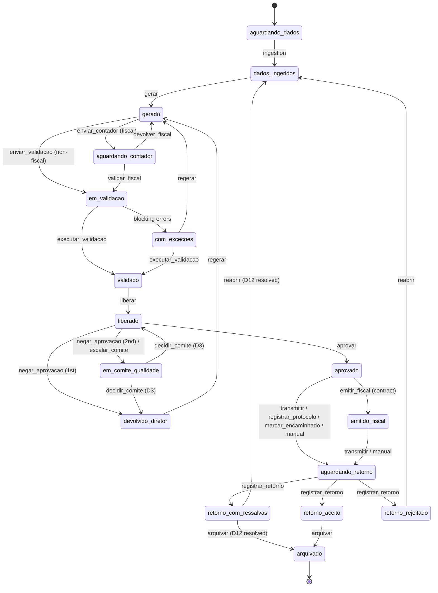

# Videnas - Front-end Backlog: Approval, Return and Archive Flow

**Date:** 2026-09-29
**Author role:** Product Owner
**Status:** R1 (E1 all, E2 all, E4-S1..S3, E11-S1, E11-S2, E11-S5) is implemented on branch `feat/r1-approval-flow`; R2 (E7-S1..S3, E7-S5, E8-S1, E8-S2, E8-S3, E8-S4, E11-S3, rest of E11-S2) is implemented on branch `feat/r2-return-archive`, see section 12. The target state machine below now reflects what R1 built; remaining epics (E3, E5-E10, E11-S3/S4, E12) are still proposals.

## 1. Scope

- **Front-end only.** Everything in this backlog is built inside the existing Next.js 16 + React 19 + TypeScript mockup.
- Data lives in `src/lib/mock/*`; state and transitions live in the Zustand stores in `src/lib/store/*` (`periodos.ts`, `evidencias.ts`, `tenants.ts`, `sessao.ts`). Permission and transition rules live in `src/lib/permissoes.ts`; domain types in `src/lib/tipos/index.ts`.
- **No backend, no API routes, no real transmission** to the Central Bank (BCB) or to any fiscal issuer. "Transmit", "issue" and "regulator return" are simulated in the store and recorded in the audit trail and the seal chain.
- Every rule that depends on an open business decision is kept as a **configurable flag in mock data** and flagged "Blocked by D#". No rule is invented.
- Out of scope: backend contracts, real KMS/HSM, real notifications (e-mail/Slack), real regulator integrations, new Figma designs (UI/UX owns those; stories reference existing components).

## 2. Glossary

Ids stay in Portuguese snake_case to match the code. English meaning in the second column.

### 2.1 Profiles (`PerfilId`)

| Id | Current UI label | Meaning |
|---|---|---|
| `cliente` | Cliente | Client data supplier. Only profile that uploads source inputs. |
| `executor` | Executor | Videnas operator who ingests and generates files. |
| `validador` | Validador | Videnas validator; runs schema validation and releases. Cannot release what they generated (SoD). |
| `contador` | Contador | Client accountant; Fiscal module only. |
| `diretor` | Compliance (label) | Client responsible director; approves and records protocol. Label vs name is D11. |
| `operacional` | Operacional | Client-side support; follows completeness and exceptions. |
| `admin` | Administrador | Videnas admin; provisions tenants and contracted modules. |

### 2.2 Current states (`EstadoPeriodo`)

| Id | Meaning |
|---|---|
| `aguardando_dados` | Waiting for client data |
| `dados_ingeridos` | Data ingested |
| `gerado` | File generated |
| `aguardando_contador` | Waiting for accountant (Fiscal) |
| `em_validacao` | Under schema validation |
| `validado` | Validated |
| `com_excecoes` | Validation found exceptions |
| `liberado` | Released by Validador to the client |
| `aprovado` | Approved by Diretor |
| `entregue` | Delivered / protocol recorded |
| `retorno_com_erro` | Regulator returned with error |

### 2.3 Proposed new states

| Id | Meaning |
|---|---|
| `devolvido_diretor` | Approval denied/returned by Diretor, with mandatory reason; back to Executor |
| `em_comite_qualidade` | Escalated to Quality Committee after the 2nd denial |
| `emitido_fiscal` | Fiscal document issued after approval (only if contract allows) |
| `aguardando_retorno` | Transmitted / protocol recorded; waiting for regulator (or issuer) return. Replaces `entregue` |
| `retorno_aceito` | Regulator accepted the file |
| `retorno_com_ressalvas` | Regulator accepted with caveats |
| `retorno_rejeitado` | Regulator rejected the file. Replaces `retorno_com_erro` |
| `arquivado` | Final state: archived with exit seal and retention date |

### 2.4 Actions (`AcaoId`) touched by this backlog

| Id | Status | Meaning |
|---|---|---|
| `gerar`, `regerar`, `enviar_validacao`, `enviar_contador`, `validar_fiscal`, `devolver_fiscal`, `executar_validacao`, `liberar`, `aprovar`, `reabrir` | existing | Generate, regenerate, send to validation, send to accountant, accountant confirms, accountant returns, run validation, release, approve, reopen |
| `registrar_protocolo` | existing, retargeted | Diretor records BCB protocol |
| `marcar_encaminhado` | existing, retargeted | Diretor marks Fiscal DPS as forwarded to issuer (when Videnas does not issue) |
| `registrar_retorno` | existing, extended | Record regulator return with outcome |
| `negar_aprovacao` | new | Diretor denies/returns approval with reason |
| `escalar_comite` | new (system) | Automatic escalation to Quality Committee |
| `decidir_comite` | new | Record Quality Committee decision |
| `emitir_fiscal` | new | Issue fiscal document after approval |
| `transmitir` | new | Videnas transmits to regulator |
| `registrar_protocolo_manual` | new | Manual protocol recording fallback |
| `arquivar` | new | Archive the period (final) |

## 3. Client answers (authoritative, summarized)

1. Videnas is the new name of Sentinellus.
2. V1/V2/V3 are validators.
3. Approval is **per execution module**, not a single approval for the three branches.
4. Issuance/transmission depends on the client contract. Transmission requires a **prior registration**, done either by Videnas or by the responsible Diretor.
5. "Fall-back arquivo" is the regulator return on receipt and validation of the file (protocol/return step), e.g. **ACAM213** for ACAM212.
6. Two approval denials escalate to a **Quality Committee**.
7. Internal Controls, Custody and Accounting are **client areas**, theoretically responsible for certain controls.
8. DeCripto is **out of scope** for this flow and this backlog (decision by Manuca, 2026-09-29).
9. The regulator return is registered, and the period is archived, by someone from the Videnas team (Executor or Validador); the Diretor and the Cliente do neither (D14, decision by Manuca, 2026-09-30).
10. Retention counts from the archiving date and is 5 years for now; the value may change and lives only in `configuracaoFluxo.retencao` (D2, decision by Manuca, 2026-09-30).
11. After a regulator return "accepted with caveats" both paths are valid: archive and reopen (D12, decision by Manuca, 2026-09-30).
12. Segregation of duties on archiving: whoever generated the current version of the file cannot archive the period, and whoever registered the regulator return cannot archive it either; both apply together and neither applies to `reabrir` (D17, decision by Manuca, 2026-09-30).

## 4. Gaps found and epic mapping

| Gap | Evidence in code | Epic |
|---|---|---|
| (a) No Diretor "No"/denial | `PERFIS` (`src/lib/permissoes.ts`) gives `diretor` only `aprovar`, `registrar_protocolo`, `marcar_encaminhado` | E2 |
| (b) No archived state | `EstadoPeriodo` ends at `entregue` / `retorno_com_erro` | E8 |
| (c) Fiscal issues before approval in the design | Code already orders `aprovar` before `marcar_encaminhado`, but there is no issuance action and the design shows issuance earlier; copy in `banner-posicionamento.tsx` states Videnas never issues | E5 |
| (d) No explicit protocol/return step per channel, no ACAM213 | `registrar_protocolo` jumps to `entregue`; `registrarRetorno` in `src/lib/store/periodos.ts` only changes state on `rejeitado`; `REGRAS_ACAO` only allows `entregue -> retorno_com_erro`; no ACAM213 type | E6, E7 |
| (e) Correction loop has no limit/escalation | `reabrir` can loop indefinitely | E3 |
| (f) Internal Controls, Custody, Accounting not in app | No area entity in `Instituicao` | E9 |
| (g) Re-approval does not go back through Validador by design | Only path back is Executor `reabrir` to `dados_ingeridos`; no Diretor-originated return that forces re-validation and re-release | E2 |
| (h) V1/V2/V3 not represented | Single `validador` user in `src/lib/mock/usuarios.ts` | E10 |

Additional technical observations relevant to sizing:

- `ROTULOS_ACAO` is duplicated in `src/lib/permissoes.ts` and `src/components/dominio/modulo-barra-acoes.tsx`.
- Exhaustive `Record<EstadoPeriodo, ...>` maps exist in `src/components/dominio/badge-status.tsx`, `src/app/app/page.tsx`, `src/app/app/acam212/page.tsx`, plus state keys in `src/lib/ajuda/textos.ts`; `Record<TipoEventoAuditoria, ...>` in `src/lib/mock/auditoria.ts`. Adding states/events breaks typecheck until all are updated (good: compiler finds them).
- Audit events (`EventoAuditoria`) are **not** hash-chained today; hash chaining exists on seals (`RegistroLacre.hashAnterior`, `encadearApos` in `src/lib/evidencias/lacre.ts`). E11 keeps seal chaining for every new artifact; chaining events themselves is D15.
- CSV export in `src/app/app/auditoria/page.tsx` is a toast only.
- `periodos`, `evidencias` and `tenants` all persist in `localStorage` (`videnas-periodos`, `videnas-evidencias`, `videnas-tenants`), so the flow survives logout/login and reload. New persisted fields need a hydration-safe default.
- No test tooling in `package.json` (only `lint`); no `typecheck` script (use `pnpm exec tsc --noEmit`).

## 5. Proposed target state machine (PROPOSED)

Module keys: `ACAM` = `acam212`, `C5710` = `cadoc5710`, `C5711` = `cadoc5711`, `FIS` = `fiscal`. "All" = all four.
The current `somenteFiscal` / `excetoFiscal` flags are proposed to become an explicit `modulos?: ModuloId[]` list on each rule.

| Action | From | To | Profile | Modules | Guard |
|---|---|---|---|---|---|
| `gerar` | `dados_ingeridos` | `gerado` | executor | All | At least one lot received (existing) |
| `regerar` | `com_excecoes`, **`devolvido_diretor`** | `gerado` | executor | All | From `devolvido_diretor`: new file version; previous file becomes `substituida` |
| `enviar_validacao` | `gerado` | `em_validacao` | executor | ACAM, C5710, C5711 | existing |
| `enviar_contador` | `gerado` | `aguardando_contador` | executor | FIS | existing; whether required again after a Diretor denial is D13 |
| `validar_fiscal` | `aguardando_contador` | `em_validacao` | contador | FIS | existing |
| `devolver_fiscal` | `aguardando_contador` | `gerado` | contador | FIS | existing; whether it counts as a denial is D9 |
| `executar_validacao` | `em_validacao`, `com_excecoes` | `validado` | validador | All | No open blocking exceptions (existing) |
| `liberar` | `validado` | `liberado` | validador | All | Generator cannot release (existing SoD); assigned validator(s) per branch (E10, D7) |
| `aprovar` | `liberado` | `aprovado` | diretor | All, **one module per approval** | Ciência text accepted; not in committee |
| `negar_aprovacao` | `liberado` | `devolvido_diretor` | diretor | All | Mandatory reason (min length, same rule as `reabrir`: 10 chars); increments denial counter |
| `escalar_comite` | `liberado` (on 2nd denial) | `em_comite_qualidade` | system (triggered by `negar_aprovacao`) | All | Denial counter reaches threshold (2, configurable); counting rules D8, D9 |
| `decidir_comite` | `em_comite_qualidade` | configurable (e.g. `devolvido_diretor` or `liberado`) | TBD (D3) | All | Outcomes, quorum and actor from mock config; Blocked by D3 |
| `emitir_fiscal` | `aprovado` | `emitido_fiscal` | TBD (D5) | FIS | Contract flag `emissao = true` for the module (D4) |
| `marcar_encaminhado` | `aprovado` | `aguardando_retorno` | diretor | FIS | Contract flag `emissao = false` |
| `transmitir` | `aprovado`, `emitido_fiscal` | `aguardando_retorno` | TBD Videnas profile (D5) | All | Contract flag `transmissao = true` and prior registration by Videnas exists (D4, D5) |
| `registrar_protocolo` | `aprovado` | `aguardando_retorno` | diretor | ACAM, C5710, C5711 | Prior registration by Diretor exists; protocol number and channel required |
| `registrar_protocolo_manual` | `aprovado`, `emitido_fiscal` | `aguardando_retorno` | diretor | All | Fallback when automatic transmission is unavailable; mandatory justification and sealed receipt |
| `registrar_retorno` (aceito) | `aguardando_retorno` | `retorno_aceito` | executor, validador (D14) | All | Return artifact fields for the module (ACAM213 for ACAM; others D6) |
| `registrar_retorno` (aceito_com_ressalvas) | `aguardando_retorno` | `retorno_com_ressalvas` | executor, validador (D14) | All | Caveat text mandatory |
| `registrar_retorno` (rejeitado) | `aguardando_retorno` | `retorno_rejeitado` | executor, validador (D14) | All | Rejection code mandatory; opens exception with origin `retorno_bcb` |
| `reabrir` | `retorno_rejeitado`, `retorno_com_ressalvas` (D12 resolved), `liberado`, `aprovado` | `dados_ingeridos` | executor | All | Reason min 10 chars (existing); `liberado`/`aprovado` origins kept as today pending refinement; no segregation rule (D17) |
| `arquivar` | `retorno_aceito`, `retorno_com_ressalvas` (D12 resolved) | `arquivado` | executor, validador (D14) | All | Exit seal created and chained; retention date computed from the archiving date (D2); blocked for the generator of the current file version and for the registrar of the return (D17) |

Read-only actions (`baixar_arquivo`, `baixar_comprovante`, `verificar_integridade`, `ver_evidencias`, `exportar_auditoria`) must add all new states, including `arquivado`, to their `estadosOrigem`.

## 6. Epics and stories

Priority scale: **P0 = Must**, **P1 = Should**, **P2 = Could** (MoSCoW). Relative estimate: **S / M / L** (weights 1 / 3 / 5 for totals).

---

### E1 - State machine and types foundation

**Goal:** make the proposed state machine the single source of truth for every screen, without breaking existing demo flows.
**Priority:** P0 (Must)

**E1-S1 - Extend domain types** (P0, M)
**Status (R1): done**
As an Executor, Validador or Diretor, I want the app to know the new states, actions and events, so that every screen can represent the full approval, return and archive lifecycle.
- Given the proposed tables, When `src/lib/tipos/index.ts` is updated, Then `EstadoPeriodo`, `AcaoId` and `TipoEventoAuditoria` include every new id in sections 2.3, 2.4 and E11-S1.
- Given `entregue` and `retorno_com_erro` are replaced, When the types change, Then no reference to the old ids remains outside the seed migration (E1-S4).
- Given the change, When `pnpm exec tsc --noEmit` runs, Then it passes.
- Files: `src/lib/tipos/index.ts`.
- Dependencies: none.

**E1-S2 - Rewrite transition rules and guards** (P0, L)
**Status (R1): done**
As a Validador, I want each period to expose only the actions allowed by the target state machine, so that no one can skip a control step.
- Given `REGRAS_ACAO` in `src/lib/permissoes.ts`, When rules are rewritten, Then each row of section 5 exists with `estadosOrigem`, `estadoDestino`, profile via `PERFIS[].acoesPermitidas` and module list via a new `modulos` field replacing `somenteFiscal` / `excetoFiscal`.
- Given a guard fails (e.g. missing reason, missing prior registration, contract flag off, period in committee), When `podeExecutar` is called, Then it returns `permitido: false`, `visivel: true` and a Portuguese `motivo`.
- Given an action from a Blocked story, When its mock flag is off, Then the action is hidden (`visivel: false`).
- Files: `src/lib/permissoes.ts`, `src/lib/store/periodos.ts` (`podeExecutar` wrapper).
- Dependencies: E1-S1.

**E1-S3 - Update every exhaustive state/action/event map** (P0, M)
**Status (R1): done**
As any user, I want new states to show the correct badge, label, help text and stepper position, so that the screen never shows a blank or wrong status.
- Given a new state, When it is rendered, Then `badge-status.tsx`, `src/app/app/page.tsx` (`ROTULOS_ESTADO`), `src/app/app/acam212/page.tsx`, `src/lib/ajuda/textos.ts`, `modulo-etapas.ts` / `stepper-etapas.tsx` and `modulo-etapa-entrega.tsx` all handle it.
- Given `ROTULOS_ACAO` exists twice, When updated, Then `src/components/dominio/modulo-barra-acoes.tsx` reuses the label source from `src/lib/permissoes.ts` (single source).
- Given `devolvido_diretor`, `em_comite_qualidade` or `retorno_rejeitado`, When the stepper renders, Then the current step shows the `erro` visual.
- Files: listed above plus `src/app/app/operacao/page.tsx`, `src/app/app/fornecimento/page.tsx`.
- Dependencies: E1-S1.

**E1-S4 - New period fields and seed migration** (P0, M)
**Status (R1): done**
As a demo presenter, I want the seed data to already contain periods in the new states, so that every flow can be shown without manual setup.
- Given `PeriodoObrigacao`, When extended, Then it holds at least: `negacoesAprovacao` (list of reason, user, timestamp, file id), `emComiteDesde`, `emitidoFiscalEm`, `transmitidoEm`, `retornoSituacao`, `arquivadoEm`, `arquivadoPorUsuarioId`, `retencaoAte`.
- Given seeds in `src/lib/mock/periodos.ts`, When migrated, Then `entregue` becomes `aguardando_retorno` or `retorno_aceito` according to the linked `ProtocoloBCB.situacaoRetorno`, and `retorno_com_erro` becomes `retorno_rejeitado`.
- Given the migrated seeds, When the demo starts, Then at least one period per module exists in each of: `liberado`, `devolvido_diretor`, `aguardando_retorno`, `retorno_aceito`, `arquivado`, and one period in `em_comite_qualidade`.
- Given `reiniciarMock`, When called, Then the new fields reset.
- Files: `src/lib/tipos/index.ts`, `src/lib/mock/periodos.ts`, `src/lib/store/periodos.ts`.
- Dependencies: E1-S1.

**E1-S5 - Mock configuration for pending rules** (P0, M)
**Status (R1): done**
As the product team, I want every rule tied to an open decision to live in one mock config, so that we can switch behaviour after each decision without code rewrites.
- Given a new file (proposed `src/lib/mock/configuracao-fluxo.ts`), When read, Then it exposes per institution and per module: contract flags (`emissao`, `transmissao`), prior registration (`responsavel: "videnas" | "diretor" | null`, date, identifier), denial threshold (default 2), counter reset rule, whether Contador returns count, committee outcomes, retention rule, return artifact per module, validator assignment mode, client area ownership.
- Given a flag is undefined, When a guard reads it, Then the action is hidden, never allowed by default.
- Files: new mock file, `src/lib/mock/index.ts`.
- Dependencies: E1-S1.

---

### E2 - Diretor denial with mandatory reason and re-validation loop

**Goal:** let the Diretor say "No" with a reason and force the correction back through Executor, Validador and a new release before a new approval.
**Priority:** P0 (Must)

**E2-S1 - Deny approval with mandatory reason** (P0, M)
**Status (R1): done**
As a Diretor, I want to deny or return a released file with a mandatory reason, so that I do not have to approve something I disagree with.
- Given a period in `liberado`, When the Diretor opens the action bar, Then a "Devolver / negar aprovação" action appears next to "Aprovar".
- Given the dialog, When the reason has fewer than 10 characters, Then confirm is disabled and the reason field shows the error.
- Given a valid reason, When confirmed, Then the period goes to `devolvido_diretor`, the denial is appended to `negacoesAprovacao`, and event `APROVACAO_NEGADA` is recorded with reason and file hash.
- Files: `src/components/dominio/modulo-barra-acoes.tsx`, `src/lib/store/periodos.ts` (new `negarAprovacao`), `src/lib/permissoes.ts`.
- Dependencies: E1-S2, E1-S4.

**E2-S2 - Executor sees denial reason and regenerates** (P0, M)
**Status (R1): done**
As an Executor, I want to see the Diretor's reason and regenerate a new version, so that I fix exactly what was questioned.
- Given `devolvido_diretor`, When the Executor opens the period, Then a banner shows the latest reason, author and timestamp.
- Given `devolvido_diretor`, When `regerar` runs, Then a new file version is created, the previous becomes `substituida`, the state becomes `gerado`, and event `ARQUIVO_REGERADO` references the denial.
- Given the operation queue, When filtered, Then periods in `devolvido_diretor` appear with a "Returned by Diretor" tag.
- Files: `src/components/dominio/modulo-detalhe-periodo.tsx`, `src/components/dominio/painel-arquivo.tsx`, `src/app/app/operacao/page.tsx`, `src/lib/store/periodos.ts`.
- Dependencies: E2-S1.

**E2-S3 - Mandatory re-validation and new release** (P0, S)
**Status (R1): done — default kept as today for Fiscal (D13 undecided), see note below**
As a Validador, I want a regenerated file to go through validation and release again, so that the Diretor never re-approves an unvalidated version.
- Given a period regenerated from `devolvido_diretor`, When the Executor proceeds, Then only `enviar_validacao` (non-fiscal) or `enviar_contador` (Fiscal, if D13 says so; else configurable) is available.
- Given release, When the Validador is the generator, Then SoD block applies as today.
- Given a Fiscal period and D13 undecided, When configured, Then the mock flag decides whether Contador is required again. **Blocked by D13** for the default.
- Files: `src/lib/permissoes.ts`, `src/lib/store/periodos.ts`.
- Dependencies: E2-S2.

**E2-S4 - Denial history visible on re-approval** (P0, S)
**Status (R1): done — verified live end-to-end across logins (2026-09-29): see §11 persistence note**
As a Diretor, I want to see previous denials and what changed, so that my new decision is informed.
- Given a period with at least one denial, When the Diretor opens the approval dialog, Then it lists previous reasons, dates and the file versions/hashes involved.
- Given the period timeline, When rendered, Then denial events appear in `timeline-auditoria.tsx`.
- Files: `src/components/dominio/modulo-barra-acoes.tsx`, `src/components/dominio/timeline-auditoria.tsx`.
- Dependencies: E2-S1.

---

### E3 - Denial counter and Quality Committee escalation

**Goal:** cap the correction loop at two denials and escalate to the Quality Committee.
**Priority:** P1 (Should)

**E3-S1 - Visible denial counter** (P1, S)
As a Diretor, I want to see how many times this file was denied, so that I know when the next denial escalates.
- Given a period with denials, When shown, Then a counter "n of 2" (threshold from config) appears in the period header and approval dialog.
- Given the reset rule and Contador-return rule are undecided, When the counter is computed, Then it follows the mock flags. **Blocked by D8, D9** for defaults.
- Files: `src/components/dominio/modulo-detalhe-periodo.tsx`, `src/components/dominio/modulo-barra-acoes.tsx`.
- Dependencies: E2-S1, E1-S5.

**E3-S2 - Automatic escalation on 2nd denial** (P1, M)
As a Diretor, I want my second denial to escalate automatically to the Quality Committee, so that the loop does not repeat indefinitely.
- Given the counter is at threshold minus one, When the Diretor denies with a reason, Then the dialog warns about escalation before confirming.
- Given confirmation, When saved, Then the state becomes `em_comite_qualidade` and events `APROVACAO_NEGADA` and `COMITE_QUALIDADE_ACIONADO` are recorded.
- Given `em_comite_qualidade`, When any pipeline profile opens the period, Then all mutating actions are hidden and a banner explains the escalation.
- Files: `src/lib/store/periodos.ts`, `src/lib/permissoes.ts`, `src/components/dominio/modulo-detalhe-periodo.tsx`.
- Dependencies: E3-S1.

**E3-S3 - Record committee decision** (P1, M) **Blocked by D3**
As a Quality Committee member, I want to record the committee decision with justification, so that the period leaves the committee with a traceable outcome.
- Given `em_comite_qualidade`, When the configured actor opens the period, Then `decidir_comite` offers only the outcomes listed in mock config.
- Given a decision, When saved, Then the state follows the configured target, event `COMITE_QUALIDADE_DECIDIU` stores outcome, justification and participants.
- Files: `src/components/dominio/modulo-barra-acoes.tsx`, `src/lib/store/periodos.ts`, `src/lib/permissoes.ts` (profile/actor TBD).
- Dependencies: E3-S2, E1-S5.

**E3-S4 - Committee items in dashboard and queue** (P1, S)
As an Operacional or Diretor, I want periods in committee to stand out with deadline risk, so that regulatory deadlines are not missed.
- Given periods in `em_comite_qualidade`, When the dashboard and operation queue load, Then they appear in a dedicated group with days to deadline.
- Files: `src/app/app/page.tsx`, `src/components/dominio/card-modulo-dashboard.tsx`, `src/app/app/operacao/page.tsx`, `src/app/app/calendario/page.tsx`.
- Dependencies: E3-S2.

---

### E4 - Per-module approval UX

**Goal:** make explicit that each execution module is approved on its own.
**Priority:** P0 (Must)

**E4-S1 - Approval dialog scoped to one module** (P0, S)
**Status (R1): done**
As a Diretor, I want the approval dialog to show exactly which module, competence, file version, hash and validator I am approving, so that my responsibility is unambiguous.
- Given `liberado`, When "Aprovar" opens, Then the dialog shows module name, competence, file version, SHA-256, releasing Validador and the per-module ciência text.
- Given approval, When saved, Then `PERIODO_APROVADO` payload includes `moduloId` and file version.
- Files: `src/components/dominio/modulo-barra-acoes.tsx`, `src/lib/store/periodos.ts`.
- Dependencies: E1-S2.

**E4-S2 - Pending approvals grouped by module** (P0, M)
**Status (R1): done**
As a Diretor, I want my dashboard to list pending approvals per module, so that I decide each one separately.
- Given periods in `liberado` for several modules, When the Diretor opens `/app`, Then they are grouped by module with a link to each period.
- Given the list, When shown, Then there is no bulk approve across modules.
- Files: `src/app/app/page.tsx`, `src/components/dominio/card-modulo-dashboard.tsx`.
- Dependencies: E4-S1.

**E4-S3 - Cadoc 5710 and 5711 approved separately** (P0, S)
**Status (R1): done (already true by construction; verified, no change needed beyond E1/E4-S1)**
As a Diretor, I want Cadoc 5710 and 5711 to be approved independently even though they share a route, so that one does not block the other.
- Given `/app/cadoc`, When listing, Then each competence row shows its own module and state.
- Given one Cadoc module is denied, When the other is `liberado`, Then its approval remains available.
- Files: `src/app/app/cadoc/page.tsx`, `src/app/app/cadoc/[periodoId]/page.tsx`.
- Dependencies: E4-S1.

**E4-S4 - Consistent approver label** (P0, S) **Blocked by D11**
As any user, I want the approver to have one consistent name, so that roles are not confused.
- Given D11 decided, When rendered, Then `PERFIS` label, help texts, tutorial scripts and README use the same term.
- Files: `src/lib/permissoes.ts`, `src/lib/ajuda/textos.ts`, `src/components/tutorial/roteiros.ts`, `README.md`, `docs/resumo-executivo-videnas.md`.
- Dependencies: D11.

---

### E5 - Fiscal issuance after approval, gated by contract

**Goal:** Fiscal issuance happens only after approval and only if the client contract includes it.
**Priority:** P1 (Should)

**E5-S1 - Contract flags per module** (P1, M)
As an Administrador, I want to see and set, per contracted module, whether issuance and transmission are included, so that the pipeline enables only what was sold.
- Given `/app/clientes/[id]`, When the Admin views contracted modules, Then each shows `emissao` and `transmissao` toggles from mock config.
- Given a change, When saved, Then event `MODULOS_CONTRATADOS_ALTERADOS` records the flag change.
- Files: `src/components/clientes/ficha-cliente.tsx`, `src/components/dominio/item-modulo-contratado.tsx`, `src/lib/store/tenants.ts`.
- Dependencies: E1-S5. Default values **Blocked by D4**.

**E5-S2 - Issue fiscal document only after approval** (P1, M) **Blocked by D4, D5**
As the responsible issuer (actor TBD), I want to issue the Fiscal document only after the Diretor approved it, so that nothing is issued without approval.
- Given `aprovado` in Fiscal and `emissao = true`, When the actor opens the period, Then `emitir_fiscal` is available and moves to `emitido_fiscal` with event `DOCUMENTO_FISCAL_EMITIDO`.
- Given any state before `aprovado`, When checked, Then `emitir_fiscal` is not visible.
- Given `emissao = false`, When `aprovado`, Then only `marcar_encaminhado` is available (existing behaviour, now to `aguardando_retorno`).
- Files: `src/lib/permissoes.ts`, `src/lib/store/periodos.ts`, `src/components/dominio/modulo-barra-acoes.tsx`.
- Dependencies: E5-S1, E1-S2.

**E5-S3 - Explain why issuance is unavailable** (P1, S)
As a Diretor, I want a clear message when issuance is not part of the contract, so that I know I must forward the DPS myself.
- Given `emissao = false`, When the Fiscal period is `aprovado`, Then the delivery step explains the contract limit and the forwarding path.
- Files: `src/components/dominio/modulo-etapa-entrega.tsx`, `src/components/dominio/banner-posicionamento.tsx`.
- Dependencies: E5-S1.

**E5-S4 - Contract-aware positioning copy** (P1, S)
As a client user, I want the "Videnas does not issue NFS-e" copy to reflect my contract, so that the product never contradicts what I bought.
- Given `emissao = true`, When the Fiscal banners render, Then they do not claim Videnas never issues.
- Files: `src/components/dominio/banner-posicionamento.tsx`, `src/components/dominio/selo-candidato.tsx`, `src/lib/ajuda/textos.ts`, `src/lib/mock/modulos.ts` (`descricaoCurta`).
- Dependencies: E5-S1.

---

### E6 - Transmission prerequisites and manual protocol fallback

**Goal:** transmission only happens with a prior registration (by Videnas or by the Diretor), with a manual protocol fallback.
**Priority:** P1 (Should)

**E6-S1 - Prior registration record** (P1, M) **Blocked by D5**
As a Diretor, I want to see whether the prior registration needed for transmission exists and who holds it, so that I know if transmission can happen.
- Given `/app/configuracoes/instituicao`, When viewed, Then each module shows prior registration responsible (`videnas` / `diretor` / none), date and identifier.
- Given the Admin ficha, When viewed, Then the same data is visible read-only.
- Files: `src/app/app/configuracoes/instituicao/page.tsx`, `src/components/clientes/ficha-cliente.tsx`, mock config (E1-S5).
- Dependencies: E1-S5.

**E6-S2 - Videnas transmits when allowed** (P1, M) **Blocked by D4, D5**
As a Videnas operator (profile TBD), I want to transmit an approved file when the contract and prior registration allow it, so that the client does not need to do it manually.
- Given `aprovado` (or `emitido_fiscal`), `transmissao = true` and prior registration by Videnas, When the actor opens the period, Then `transmitir` is available and moves to `aguardando_retorno`, recording event `TRANSMISSAO_REALIZADA` with a simulated receipt.
- Given any guard fails, When checked, Then `motivo` names the missing prerequisite.
- Given SoD, When the actor also generated the file, Then the rule defined in D5 applies (default: blocked).
- Files: `src/lib/permissoes.ts`, `src/lib/store/periodos.ts`, `src/components/dominio/modulo-barra-acoes.tsx`.
- Dependencies: E6-S1, E5-S1.

**E6-S3 - Diretor records protocol when registration is theirs** (P1, S)
As a Diretor, I want to record the protocol when I hold the prior registration, so that the external transmission is traceable.
- Given `aprovado` and prior registration by Diretor, When `registrar_protocolo` is confirmed with protocol number and channel, Then the state becomes `aguardando_retorno` and `ENTREGA_REGISTRADA` is recorded.
- Files: `src/components/dominio/modulo-barra-acoes.tsx`, `src/lib/store/periodos.ts` (`registrarEntrega`).
- Dependencies: E1-S2, E6-S1.

**E6-S4 - Manual protocol fallback** (P1, M)
As a Diretor, I want to record a protocol manually when automatic transmission is unavailable, so that the period does not get stuck.
- Given `aprovado` or `emitido_fiscal`, When `registrar_protocolo_manual` is used, Then a justification (min 10 chars), protocol number, channel and receipt file are mandatory.
- Given the receipt file, When saved, Then it is sealed (SHA-256, chained with `encadearApos`) and event `PROTOCOLO_MANUAL_REGISTRADO` is recorded.
- Files: `src/components/dominio/modulo-barra-acoes.tsx`, `src/lib/store/periodos.ts`, `src/lib/store/evidencias.ts`, `src/lib/evidencias/lacre.ts`.
- Dependencies: E1-S2, E11-S2.

**E6-S5 - Channel options per module** (P1, S)
As a Diretor, I want channel choices that match the module, so that I cannot record a BCB channel for a fiscal issuer.
- Given ACAM212/Cadoc, When recording, Then only `CanalEnvioBcb` values are offered; Given Fiscal, Then an issuer name field is offered.
- Files: `src/components/dominio/modulo-barra-acoes.tsx`, `src/lib/tipos/index.ts`.
- Dependencies: E6-S3.

---

### E7 - Regulator return step with three outcomes

**Goal:** represent the regulator return ("fall-back arquivo") explicitly: ACAM213 for ACAM212, per-channel equivalents for the others.
**Priority:** P0 (Must)

**E7-S1 - Waiting-for-return state** (P0, S)
**Status (R2): done — days since transmission and protocol number in the Validador operation queue, module lists (ACAM212, Cadoc 5711/5710, Fiscal) and the period delivery tab**
As a Validador, I want transmitted periods to wait visibly for the regulator return, so that none is forgotten.
- Given `aguardando_retorno`, When listed in operation queue and module lists, Then it shows days since transmission and the protocol number.
- Files: `src/app/app/operacao/page.tsx`, `src/app/app/acam212/page.tsx`, `src/app/app/cadoc/page.tsx`, `src/app/app/fiscal/page.tsx`, `src/components/dominio/modulo-etapa-entrega.tsx`.
- Dependencies: E1-S3.

**E7-S2 - Record return with outcome** (P0, M)
**Status (R2): done — required 3-option radio, code and message required, caveat text min 10 chars, `situacaoRetorno` matches; the record also seals the return (see E11-S2)**
As a Validador, I want to record the return as accepted, accepted with caveats or rejected, so that the period follows the correct next step.
- Given `aguardando_retorno`, When `registrar_retorno` opens, Then the outcome is a required radio (3 options), return code and message are required, caveat text is required for "with caveats".
- Given each outcome, When saved, Then the state becomes `retorno_aceito`, `retorno_com_ressalvas` or `retorno_rejeitado` and events `RETORNO_ACEITO`, `RETORNO_ACEITO_COM_RESSALVAS` or `RETORNO_REJEITADO` are recorded (today only accepted/rejected exist).
- Given `ProtocoloBCB.situacaoRetorno`, When saved, Then it matches the outcome.
- Files: `src/lib/store/periodos.ts` (`registrarRetorno`), `src/components/dominio/modulo-barra-acoes.tsx`, `src/components/ui/radio-group.tsx`.
- Dependencies: E1-S2.

**E7-S3 - ACAM213 return artifact for ACAM212** (P0, M)
**Status (R2): done — dialog titled ACAM213 with identifier, date, code, message and optional attached file; attached file sealed and chained, plus a sealed return receipt**
As a Validador, I want the ACAM212 return to be recorded as an ACAM213 artifact, so that it matches the regulator vocabulary.
- Given an ACAM212 period in `aguardando_retorno`, When recording the return, Then the dialog is titled with ACAM213 and captures its identifier, date, code, message and an optional attached file.
- Given an attached file, When saved, Then it is sealed and chained (E11-S2).
- Files: `src/components/dominio/modulo-barra-acoes.tsx`, `src/components/dominio/modulo-etapa-entrega.tsx`, `src/lib/tipos/index.ts`, mock config.
- Dependencies: E7-S2.

**E7-S4 - Per-channel return artifacts for other modules** (P0, S) **Blocked by D6**
**Status (R2): not in R2 — Cadoc 5710/5711 and Fiscal use the generic "Retorno do regulador/emissor" label (`ROTULO_RETORNO_GENERICO`); per-channel labels/fields still come with D6**
As a Validador, I want Cadoc 5710/5711 and Fiscal returns to use their own artifact names and fields, so that each channel is recorded correctly.
- Given mock config per module, When recording, Then labels and fields come from config; until D6 is decided, a generic "Regulator/issuer return" label is used.
- Files: mock config, `src/components/dominio/modulo-barra-acoes.tsx`.
- Dependencies: E7-S2.

**E7-S5 - Next steps after rejection or caveats** (P0, M)
**Status (R2): done — rejection opens an exception with origin `retorno_bcb` and `reabrir` (Executor) closes it; from `retorno_com_ressalvas` both paths are available (`caminhosAposRessalvas: ["arquivar", "reabrir"]`, D12 resolved on 2026-09-30)**
As an Executor, I want a rejected return to open an exception and allow reopening, so that the correction starts immediately.
- Given `retorno_rejeitado`, When saved, Then an exception with origin `retorno_bcb` is opened and `reabrir` is available to the Executor.
- Given `retorno_com_ressalvas`, When shown, Then both `arquivar` (executor, validador) and `reabrir` (Executor, back to `dados_ingeridos`) are available, following `caminhosAposRessalvas` (D12 resolved). The caveat recorded at the return appears in the archive dossier (`retorno.situacao` and `retorno.mensagem`).
- Files: `src/lib/store/periodos.ts`, `src/components/dominio/modulo-painel-excecoes.tsx`, `src/lib/mock/excecoes.ts`.
- Dependencies: E7-S2.

---

### E8 - Archive final state, exit seal and retention

**Goal:** close each period with an archived state, a final chained seal and a visible retention date.
**Priority:** P1 (Should)

**E8-S1 - Archive a period** (P1, M) **Actor: Videnas team (D14 resolved)**
**Status (R2): done — `arquivar` produces `arquivado` + `PERIODO_ARQUIVADO` and the period becomes read-only; visible by default to Executor and Validador (`configuracaoFluxo.arquivamentoPerfis`); from `retorno_com_ressalvas` too (D12 resolved); blocked for the generator of the current file version and for the registrar of the return (D17)**
As the archiving actor, I want to archive a period after an accepted return, so that it is closed and read-only.
- Given `retorno_aceito` (and `retorno_com_ressalvas`, D12 resolved), When `arquivar` is confirmed, Then the state becomes `arquivado` and `PERIODO_ARQUIVADO` is recorded.
- Given `arquivado`, When any user opens the period, Then only read-only actions are available.
- Files: `src/lib/permissoes.ts`, `src/lib/store/periodos.ts`, `src/components/dominio/modulo-barra-acoes.tsx`.
- Dependencies: E7-S2.

**E8-S2 - Exit seal on archive** (P1, M)
**Status (R2): done — dossier sealed with `construirLacre`, chained with `encadearApos` to the last period seal, listed in `/app/evidencias`, "Verificar integridade" works on it**
As a Diretor, I want archiving to produce a final seal chained to the period seal chain, so that the closed dossier is tamper-evident.
- Given archive, When confirmed, Then a seal is built with `construirLacre` over a dossier summary (file hash, approvals, denials, protocol, return), chained via `encadearApos` to the last seal of the period.
- Given `/app/evidencias`, When opened, Then the archive seal is listed and "Verificar integridade" works on it.
- Given `localStorage` data from before this change, When hydrated, Then existing seals remain valid.
- Files: `src/lib/store/evidencias.ts`, `src/lib/evidencias/lacre.ts`, `src/components/evidencias/detalhe-lacre.tsx`, `src/components/evidencias/linha-do-tempo-cadeia.tsx`, `src/app/app/evidencias/page.tsx`.
- Dependencies: E8-S1, E11-S2.

**E8-S3 - Retention display** (P1, S) **D2 resolved**
**Status (R2): done — the archived period shows "Retido até <date>" (archiving date + `configuracaoFluxo.retencao.anos`, 5 for now) in the archive card and in the archived banner; the value is also stored in `PeriodoObrigacao.retencaoAte`, in the dossier and in the `PERIODO_ARQUIVADO` payload. Display and record only: nothing is purged or blocked when the term ends. The legal basis text (`retencao.baseLegal`) is shown when configured; it is not set because no legal basis was given**
As a Diretor, I want to see until when an archived period must be retained, so that I can answer audits.
- Given `arquivado`, When shown, Then "Retain until" is computed from the configured rule (start date and years) and the legal basis text when configured.
- Files: `src/components/dominio/modulo-detalhe-periodo.tsx`, `src/app/app/entregas/page.tsx`, mock config.
- Dependencies: E8-S1.

**E8-S4 - Archived filters** (P1, S)
**Status (R2): done — archived hidden by default in ACAM212, Cadoc, Fiscal lists, deliveries, operation queue and calendar, with a "Mostrar arquivados" switch (ACAM212 also has Arquivado in the state select)**
As any pipeline user, I want to filter archived periods in or out, so that active work is not buried.
- Given module lists, deliveries, operation queue and calendar, When filtered, Then "Archived" is a state option and hidden from active queues by default.
- Files: `src/app/app/acam212/page.tsx`, `src/app/app/cadoc/page.tsx`, `src/app/app/fiscal/page.tsx`, `src/app/app/entregas/page.tsx`, `src/app/app/operacao/page.tsx`, `src/app/app/calendario/page.tsx`.
- Dependencies: E8-S1.

---

### E9 - Client areas as control owners and recipients

**Goal:** represent Internal Controls, Custody and Accounting as client areas that own or receive certain controls.
**Priority:** P2 (Could)

**E9-S1 - Client area catalogue** (P2, M)
As a Diretor, I want to register my Internal Controls, Custody and Accounting areas with contacts, so that the platform knows who owns which control.
- Given `/app/configuracoes/instituicao`, When opened, Then the three areas can be viewed and edited (name, contact, e-mail) in mock state.
- Given a save, When done, Then `CONFIG_INSTITUICAO_ALTERADA` is recorded.
- Files: `src/app/app/configuracoes/instituicao/page.tsx`, `src/lib/tipos/index.ts`, `src/lib/store/tenants.ts`.
- Dependencies: E1-S5.

**E9-S2 - Control ownership per module** (P2, M) **Blocked by D10**
As an Operacional, I want each module/stage to show which client area owns the related control, so that I know whom to contact.
- Given mock mapping, When a period renders, Then "Control owner" chips show per stage; unmapped stages show nothing.
- Files: `src/components/dominio/modulo-detalhe-periodo.tsx`, `src/components/dominio/stepper-etapas.tsx`, mock config.
- Dependencies: E9-S1.

**E9-S3 - Area notifications (simulated)** (P2, S)
As a Custody (or other) area contact, I want to be notified of relevant events, so that I can perform my control.
- Given an event mapped to an area (e.g. approval, return), When it happens, Then a simulated notification toast appears and `AREA_CLIENTE_NOTIFICADA` is recorded.
- Files: `src/lib/store/periodos.ts`, `src/components/ui/sonner.tsx`.
- Dependencies: E9-S2.

**E9-S4 - Optional area sign-off** (P2, L) **Blocked by D10**
As a client area, I want to sign off my control before approval (only if D10 says areas approve), so that my responsibility is recorded.
- Given D10 = areas approve, When a period reaches the configured step, Then approval is blocked until each required area signs off.
- Files: `src/lib/permissoes.ts`, `src/lib/store/periodos.ts`, `src/components/dominio/modulo-barra-acoes.tsx`.
- Dependencies: E9-S2.

---

### E10 - Validators V1/V2/V3 per branch

**Goal:** show which validator (V1, V2, V3) is responsible for each branch.
**Priority:** P2 (Could)

**E10-S1 - Validator roster and assignment** (P2, M) **Blocked by D7**
As an Operacional, I want three validators (V1, V2, V3) assigned per branch, so that responsibility is visible.
- Given mock users, When seeded, Then three `validador` users exist with V1/V2/V3 tags and assignment per module/branch from mock config.
- Given `/app/configuracoes/usuarios`, When listed, Then the tag is visible.
- Files: `src/lib/mock/usuarios.ts`, `src/lib/usuarios/rotulos.ts`, `src/app/app/configuracoes/usuarios/page.tsx`.
- Dependencies: E1-S5.

**E10-S2 - Show assigned validator in period, queue and approval** (P2, S)
As a Diretor, I want to see which validator released each branch, so that I know who vouched for it.
- Given a period, When rendered, Then the assigned and releasing validator (with tag) appear in the header, operation queue and approval dialog.
- Files: `src/components/dominio/modulo-detalhe-periodo.tsx`, `src/app/app/operacao/page.tsx`, `src/components/dominio/modulo-barra-acoes.tsx`, `src/components/dominio/identidade-usuario.tsx`.
- Dependencies: E10-S1.

**E10-S3 - Sequential sign-offs (only if sequential)** (P2, L) **Blocked by D7**
As a V2/V3 validator, I want to sign off after the previous validator, so that multi-level validation is enforced.
- Given D7 = sequential, When releasing, Then `liberar` requires the previous level sign-off and each sign-off is recorded.
- Files: `src/lib/permissoes.ts`, `src/lib/store/periodos.ts`.
- Dependencies: E10-S1.

---

### E11 - Audit trail and hash chain for all new events (cross-cutting)

**Goal:** every new transition is auditable and every new artifact is sealed and chained.
**Priority:** P0 (Must)

**E11-S1 - New audit event types** (P0, M)
**Status (R1): done**
As an auditor using `/app/auditoria`, I want every new transition to emit a labelled event with payload, so that the full history is reconstructable.
- Given new types (`APROVACAO_NEGADA`, `COMITE_QUALIDADE_ACIONADO`, `COMITE_QUALIDADE_DECIDIU`, `DOCUMENTO_FISCAL_EMITIDO`, `TRANSMISSAO_REALIZADA`, `PROTOCOLO_MANUAL_REGISTRADO`, `RETORNO_ACEITO`, `RETORNO_ACEITO_COM_RESSALVAS`, `RETORNO_REJEITADO`, `PERIODO_ARQUIVADO`, `AREA_CLIENTE_NOTIFICADA`), When added, Then `ROTULOS_TIPO` in `src/lib/mock/auditoria.ts` has labels and each store action emits via `construirEvento`.
- Given each event, When stored, Then payload includes actor, previous state, new state, file hash and, when applicable, reason/outcome/counter.
- Given `RETORNO_BCB_ACEITO` / `RETORNO_BCB_REJEITADO` exist, When migrated, Then seeds and filters use the new names (or keep old names as aliases, decided in refinement).
- Files: `src/lib/tipos/index.ts`, `src/lib/mock/auditoria.ts`, `src/lib/store/periodos.ts`.
- Dependencies: E1-S1.

**E11-S2 - Seal and chain every new artifact** (P0, M)
**Status (R1): partial — applied to the regenerated file after a Diretor denial only, as scoped for R1; manual receipts/ACAM213/archive dossier are later slices**
**Status (R2): ACAM213/return receipt and archive dossier done; manual protocol receipts (E6-S4) remain for R4**
As a Diretor, I want manual protocol receipts, return artifacts (ACAM213 and others) and the archive dossier to be sealed in the same chain, so that the custody chain stays verifiable end to end.
- Given a new artifact, When saved, Then `construirLacre` and `encadearApos` (`src/lib/evidencias/lacre.ts`) are used, with the period chain key.
- Given `DialogoVerificarIntegridade`, When run on any new seal, Then it verifies.
- Files: `src/lib/store/evidencias.ts`, `src/lib/evidencias/lacre.ts`, `src/components/evidencias/dialogo-verificar-integridade.tsx`.
- Dependencies: E1-S1.

**E11-S3 - Filters and views for new events and seals** (P0, S)
**Status (R2): done — event type filter in `/app/auditoria`, artifact kind filter and badge in `/app/evidencias`, kind badge in seal detail and chain timeline**
As an auditor, I want to filter by the new event types and see new seal kinds, so that I can inspect denials, escalations, returns and archives quickly.
- Given `/app/auditoria` and `/app/evidencias`, When filtering, Then new types appear in filters; seal detail shows the artifact kind.
- Files: `src/app/app/auditoria/page.tsx`, `src/app/app/evidencias/page.tsx`, `src/components/evidencias/badge-sentido.tsx`, `src/components/evidencias/detalhe-lacre.tsx`.
- Dependencies: E11-S1, E11-S2.

**E11-S4 - Real client-side CSV export** (P1, S)
As an auditor, I want "Exportar trilha (CSV)" to download the filtered trail, so that I can hand it to external reviewers.
- Given filters applied, When export is clicked, Then a CSV is generated in the browser (no network) with the filtered events and payload summary, and `TRILHA_EXPORTADA` is recorded.
- Files: `src/app/app/auditoria/page.tsx`.
- Dependencies: E11-S1.

**E11-S5 - Period timeline shows new milestones** (P0, S)
**Status (R1): done**
As any pipeline user, I want the period timeline to show denials, committee, transmission, return and archive, so that the story of the period is visible in one place.
- Files: `src/components/dominio/timeline-auditoria.tsx`, `src/components/dominio/modulo-detalhe-periodo.tsx`.
- Dependencies: E11-S1.

---

### E12 - QA: unit and e2e coverage

**Goal:** protect the state machine with automated tests.
**Priority:** P2 (Could). **Blocked by D16**: `package.json` has no test runner (only `lint`), so tooling is a pending decision.

**E12-S1 - Test tooling decision and setup** (P2, M) **Blocked by D16**
As a front-end developer, I want an agreed unit and e2e test setup, so that transitions can be tested automatically.
- Given D16 decided, When set up, Then `pnpm test` (unit) and an e2e command run locally and are documented in `README.md`.
- Files: `package.json`, test config files, `README.md`.
- Dependencies: D16.

**E12-S2 - Transition table unit tests** (P2, M)
As a Validador, I want every transition row of section 5 covered by a test, so that regressions in permissions are caught.
- Given each row, When `podeExecutar` / `acoesDisponiveis` run for allowed and disallowed profiles, modules and states, Then results match the table, including SoD and reason guards.
- Files: `src/lib/permissoes.ts` (under test).
- Dependencies: E12-S1, E1-S2.

**E12-S3 - Store tests for denial loop and escalation** (P2, M)
As a Diretor, I want the denial counter and escalation logic tested, so that the second denial always escalates.
- Files: `src/lib/store/periodos.ts` (under test).
- Dependencies: E12-S1, E3-S2.

**E12-S4 - E2E happy and unhappy paths** (P2, L)
As the product team, I want e2e scenarios per module, so that demos never break.
- Scenarios: happy path to `arquivado` per module; single denial then re-approval; double denial to committee; rejected return then reopen; manual protocol fallback.
- Dependencies: E12-S1, E2, E3, E6, E7, E8.

## 7. Pending decisions

| Id | Question | Why it matters | Owner (if known) | Blocks |
|---|---|---|---|---|
| D1 | **Resolved (2026-09-29):** DeCripto is out of scope for this flow and this backlog (decision by Manuca; client answer 8). | No DeCripto artifact, module or return channel is added | Manuca | None |
| D2 | **Resolved (2026-09-30, decision by Manuca):** retention counts from the archiving date and is 5 years for now (configurable in `configuracaoFluxo.retencao`). Legal basis still not informed. | "Retain until" is archive date + 5 years | Manuca | None |
| D3 | Quality Committee: composition, quorum, possible outcomes, who records the decision in the app, target state per outcome | Committee step cannot be completed without it | Unknown (client governance) | E3-S3 |
| D4 | Which contracts allow issuance and/or transmission, per module | Default contract flags | Unknown (commercial / client) | E5-S1 defaults, E5-S2, E6-S2 |
| D5 | Who performs the prior registration, what it contains, which Videnas profile transmits or issues, and SoD rule for that actor | Guards for `transmitir`, `emitir_fiscal`; registration screen fields | Unknown; Fiscal part: Carlos | E5-S2, E6-S1, E6-S2 |
| D6 | Return artifacts per channel for Cadoc 5710/5711 and Fiscal (ACAM213 is known only for ACAM212) | Labels and fields of the return step | Caio (Cadoc), Carlos (Fiscal) | E7-S4 |
| D7 | V1/V2/V3: sequential or parallel? Do they map to branches or to seniority? What exactly are the "three branches" (ACAM212 / Cadoc / Fiscal, or ACAM212 / 5710 / 5711)? | Validator assignment and release guard | Unknown | E10-S1, E10-S3 |
| D8 | Does the denial counter reset per period, per file version, or never within a competence? | Correct escalation trigger | Unknown | E3-S1 |
| D9 | Do Contador returns (`devolver_fiscal`) count toward the 2 denials? | Fiscal escalation behaviour | Carlos (Fiscal) | E3-S1 |
| D10 | Do client areas (Internal Controls, Custody, Accounting) approve, or only receive? Which controls does each own? | Adds a sign-off step or only notifications | Client | E9-S2, E9-S4 |
| D11 | Approver label: "Compliance" (current UI label) or "Diretor" (profile id / client wording)? | Consistent vocabulary in UI and docs | Client / Manuca | E4-S4 |
| D12 | **Resolved (2026-09-30, decision by Manuca):** after "accepted with caveats" both paths are valid, archive and reopen. | Transitions out of `retorno_com_ressalvas` | Manuca | None |
| D13 | After a Diretor denial on Fiscal, must the DPS go through the Contador again? | Re-validation path for Fiscal | Carlos (Fiscal) | E2-S3 |
| D14 | **Resolved (2026-09-30, decision by Manuca):** someone from the Videnas team records the regulator return and archives (Executor and Validador). | Profile permissions for `registrar_retorno` and `arquivar` | Manuca | None |
| D15 | Should audit events themselves be hash-chained, or is chaining seals (current model) enough? | Scope of E11 | Unknown (compliance) | E11 (possible extra story) |
| D16 | Test tooling for the front (e.g. Vitest + Testing Library + Playwright) and whether it enters this repo | E12 cannot start | Manuca (tech) | E12 |
| D17 | **Resolved (2026-09-30, decision by Manuca):** archiving has two segregation rules, both applied: whoever generated the current version of the file cannot archive, and whoever registered the regulator return cannot archive. Does not apply to `reabrir`. | `arquivar` guard in UI and store | Manuca | None |

## 8. Suggested delivery order

| Slice | Content | Outcome |
|---|---|---|
| R1 - Foundation and "No" | E1 (all), E2 (all), E4-S1..S3, E11-S1, E11-S2, E11-S5 | Diretor can deny with reason; loop goes back through Validador; every step audited |
| R2 - Return and archive | E7 (S1..S3, S5 with flags), E8-S1, E8-S2, E8-S3, E8-S4, E11-S3 | Explicit ACAM213 return and archived state with exit seal and retention date |
| R3 - Escalation | E3 (S1, S2, S4; S3 after D3) | Loop capped at 2 denials |
| R4 - Contract and transmission | E5, E6 | Issuance and transmission gated by contract and prior registration; manual fallback |
| R5 - Organization | E9, E10, E4-S4, E7-S4, E11-S4 | Client areas, V1/V2/V3, retention and per-channel returns as decisions land |
| R6 - Quality | E12 | Automated coverage after D16 |

Blocked stories can ship in their slice behind a mock flag set to "off" (action hidden), and be switched on when the decision is recorded.

## 9. Definition of Done (for every story)

- Front only: no backend, API route, network call or real integration added; state changes only through Zustand store actions.
- Transition allowed only via `podeExecutar` / `acoesDisponiveis`; every blocked action shows a Portuguese `motivo`.
- Every state change emits an audit event with payload; every new artifact is sealed and chained.
- Acceptance criteria demonstrated on the seed data for every affected module (ACAM212, Cadoc 5710, Cadoc 5711, Fiscal).
- `reiniciarMock` and `localStorage` hydration (`videnas-periodos`, `videnas-evidencias`, `videnas-tenants`) keep working with old and new data.
- UI copy in Portuguese, consistent with existing labels; dialogs keyboard-accessible with focus management.
- `pnpm lint` and `pnpm exec tsc --noEmit` green; `pnpm build` succeeds.
- `README.md` (routes, profiles, state machine) and `docs/resumo-executivo-videnas.md` updated in the same change when behaviour changes.
- No code comments added.
- Rules tied to an open decision are configurable in mock and marked with the decision id in the story, not hardcoded.

## 10. Epic summary

| Epic | Name | Stories | Priority mix | Estimate (S/M/L) | Weight |
|---|---|---|---|---|---|
| E1 | State machine and types foundation | 5 | 5 x P0 | 0 / 4 / 1 | 17 |
| E2 | Diretor denial and re-validation loop | 4 | 4 x P0 | 2 / 2 / 0 | 8 |
| E3 | Denial counter and Quality Committee | 4 | 4 x P1 | 2 / 2 / 0 | 8 |
| E4 | Per-module approval UX | 4 | 4 x P0 | 3 / 1 / 0 | 6 |
| E5 | Fiscal issuance after approval | 4 | 4 x P1 | 2 / 2 / 0 | 8 |
| E6 | Transmission prerequisites and manual fallback | 5 | 5 x P1 | 2 / 3 / 0 | 11 |
| E7 | Regulator return with three outcomes | 5 | 5 x P0 | 2 / 3 / 0 | 11 |
| E8 | Archive, exit seal, retention | 4 | 4 x P1 | 2 / 2 / 0 | 8 |
| E9 | Client areas as control owners | 4 | 4 x P2 | 1 / 2 / 1 | 12 |
| E10 | Validators V1/V2/V3 per branch | 3 | 3 x P2 | 1 / 1 / 1 | 9 |
| E11 | Audit trail and hash chain | 5 | 4 x P0, 1 x P1 | 3 / 2 / 0 | 9 |
| E12 | QA unit and e2e | 4 | 4 x P2 | 0 / 3 / 1 | 14 |
| **Total** | | **51** | 22 P0 / 18 P1 / 11 P2 | 20 / 27 / 4 | **121** |

Weights: S = 1, M = 3, L = 5.

## 11. R1 implementation notes (branch `feat/r1-approval-flow`)

- **Escalation to committee is disabled in R1** (Tech Lead decision): `negar_aprovacao` always targets `devolvido_diretor`; the `escalar_comite` row exists in `REGRAS_ACAO` but is never reachable (no profile holds the action). `configuracaoFluxo.limiarNegacoesComite = 2` and `escaladaComiteAutomaticaHabilitada = false` are recorded for R3.
- **`registrar_protocolo` and `marcar_encaminhado`** keep their current guard-free behaviour, only redirected to `aguardando_retorno` instead of the retired `entregue`, per the Tech Lead's explicit instruction not to gate them (their prior-registration guard is E5/E6, R4 scope).
- **`registrar_protocolo_manual`** is gated behind `configuracaoFluxo.registroProtocoloManualHabilitado` (currently `false`); the row exists in `REGRAS_ACAO` and in `diretor.acoesPermitidas`, but stays hidden until the flag is turned on in a later slice (E6-S4, R4).
- **`enviar_contador` after a Diretor denial on Fiscal (D13)** was left exactly as it already worked: after `regerar` from `devolvido_diretor`, a Fiscal period lands in `gerado`, where `enviar_contador` is the only path forward (same as any other `gerado` period). No extra guard was added, so the only Fiscal path stays open.
- **`RETORNO_BCB_ACEITO` / `RETORNO_BCB_REJEITADO` were renamed** to `RETORNO_ACEITO` / `RETORNO_REJEITADO` (plus the new `RETORNO_ACEITO_COM_RESSALVAS`), with **no aliases kept**. This is a pure front-end mock with no external consumers of `TipoEventoAuditoria` literals, so a rename was judged lower-risk than carrying two names for the same concept.
- **E11-S2 seal-and-chain helper** (`selarNovaVersaoArquivo` in `src/lib/store/evidencias.ts`) is wired at exactly one call site in R1: `BarraAcoesFluxo`'s `regerar` confirmation, when the period being regenerated was in `devolvido_diretor`. Manual protocol receipts, the ACAM213 return artifact and the archive dossier seal are out of scope for R1 (later slices per the story dependencies above).
- **Seed migration**: `construirEntregue` (historical, fully-delivered periods) now derives `retorno_aceito` / `retorno_com_ressalvas` from `situacaoRetorno` instead of the retired `entregue`. A dedicated `construirPeriodoDemoR1` helper adds, per module (ACAM212, Cadoc 5711, Cadoc 5710, Fiscal), one period each in `liberado`, `devolvido_diretor`, `aguardando_retorno` and `arquivado`, plus one additional ACAM212 period in `em_comite_qualidade` (with two prior denials) — ids follow the pattern `per-meridian-<modulo>-r1<estado>`.
- **`registrar_retorno` return-code field fix**: the dialog no longer pre-fills `RET-0000` (it is now only the input placeholder) and the `campoTexto || "RET-0000"` fallback was removed, so the saved code is exactly what the user typed; an empty code is rejected by the store's existing guard ("Informe o código de retorno recebido.").
- **`periodos` store now persists** (`src/lib/store/periodos.ts`), following the same `zustand/persist` pattern already used by `evidencias` and `tenants`: key `videnas-periodos`, `version: 1` with a `migrate` that falls back to the seed on any version mismatch, `skipHydration: true` plus a `useHidratarPeriodos` hook (mounted via `HidratacaoPeriodos` in `src/app/app/layout.tsx`, and called directly in `src/app/onboarding/page.tsx` since `abrirCompetenciasIniciais` runs before `/app` mounts), and a `merge` that unions persisted records over the seed per collection (`periodos`, `arquivos`, `validacoes`, `protocolos`, `excecoes`, `registros`) with `eventos` (the audit trail) taken from the persisted state when present. `reiniciarMock()` is unchanged and still wipes the persisted data when called explicitly. `useLogout` (`src/lib/hooks/use-logout.ts`) no longer calls `usePeriodosStore.getState().reiniciarMock()` — logout now only clears the session store, so the R1 approval-loop demo (Diretor denies → Executor regenerates/sends to validation → Validador validates/releases → Diretor re-approves with denial history visible) survives logout/login and reload. Verified live in the browser end-to-end on 2026-09-29 with `ricardo.menezes@…` (Diretor), `t.nakamura@videnas.com.br` (Executor) and `c.veloso@videnas.com.br` (Validador) against `per-meridian-acam212-r1liberado`.
- **Global "Reiniciar demo" button** (2026-09-29): added `reiniciarDemo()` in `src/lib/store/demo.ts` as the single entry point that resets the whole mock — it calls `useTenantsStore.getState().reiniciarTenants()`, `usePeriodosStore.getState().reiniciarMock()` and `useEvidenciasStore.getState().reiniciarEvidencias()` in sequence, so tenants, periods/files/validations/protocols/exceptions/audit trail, and supply evidence (seals/verifications) all go back to their seed together — no orphaned evidence pointing at reset periods, no stale tenant/period mismatch. All three underlying resets were already full seed resets (`set(estadoInicial())`); the gap was only that nothing called them together. Session (`videnas-sessao`) is left untouched unless the logged-in `usuarioId` no longer resolves via `buscarUsuario` after the reset (i.e. it only existed among demo-provisioned users) — in that case `reiniciarDemo()` calls `sessao.sair()` and `GuardiaSessao` (`src/components/layout/guardia-sessao.tsx`) picks up the `autenticado` change and redirects to `/login` on its own, so no manual `router.replace` was needed. New shared component `src/components/dominio/botao-reiniciar-demo.tsx` (Button + the existing `Dialog` primitives, no `AlertDialog` exists in `src/components/ui/` yet) is mounted globally in `src/components/layout/header-app.tsx`, next to the profile selector and the "Sair" button. `/app/clientes` (`src/app/app/clientes/page.tsx`) was switched from calling `reiniciarTenants()` alone to `reiniciarDemo()`, since resetting only tenants could leave periods/evidences pointing at tenants that no longer match the seed; its confirmation dialog copy was updated accordingly. README's "Persistência e reinício" and "Reiniciar o mock" sections were updated to match.

## 12. R2 implementation notes (branch `feat/r2-return-archive`)

- **Base:** `feat/r1-approval-flow` (6355ab9). Nothing committed or pushed.
- **Return record (E7-S2, E7-S3):** `registrar_retorno` opens a dialog titled by the module artifact label (`rotuloRetornoDoModulo`, in `src/lib/mock/configuracao-fluxo.ts`: `ACAM213` for ACAM212, `ROTULO_RETORNO_GENERICO` for the other modules). Fields: outcome (required radio), identifier (optional), date, code, message and optional attached file. The store action `registrarRetorno` stores a `RetornoRegulador` inside `ProtocoloBCB.retornoRegulador` and emits `RETORNO_ACEITO`, `RETORNO_ACEITO_COM_RESSALVAS` or `RETORNO_REJEITADO` with artifact, identifier, seal ids and hashes in the payload.
- **Sealing order:** the UI validates (`validarEntradaRetorno`), seals, then calls the store: `selarRetornoRegulador` seals the attached file (kind `anexo_retorno`, optional) and then a JSON receipt (kind `recibo_retorno`, containing the attachment hash). Both use `sentido` `entrada`, `insumoId` null and join the period chain (the same chain as the delivered-file seal and the archive dossier), so the receipt chains after the last period seal. If Web Crypto is missing nothing is recorded.
- **Rejection (E7-S5):** `retorno_rejeitado` opens a blocking exception (`origem` `retorno_bcb`, responsible profile `executor`) and emits `EXCECAO_ABERTA`. `reabrir` (Executor) closes open `retorno_bcb` exceptions as `tratada` with the reopening reason, clears `transmitidoEm` and `retornoSituacao`, and goes back to `dados_ingeridos`.
- **D12 (resolved):** `configuracaoFluxo.caminhosAposRessalvas` (`("arquivar" | "reabrir")[]`) is `["arquivar", "reabrir"]`. The flag mechanism stays: removing an entry hides the matching action and `reabrir` also enforces it in the store. The "D12 pending" banner and the `caminhosAposRessalvasDefinidos` helper were removed.
- **D14 (resolved):** `configuracaoFluxo.arquivamentoPerfis` and `registroRetornoPerfis` (`PerfilId[]`) are both `["executor", "validador"]`. `acaoOcultaPorConfiguracao` hides `arquivar` and `registrar_retorno` for any other profile; Executor and Validador list both actions in `acoesPermitidas`, Diretor keeps `arquivar` listed but hidden by the config, Cliente never had it. Admin is not included (it does not operate the regulatory pipeline). From `retorno_com_ressalvas`, `arquivar` requires `"arquivar"` in `caminhosAposRessalvas` (present, D12 resolved).
- **Archive (E8-S1, E8-S2):** the dialog seals a dossier (`montarDossieArquivamento` in `src/lib/evidencias/dossie.ts`: file hash, approvals, denials, protocol, return, previous seal hash) with `selarArquivamento` (kind `dossie_arquivamento`, `sentido` `saida`, `arquivoId` null so it never replaces the delivery proof), then `arquivar` sets `arquivado`, `arquivadoEm`, `arquivadoPorUsuarioId`, `arquivamentoLacreId` and emits `PERIODO_ARQUIVADO` (payload: seal id, dossier hash, file hash, protocol, return outcome, `retencaoAte`). Archived periods accept only read-only actions; `ingerirDados` and `tratarExcecao` also refuse them.
- **Retention (D2, E8-S3):** `configuracaoFluxo.retencao` is `{ anos: 5, marcoInicial: "arquivamento" }` (`baseLegal` optional, unset). `calcularRetencaoAte(arquivadoEm)` in `src/lib/mock/configuracao-fluxo.ts` adds the years with `setUTCFullYear` (Feb 29 falls on Feb 28 of a non-leap target year) and returns an ISO string. The archive date is generated once in the UI and shared by the dossier, the period (`arquivadoEm`, `retencaoAte`) and the `PERIODO_ARQUIVADO` payload. The dossier JSON now has `arquivamento.retencao` (`marcoInicial`, `anos`, `retencaoAte`); it is hashed at seal time, so it stays verifiable. The seed `r1arquivado` periods carry `retencaoAte` = archive date + 5 years and are archived by Igor Salgado (Executor). No purge or blocking happens when the term ends. `marcoInicial` other than `arquivamento` is not implemented.
- **Archive segregation (D17):** `PeriodoObrigacao.retornoRegistradoPorUsuarioId` (optional) is filled by `registrarRetorno` with the author and, in the seed, is Clarice Veloso. `podeExecutar` (`src/lib/permissoes.ts`) blocks `arquivar` when `usuarioAtualId` equals `geradoPorUsuarioId` (the same field the `liberar` guard uses; it is updated on every regeneration, so it is the generator of the current version) with "Quem gerou o arquivo não pode arquivá-lo. Segregação de funções obrigatória.", and when it equals `retornoRegistradoPorUsuarioId` with "Quem registrou o retorno não pode arquivar o período. Segregação de funções obrigatória.". The store `arquivar` calls the same evaluation with the author, so the action is blocked with an error toast, and the UI shows the button disabled with the reason as tooltip. `reabrir` is unaffected. With the seed (generator Tomoe Nakamura, return registered by Clarice Veloso) the only eligible archiver is Igor Salgado (Executor, `i.salgado@videnas.com.br`, login shortcut "Executor (arquivamento)"). The seed periods `r1arquivado` are archived by Igor Salgado.
- **Seal kinds:** `RegistroLacre.tipoArtefato` (optional): `insumo`, `arquivo_entregue`, `anexo_retorno`, `recibo_retorno`, `dossie_arquivamento`. Seals without the field are read as `insumo` (entrada) or `arquivo_entregue` (saida) through `tipoArtefatoDoLacre`, so existing seals stay valid. `lacreDeSaidaDoArquivo` now only matches `arquivo_entregue`. Receipt and dossier contents can be downloaded from the seal detail and from the period (the envelope is opened in the browser) and verified with "Verificar integridade".
- **Persist versions:** `videnas-periodos` went from `version: 1` to `version: 4` (version 4: new optional `PeriodoObrigacao.retornoRegistradoPorUsuarioId`, seed archiver Igor Salgado and the extra seed period `r2ressalvasb`; version 2: new `ProtocoloBCB.retornoRegulador`, `PeriodoObrigacao.arquivamentoLacreId`, new seed periods; version 3: `retencaoAte` filled on archive, `arquivamentoPerfis`/`registroRetornoPerfis` config, seed archiver); any older stored data is discarded by `migrate` and returns to the seed. `videnas-evidencias` stays unversioned (0): the only format change is an optional field, so stored seals remain valid and are merged with the new seed seals. To start a browser clean after pulling this branch, use "Reiniciar demo".
- **Seed:** per module (ACAM212, Cadoc 5711, Cadoc 5710, Fiscal) the R1 periods `r1retorno` and `r1arquivado` now have sealed chains (delivered file, return attachment and receipt, exit dossier), and three periods were added: `per-meridian-<modulo>-r2aceito` (`retorno_aceito`, 2025-08), `r2ressalvas` (`retorno_com_ressalvas`, 2025-07), `r2ressalvasb` (`retorno_com_ressalvas`, 2025-05, a second case so reopen and archive can both be demoed) and `r2rejeitado` (`retorno_rejeitado` with its `retorno_bcb` exception, 2025-06). Seed seals use deterministic mock hashes: their chain is consistent, but the contents are not recoverable, so only seals created live can be verified against a file.
- **Side fixes:** `gerarHashDeterministico` (`src/lib/mock/hash.ts`) lost precision in the multiplication and returned all zeros for most seeds; it now uses `Math.imul`. Runtime event and exception ids (`evt-rt-`, `exc-rt-`) now carry a per-session prefix so they do not collide with persisted ones after a reload.
- **Lists and queues:** the Validador operation queue gained "Aguardando retorno do regulador" and the Executor queue "Retorno rejeitado"; both show days since transmission and protocol number. Days are counted from the mock "today" (`HOJE_ISO`), so periods transmitted at runtime show 0 days.
- **Audit and evidence views:** `/app/auditoria` has an event type filter (types present in scope, labels from `ROTULOS_TIPO`); `/app/evidencias` has an artifact kind filter and a kind badge; the seal detail and the chain timeline show the kind.
- **Out of R2:** E7-S4 (D6), E6-S4 manual protocol receipt, committee (R3).
