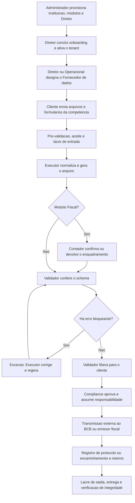

# Videnas - Resumo Executivo da Aplicacao

**Escopo analisado:** mockup front-end disponivel no repositorio em 18/09/2026  
**Objetivo:** apresentar, de forma sucinta, a aplicacao, seus perfis, fluxo, modulos e obrigacoes contempladas.

## 1. Visao geral

A Videnas e uma aplicacao RegTech voltada a instituicoes brasileiras que operam com criptoativos, como SPSAVs, exchanges, custodiantes e mesas OTC. O produto organiza o recebimento dos dados do cliente, a geracao e validacao de arquivos regulatorios, a segregacao de funcoes, os prazos, a auditoria e a cadeia de custodia das entregas.

O repositorio e um **mockup front-end 100% local**, construido com Next.js 16, React 19, TypeScript, Tailwind CSS, shadcn/ui e Zustand. Nao ha backend, API, banco de dados ou autenticacao real. O estado vive no navegador; sessao, evidencias e tenants sao parcialmente persistidos em `localStorage`. Os hashes SHA-256 e os envelopes AES-GCM sao calculados de verdade pela Web Crypto API, embora a gestao de chaves seja simulada no navegador.

O escopo atual cobre quatro frentes: **ACAM212**, **Cadoc 5711**, **Cadoc 5710** e **Fiscal - NFS-e/DPS**, sendo o Fiscal marcado como funcionalidade candidata. A Videnas estrutura e controla o processo, mas a transmissao ao Banco Central ou ao emissor fiscal ocorre fora da plataforma e permanece sob responsabilidade da instituicao cliente.

## 2. Perfis e responsabilidades

| Perfil | Responsabilidade principal | Limite relevante |
|---|---|---|
| Responsavel de Compliance | Aprova o arquivo liberado e registra protocolo ou encaminhamento em nome da instituicao. | Nao gera, nao valida schema e nao configura a operacao. |
| Operacional / Suporte | Acompanha completude, orienta pendencias, notifica o cliente, trata excecoes e mantem usuarios e dicionarios. | Nao fornece dados em nome do cliente e nao aprova. |
| Cliente / Fornecedor de dados | Unico perfil que envia os insumos de origem; acompanha pendencias, baixa comprovantes e verifica integridade. | Nao acessa a fila de operacao nem opera o pipeline regulatorio. |
| Contador / Fiscal | Confirma ou devolve aliquota de ISS, retencao e enquadramento tributario das DPS. | Atua apenas no modulo Fiscal. |
| Executor - Videnas | Executa a ingestao tecnica, gera ou regera o arquivo e o envia para validacao. | Nao fornece dados, nao libera e nao aprova. |
| Validador - Videnas | Valida o schema e libera o arquivo para o cliente. | Nunca gera; quem gerou nao pode liberar. |
| Administrador - Videnas | Provisiona tenants, contrata modulos, convida usuarios iniciais, suspende e reativa clientes. | Nao participa do pipeline regulatorio. |

A separacao **Executor -> Validador -> Compliance** materializa o controle de quatro olhos e reduz conflito de interesses. O Administrador fica fora desse ciclo.

## 3. Fluxograma da aplicacao

Em todas as etapas, eventos relevantes alimentam a trilha de auditoria. Reenvios nao sobrescrevem o historico: cada novo lacre aponta para o anterior, formando uma cadeia verificavel.

## 4. Modulos regulatorios e documentos

### ACAM212 / C212

Declaracao mensal destinada ao Banco Central para operacoes de cambio com ativos virtuais. Na aplicacao, recebe cadastro de clientes com KYC resolvido, operacoes da competencia, saldos de encerramento e parametros da declaracao. O Executor gera o arquivo no schema ACAM212 2.1; o Validador confere e libera; o Compliance aprova e registra a transmissao externa. O modulo serve para consolidar, validar, auditar e entregar a obrigacao com rastreabilidade.

### ACAM213 / C213 - lacuna de escopo

A solicitacao menciona o ACAM213, mas o repositorio analisado **nao possui modulo, rota, tipo, schema, insumo, tela ou documentacao correspondente**. O tipo de modulo admite somente `acam212`, `cadoc5711`, `cadoc5710` e `fiscal`; o documento de escopo existente tambem cita apenas ACAM212. Portanto, a finalidade do ACAM213 nao pode ser descrita com seguranca a partir desta aplicacao. Sua inclusao exige validacao de negocio e documentacao oficial antes de qualquer implementacao.

### Cadoc 5711

Representa a posicao diaria de custodia por cliente, consolidada e enviada mensalmente ao Banco Central. Usa datas-base da competencia, arquivo de posicoes diarias e conciliacao entre custodia propria e de terceiros. Serve para demonstrar, por cliente e data-base, os ativos custodiados e a consistencia do periodo. A aplicacao usa o schema CADOC5711 1.4.

### Cadoc 5710

Representa a posicao mensal agregada por carteira ou endereco, incluindo saldos em staking. Recebe inventario de carteiras, posicao consolidada por ativo, declaracao de staking e parametros de data-base/cotacao. Serve para consolidar a exposicao de custodia por carteira e ativo na data-base mensal. A aplicacao usa o schema CADOC5710 1.4.

### Fiscal - NFS-e / DPS

Estrutura a Declaracao de Prestacao de Servicos (DPS) a partir dos servicos prestados e dos parametros tributarios da instituicao. E o unico modulo com a etapa **Contador**, que confirma ou devolve aliquota de ISS, retencao e enquadramento antes da validacao de schema. Serve para preparar e controlar a informacao fiscal com rastreabilidade. E uma funcionalidade candidata: a Videnas **nao emite NFS-e**, nao substitui o contador e apenas marca o encaminhamento ao emissor definido pelo cliente.

## 5. Modulos funcionais da aplicacao

| Modulo funcional | Para que serve |
|---|---|
| Acesso e selecao de instituicao | Simula login, perfil e contexto do tenant conforme as permissoes. |
| Onboarding | Configura e ativa um tenant ja provisionado e abre as competencias contratadas. |
| Dashboard | Consolida prazos, pendencias, competencias e proximas acoes conforme o perfil. |
| Clientes | Permite ao Administrador provisionar e gerir instituicoes, modulos e usuarios iniciais. |
| Fornecimento de dados | Reune checklist, upload, formularios, pre-validacao, aceite, completude e comprovante. |
| ACAM212, Cadoc e Fiscal | Organizam competencias e etapas de cada obrigacao. |
| Operacao | Oferece fila multi-tenant para Executor e Validador. |
| Arquivos entregues | Disponibiliza arquivo lacrado, comprovante, hash e verificacao de integridade. |
| Calendario | Centraliza prazos regulatorios por competencia. |
| Auditoria | Registra eventos e decisoes com usuario, data, contexto e payload resumido. |
| Evidencias | Exibe lacres de entrada e saida, cadeia por hash e resultados de verificacao. |
| Configuracoes | Mantem instituicao, usuarios, permissoes e dicionarios de apoio. |
| Ajuda e tutorial | Orienta cada perfil com conteudo contextual e roteiros guiados. |

## 6. Controles, limites e conclusao

- **Completude:** cada obrigacao possui insumos obrigatorios; arquivos passam por pre-validacao e aceite explicito.
- **Segregacao de funcoes:** o Executor gera, o Validador libera e o Compliance aprova; quem gerou nao pode liberar.
- **Cadeia de custodia:** entradas e saidas recebem SHA-256, carimbo de tempo, autoria e envelope AES-GCM; reenvios sao encadeados.
- **Responsabilidade:** a plataforma nao transmite ao BCB, nao custodia ativos, nao emite NFS-e e nao substitui contador ou advogado.
- **Limite do mockup:** nao ha backend, autenticacao real, banco, integracoes externas ou custodia produtiva de chaves. O arquivo baixavel e um extrato demonstrativo deterministico, limitado aos primeiros 12 registros; nao e um documento regulatorio completo. Em producao, a chave deve ficar em KMS/HSM.

Em sintese, a Videnas demonstra um fluxo de conformidade ponta a ponta: provisionamento do cliente, coleta estruturada, geracao, validacao independente, aprovacao, registro da transmissao externa e preservacao das evidencias. O principal ponto pendente para alinhamento e o **ACAM213**, que nao integra o escopo atual do repositorio.

## Fontes internas consultadas

- `README.md`
- `src/lib/permissoes.ts`
- `src/lib/mock/modulos.ts`
- `src/lib/tipos/index.ts`
- `src/lib/fornecimento/insumos.ts`
- `src/lib/store/periodos.ts`
- `src/lib/evidencias/cripto.ts`
- `src/components/layout/sidebar-app.tsx`
- `Sentinellus_Escopo_Essencial_Mockup_v1.docx`
